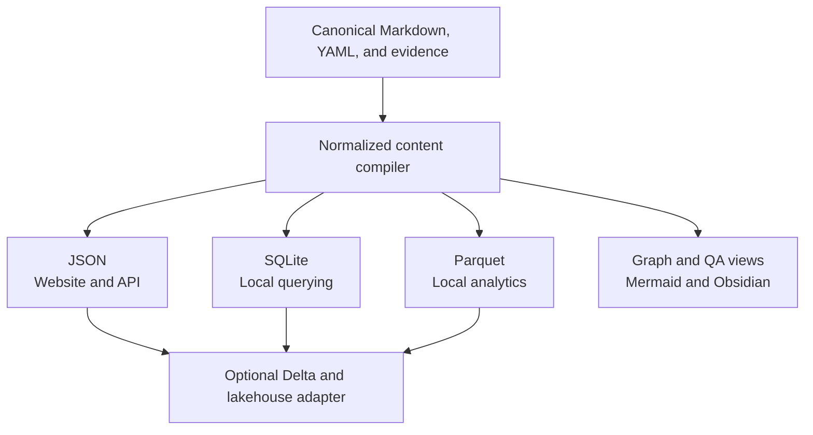

# Analytical Projection Architecture

## Purpose

This document describes how the knowledge framework can support local querying, websites,
analytics, notebooks, and eventually lakehouse-scale processing without changing the authority
of canonical project content.

The architecture deliberately separates two decisions:

1. adopting a layered data-processing model; and
2. deploying a particular platform such as Azure Databricks.

The framework benefits from the first now. Databricks remains an optional future adapter whose
value depends on workload scale, source diversity, collaboration, governance, and operational
requirements.

The near-term implementation recommendation is explicit: use SQLite for local application and
editor queries, and use DuckDB plus generated Parquet for local analytical workloads before
adopting Databricks. These options exercise the persistence and analytical boundaries on one
machine while keeping the generated data portable. Databricks should enter only when measured
scale, distributed ingestion, shared governance, or multi-team operation justifies its overhead.

## Authority And Flow

Canonical Markdown, structured page data, project registries, evidence, and investigations remain
the authoritative project inputs. Databases, lakehouse tables, indexes, graphs, dashboards, and
bounded pages are rebuildable projections.

No projection may silently become a competing source of truth. A projection records the compiler
version, source revision or content digest, applicable schema-pack versions, and enough provenance
to explain how it was derived. Generated data may be discarded and rebuilt from canonical inputs.

## Medallion Interpretation

The Databricks bronze, silver, and gold pattern is useful as a logical quality model even when the
project runs entirely on a local machine. These names describe progressive refinement; they do not
require Databricks or Delta Lake.

### Canonical Inputs And Bronze

Canonical repository files remain the project's authority. A bronze layer, when one is needed, is
an ingested snapshot of those files and external sources rather than a replacement for them.

Bronze preserves:

- raw values and source fidelity;
- source location, revision, and ingestion metadata;
- malformed, contradictory, incomplete, or superseded claims needed for audit and reprocessing;
- original identifiers and source-specific vocabulary before normalization.

For the current repository, creating a separately persisted bronze copy may add no value. The
compiler can read canonical files directly while retaining their provenance. A durable bronze
layer becomes useful when inputs arrive from many repositories, APIs, databases, streams, or
systems whose historical state must be retained.

### Silver

Silver is the validated normalized content model. It makes records structurally trustworthy
without pretending that every disagreement has one universal answer.

Silver performs operations such as:

- strict schema validation and type normalization;
- stable identity and lookup-key resolution;
- relationship, chronology, occurrence, and applicability normalization;
- deduplication without destroying distinct evidence;
- provenance and source-priority attachment;
- explicit conflict, uncertainty, and adaptation-deviation retention.

Silver must not overwrite a lower-priority assertion merely because a higher-priority source
exists. For example, it may preserve both `novel asserts X` and `donghua asserts Y`, together with
the rule that the novel has higher authority for a canonical-novel projection.

### Gold

Gold contains purpose-specific, resolved, bounded, or aggregated views. It answers a scoped
question rather than declaring one context-free truth.

Examples include:

- the best-supported state under a selected authority policy;
- reader-visible content through a selected chapter, volume, episode, or work;
- adaptation deviations relative to a selected source of authority;
- graph nodes and relationships for a chosen subject, hop depth, category set, and boundary;
- QA summaries, orphan reports, search indexes, dashboards, and website views.

The governing distinction is:

> Silver makes modeled data trustworthy. Gold produces a scoped interpretation of truth.

Every gold projection must identify the policy, boundary, source priorities, and applicability
context used to resolve it.

## Projection Formats

Each output format serves a different consumer. They are complementary rather than candidates for
one universal storage format.

| Format | Intended use | Current posture |
| --- | --- | --- |
| Markdown | Human-authored canonical content and readable generated views | Canonical or generated according to location |
| YAML | Human-maintainable structured configuration and page records | Canonical input |
| JSON | Website payloads, APIs, interoperability, and debugging | Planned generated projection |
| SQLite | Portable local queries, editor support, QA, and small single-machine applications | Planned generated projection |
| Parquet | Columnar analytical exchange, notebooks, DuckDB, and a future lakehouse ingestion boundary | Recommended later projection |
| Delta tables | Governed, transactional, scalable lakehouse storage | Optional future adapter |
| Mermaid and rendered media | Graph inspection and publishing | Existing generated projections |

SQLite is suitable for local tooling and a single-machine proof of concept. It should not be
treated as the canonical multi-user server for a future collaborative enterprise platform.

Parquet is the preferred bridge between local compilation and analytical systems because it is
portable and columnar. A local DuckDB workflow can query Parquet directly and prove analytical
schemas before the project incurs cloud-compute and lakehouse-operational complexity.

## Databricks Execution Model

Databricks separates workspace artifacts, compute, and durable data. A notebook is an interactive
authoring surface; it is not itself the storage or compute engine.

- SQL warehouses are optimized for SQL analytics.
- Spark or serverless notebook compute executes Python and PySpark workloads.
- Delta Lake provides a transactional table layer over cloud object storage.
- Unity Catalog can govern data, identities, permissions, and lineage at organizational scale.

PySpark does not inherently prevent repeated reads from source tables. DataFrame transformations
are planned and evaluated by Spark, and reused data is only retained when Spark's execution plan,
cache, persistence, or materialized storage makes that possible. Caching is an explicit performance
choice with memory and lifecycle costs, not a replacement for sound data modeling.

Current platform references:

- [Azure Databricks notebook compute](https://learn.microsoft.com/en-us/azure/databricks/notebooks/notebook-compute)
- [Azure Databricks compute overview](https://learn.microsoft.com/en-us/azure/databricks/compute/)
- [Azure Databricks medallion architecture](https://learn.microsoft.com/en-us/azure/databricks/lakehouse/medallion)
- [Azure Databricks lakehouse overview](https://learn.microsoft.com/en-us/azure/databricks/lakehouse/)
- [Apache Spark SQL performance tuning](https://spark.apache.org/docs/latest/sql-performance-tuning.html)

## Notebook Policy

Notebooks are valuable for exploration, education, profiling, and pressure testing. Appropriate
uses include:

- taxonomy and schema-usage profiling;
- coverage, sparsity, and anomaly analysis;
- relationship and chronology exploration;
- source-authority and adaptation-deviation experiments;
- migration previews and performance benchmarks;
- temporary visualizations that help define a permanent requirement.

Notebooks must not become hidden owners of production contracts or transformations. When an
experiment becomes repeatable framework behavior, move it into shared compiler/runtime modules,
register permanent conformance coverage, and invoke that implementation from the notebook if the
interactive view remains useful. Notebook outputs are disposable generated artifacts unless a
separate promotion process explicitly says otherwise.

## Adoption Threshold

Running the current LoTM repository on a Spark cluster would add startup time, cloud cost,
authentication, deployment, serialization, and governance overhead without a matching data-scale
benefit. Local Python plus SQLite, DuckDB, or Parquet is the appropriate near-term level.

A Databricks adapter becomes reasonable when a consuming project needs several of these together:

- many repositories or organizational data sources;
- CMDB, asset, cloud-resource, ticket, incident, and change ingestion;
- logs, telemetry, security events, or streaming updates;
- historical source snapshots and large-scale reprocessing;
- multi-team access control, lineage, governance, and shared analytics;
- distributed transformations that no longer fit comfortably on one machine;
- durable analytical products consumed by dashboards, ML, or multiple applications.

This threshold is especially plausible for an IT or enterprise knowledge-platform consumer, but
Databricks must remain one adapter rather than a framework requirement. Medical, legal, scientific,
narrative, and local personal projects must be able to use the same normalized contracts without
deploying Azure infrastructure.

## Staged Implementation

The recommended sequence is:

1. implement the normalized content index and shared compiler boundary;
2. migrate QA and Visualization consumers away from independent Markdown/YAML interpretation;
3. define projection metadata, reproducibility, and invalidation rules;
4. add generated JSON for website, API, and interoperability consumers;
5. add SQLite for local querying and maintainer/editor workflows;
6. add Parquet and local DuckDB-based analytical tests when concrete analytical questions exist;
7. prove an enterprise-scale consumer and only then add a Delta/Databricks persistence adapter;
8. keep all adapters downstream of the same normalized model and authority-resolution services.

This work does not replace pending schema evolution. It gives normalized content and future
persistence work a destination while preventing storage technology from defining domain semantics.

## Design Guardrails

- Canonical authority is independent of persistence technology.
- Bronze ingestion preserves source fidelity; it does not erase or repair evidence silently.
- Silver normalization retains contradictions and provenance.
- Gold resolution is explicit, scoped, reproducible, and policy-aware.
- Source priority qualifies a projection; it does not mutate lower-priority evidence out of history.
- Local and lakehouse adapters consume the same normalized contracts.
- Notebooks explore and explain; shared services own durable behavior.
- Distributed compute is adopted because measured workload characteristics require it, not because
  the framework happens to support it.
