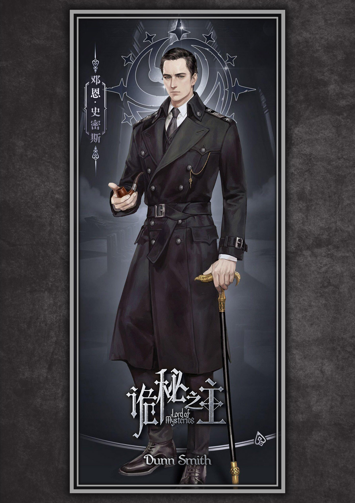

# Dunn Smith

<a href="../../Artwork/page-assets/characters/character-dunn-smith/dunn-smith-portrait.jpeg"></a>

## Metadata

Type: Character
Status: Active
First Mention Volume: 1
Subject Visible From: Novel V1 Ch12
Current Analysis Status: Novel reveal timeline directly verified through Chapter 47; Donghua verification not started
Confidence Level: Strong Evidence
Spoiler Boundary: Volume 1
Reader Knowledge Boundary: Novel Chapter 47; Donghua Season 1
Tags: volume-1, reader-knowledge, character, faction
Last Updated: 2026-07-03

Related Threads:
- [Church of Evernight](../Factions/faction-church-of-evernight.md)
- [Blackthorn Security Company](../Locations/location-blackthorn-security-company.md)
- [Saint Selena Cathedral](../Locations/location-saint-selena-cathedral.md)
- [Klein Becomes a Seer](../Events/event-klein-becomes-a-seer.md)
- [Antigonus Notebook](../Artifacts/artifact-antigonus-notebook.md)
- [Beyonders](../Concepts/concept-beyonders.md)
- [Divination](../Concepts/concept-divination.md)
- [Seer Pathway](../Pathways/pathway-seer.md)
- [Old Neil](character-old-neil.md)
- character-klein-moretti.md
- character-leonard-mitchell.md
- faction-nighthawks.md
- [Sleepless Pathway](../Pathways/pathway-sleepless.md)

Related Investigations:
- [Dunn Smith Novel Volume 1 Reveal Timeline](../../Investigations/Characters/character-dunn-smith/novel-volume-1-reveal-timeline.md)
- [Church of Evernight Volume 1 Reveal Timeline](../../Investigations/Factions/faction-church-of-evernight/novel-volume-1-reveal-timeline.md)
- [Blackthorn Security Company Novel Volume 1 Reveal Timeline](../../Investigations/Locations/location-blackthorn-security-company/novel-volume-1-reveal-timeline.md)
- [Klein Becomes a Seer Novel Volume 1 Event Timeline](../../Investigations/Events/event-klein-becomes-a-seer/novel-volume-1-reveal-timeline.md)
- [Antigonus Notebook Novel Volume 1 Reveal Timeline](../../Investigations/Artifacts/artifact-antigonus-notebook/novel-volume-1-reveal-timeline.md)

## Purpose

Track Dunn Smith as the reader-facing captain of the Tingen Nighthawks, including his police-cover introduction, Nighthawk reveal, Church authority, pathway clues, command role, recruitment decisions, safety doctrine, and early field leadership.

This page should preserve Dunn's Chapter 47 reader-safe shape without importing later Volume 1 crisis material, 0-08 manipulation details, or retrospective tragedy until this character boundary deliberately advances.

## Spoiler Boundary

This thread currently allows only Volume 1 knowledge up to Novel Chapter 47 and Donghua Season 1 knowledge after separate verification.

Later Volume 1 crisis material, final-battle knowledge, and 0-08-specific Dunn evidence from the completed 0-08 thread must remain out of this page until the Dunn boundary advances.

## Reader Knowledge Boundary

- Novel Volume: 1
- Novel Chapter: 47
- Reader knowledge state: The reader knows Dunn as the captain of the Tingen Nighthawks, initially presented through police cover, later revealed as a Church of Evernight Beyonder and operational leader. He recruits Klein as civilian staff, explains Beyonder dangers and pathway options, authorizes Klein's Seer advancement while keeping him outside the formal team, manages Blackthorn resources and staff, and mobilizes a field team around the Antigonus notebook/Ray Bieber lead.
- Donghua: Season 1
- Donghua viewer knowledge state: Not yet verified for this character thread.

## Overall Summary

Dunn Smith is the reader's first steady face of official supernatural authority: a gray-eyed police-cover investigator who gradually becomes Klein's Nighthawk captain, recruiter, institutional teacher, and field commander. He begins as pressure on Klein's impossible survival story, then turns into the person who explains what kind of hidden world Klein has stumbled into and what rules keep that world from eating ordinary people alive.

Through Chapter 47, Dunn's importance is not just that he knows things. He translates supernatural danger into systems: confidentiality, employment, pathway choices, sealed spaces, funding rules, monitoring work, safety warnings, and field response. He is protective without being soft, bureaucratic without being merely cold, and willing to make use of Klein's value while still keeping boundaries around him.

At this reader boundary, Dunn feels like the local center of gravity for the Church of Evernight's Tingen operations. The reader knows him as competent, trusted, and quietly burdened by command, but his exact Sequence, full ability set, and deeper place in the unresolved Antigonus notebook crisis remain deliberately incomplete.

## Character Snapshot

- Current reader-safe identity: Dunn Smith, captain of the Tingen Nighthawks.
- Current primary role: Church-linked Nighthawk captain, investigator, recruiter, supervisor, resource approver, and field commander.
- Current affiliation: Church of Evernight / Tingen Nighthawks, operating through Blackthorn Security Company and police Special Operations cover.
- Current pathway / ability status: Confirmed advanced Sleepless by Chapter 45; exact `Nightmare` status remains strong evidence rather than direct profile confirmation through Chapter 47.
- Current vital status: Alive at the current reader boundary.
- First appearance: Novel Volume 1, Chapter 10, as an unnamed gray-eyed police inspector.
- Main reader-safe uncertainty: Dunn's exact Sequence, full ability set, and deeper role in later Volume 1 crisis material remain outside this boundary.

## First Appearance / First Meaningful Mention

### Novel

#### First Visual / Functional Appearance

- Volume: 1
- Chapter: 10
- Context: Dunn first appears visually/functionally as the unnamed gray-eyed police inspector handling Klein during the Welch/Naya investigation.
- Reader knowledge state: The reader sees an official police-cover investigator, but does not yet know his name, Nighthawk identity, Church connection, or Beyonder status.

#### First Named Identification

- Volume: 1
- Chapter: 12
- Context: The same gray-eyed police inspector arrives at Klein's door and identifies himself as Dunn Smith.
- Reader knowledge state: The reader can now connect the Chapter 10 inspector to the name Dunn Smith, but still does not know his formal supernatural role.

#### First Supernatural Ability Clue

- Volume: 1
- Chapter: 12
- Context: Dunn appears inside Klein's nightmare-like escape attempt, revealing that the investigation has moved beyond ordinary police procedure.
- Reader knowledge state: The reader can infer Dunn has some kind of dream-related ability before the Nighthawks explanation is given.

#### First Formal Identity Reveal

- Volume: 1
- Chapter: 13
- Context: Dunn reintroduces himself as Nighthawk Dunn Smith and explains that he entered and guided Klein's dream.
- Reader knowledge state: Dunn is now explicitly understood as a Church-linked Nighthawk and Beyonder investigator.

### Donghua

- Season: 1
- Episode: TBD
- Release order: TBD
- Timestamp: TBD
- Context: Requires Donghua subtitle and visual verification.
- Viewer knowledge state: Exact first appearance, police-cover staging, and Nighthawk-reveal timing are not yet pinned down.

## Names, Aliases & Titles

| Field | Value | First reveal / change point | Status | Confidence | Notes |
|---|---|---|---|---|---|
| Title / role | Captain of the Tingen Nighthawks | Novel V1 Ch17 | Current at boundary | Confirmed | Dunn functions as the local team captain and onboarding authority. |
| Primary name | Dunn Smith | Novel V1 Ch12 | Current at boundary | Confirmed | The Chapter 10 inspector identifies himself at Klein's door. |
| Cover label | Gray-eyed police inspector | Novel V1 Ch10 | Superseded by later naming, still valid cover presentation | Confirmed | First reader-facing presentation during the Welch/Naya investigation. |

## Physical Profile

| Field | Value | First reveal / change point | Status | Confidence | Notes |
|---|---|---|---|---|---|
| Eye color | Gray | Novel V1 Ch10 | Current at boundary | Confirmed | Part of the first police-inspector description. |
| Species | Human | Novel V1 Ch10 | Current at boundary | Strong inference | Nothing through Chapter 47 suggests otherwise. |
| Sex | Male | Novel V1 Ch10 | Current at boundary | Strong inference | Presentation and references are consistently masculine through this boundary. |
| Age | Unknown | Novel V1 Ch10 | Unknown | Unknown | No verified age in the current character boundary. |
| Birthday | Unknown | Novel V1 Ch10 | Unknown | Unknown | No verified birthday in the current character boundary. |
| Height | Unknown | Novel V1 Ch10 | Unknown | Unknown | No verified height in the current character boundary. |
| Weight | Unknown | Novel V1 Ch10 | Unknown | Unknown | No verified weight in the current character boundary. |
| Hair color | Unknown | Novel V1 Ch10 | Unknown | Unknown | Not pinned down in the current page evidence. |

## Status, Origin & Location

| Field | Value | First reveal / change point | Status | Confidence | Notes |
|---|---|---|---|---|---|
| Current location | Ray Bieber apartment / Antigonus notebook field-response scene | Novel V1 Ch45-47 | Latest known location at boundary | Confirmed | Dunn is last tracked mobilizing and coordinating the team around Klein's notebook lead. |
| Residence / base | Blackthorn Security Company / Tingen Nighthawks workplace | Novel V1 Ch17 | Current operational base | Confirmed | Dunn works through the Blackthorn front and connected Nighthawk facilities. |
| Occupation / cover role | Police Special Operations / Seventh Unit cover | Novel V1 Ch17 | Current cover at boundary | Confirmed | Dunn shows the official police cover structure during Klein's onboarding. |
| Occupation / institutional role | Nighthawk captain | Novel V1 Ch17 | Current at boundary | Confirmed | Captain and local authority for staffing, resources, and field response. |
| Vital status | Alive | Novel V1 Ch10 | Current at boundary | Confirmed | No reader-safe death or disappearance through Chapter 47. |
| Nationality | Unknown | Novel V1 Ch10 | Unknown | Unknown | Not verified in the current character boundary. |
| Origin / birthplace | Unknown | Novel V1 Ch10 | Unknown | Unknown | Not verified in the current character boundary. |

## Affiliations

| Organization / faction | Relationship | First reveal / change point | Status | Confidence | Notes |
|---|---|---|---|---|---|
| Blackthorn Security Company | Works through / operational front | Novel V1 Ch17 | Current at boundary | Confirmed | Dunn uses Blackthorn as the Nighthawks' public-facing workplace. |
| Tingen Nighthawks | Leader / captain | Novel V1 Ch17 | Current at boundary | Confirmed | Dunn manages the local team and staff. |
| Church of Evernight | Member / official Beyonder affiliation | Novel V1 Ch13 | Current at boundary | Confirmed | Dunn reveals himself as a Church-linked Nighthawk. |
| Police Special Operations cover | Public-cover authority | Novel V1 Ch10 / Ch17 | Current cover at boundary | Confirmed | Introduced through police investigation, later formalized through Special Operations. |

## Pathway & Ability State

| Field | Value | First reveal / change point | Status | Confidence | Notes |
|---|---|---|---|---|---|
| Pathway | Sleepless pathway | Novel V1 Ch45 | Current at boundary | Confirmed | Leonard calls Dunn an advanced Sleepless. |
| Sequence | Nightmare | Novel V1 Ch22 | Strong evidence at boundary | Strong evidence | Inferred from dream guidance and Rozanne's Sequence 7 explanation; not directly profile-confirmed through Chapter 47. |
| Ability state | Dream entry / dream guidance | Novel V1 Ch12-13 | Current demonstrated capability | Confirmed | Dunn appears in and guides Klein's dream. |

## Ability Index

| Ability / skill | Source | First reveal / change point | Status | Confidence | Notes |
|---|---|---|---|---|---|
| Field command and team coordination | Institutional role / experience | Novel V1 Ch45 | Current at boundary | Confirmed | Mobilizes Leonard, Old Neil, Frye, and Klein around the notebook lead. |
| Resource approval and operational budgeting | Captain authority | Novel V1 Ch37-41 | Current at boundary | Confirmed | Approves training, ammunition, and external monitoring expenses. |
| Beyonder doctrine explanation | Nighthawk knowledge | Novel V1 Ch17-18 | Current at boundary | Confirmed | Explains Beyonders, potions, Sequences, advancement danger, and loss of control. |
| Dream entry / dream guidance | Sleepless/Nightmare-associated ability | Novel V1 Ch12-13 | Current at boundary | Confirmed | Demonstrated before pathway details are fully explained. |

## Equipment & Artifacts

| Item | Type | First reveal / change point | Possession status | Confidence | Notes |
|---|---|---|---|---|---|
| Antigonus notebook case materials | Investigation target / case evidence | Novel V1 Ch13 | Investigating, not possessed | Confirmed | Dunn treats the missing notebook as central to the case. |
| Nighthawk resources and ammunition access | Institutional equipment | Novel V1 Ch37-41 | Authorized by Dunn | Confirmed | Dunn can approve Klein's practice and monitoring expenses. |
| Sealed Artifact 0-08 | Sealed Artifact | Novel V1 Ch22 | Institutional knowledge, not local possession in this page | Confirmed | Dunn explains basic appearance/grade context without later function details. |

## Personality

| Trait / pattern | Evidence | First reveal / change point | Status | Confidence | Notes |
|---|---|---|---|---|---|
| Protective proceduralism | Warns Klein about confidentiality, danger, and irreversible potion consumption | Novel V1 Ch14-31 | Current pattern at boundary | Confirmed | Dunn repeatedly turns danger into rules, boundaries, and monitored choices. |
| Calm institutional authority | Converts police investigation into Church/Nighthawk onboarding | Novel V1 Ch13-18 | Current pattern at boundary | Confirmed | He explains the hidden system without abandoning official process. |
| Adaptive field leadership | Uses Klein's Seer clue to mobilize a field response | Novel V1 Ch45-47 | Current pattern at boundary | Confirmed | Dunn treats Klein as useful while preserving command structure. |

## Relationships

| Character / entity | Relationship | First reveal / change point | Status | Confidence | Notes |
|---|---|---|---|---|---|
| Old Neil | Team leader / colleague | Novel V1 Ch19 / Ch45 | Current at boundary | Confirmed | Dunn directs Old Neil inside the team and brings him into field response. |
| Klein Moretti | Recruiter, supervisor, and authorizer | Novel V1 Ch14-31 | Current at boundary | Confirmed | Dunn recruits Klein and authorizes his Seer opportunity. |
| Leonard Mitchell | Team leader / colleague | Novel V1 Ch10 / Ch45 | Current at boundary | Confirmed | Leonard works with Dunn in both investigation and field deployment context. |
| Church of Evernight | Member / official agent | Novel V1 Ch13 | Current at boundary | Confirmed | Dunn is the reader's first direct Church-linked Nighthawk. |
| Antigonus Notebook | Investigator | Novel V1 Ch13 | Active case connection | Confirmed | The notebook drives Dunn's investigation and Chapter 45 field response. |

## Messenger / Servants / Companions

| Entity | Type | First reveal / change point | Status | Confidence | Notes |
|---|---|---|---|---|---|
| None known | Messenger / servant / companion | Novel V1 Ch47 | No reader-safe entity known | Confirmed absence through boundary | No messenger, servant, or companion is established for Dunn through Chapter 47. |

## Prayers & Ritual Access

| Prayer / ritual label | Type | Function | First reveal / change point | Status | Confidence | Concept link | Notes |
|---|---|---|---|---|---|---|---|
| None known | Prayer / ritual access | No reader-safe Dunn-specific prayer or ritual address known | Novel V1 Ch47 | No reader-safe access known | Confirmed absence through boundary | [Prayers & Rituals](../Concepts/concept-prayers-and-rituals.md) | Dunn explains and participates in supernatural systems, but no prayer wording or ritual address is tied to him through Chapter 47. |

## Major Events & Fights

| Event / fight | Role | First reveal / occurrence | Outcome / status | Confidence | Notes |
|---|---|---|---|---|---|
| Welch / Naya investigation | Police-cover investigator / Nighthawk investigator | Novel V1 Ch10-13 | Ongoing case foundation | Confirmed | Dunn's first arc connects ordinary investigation to the supernatural notebook case. |
| Klein Becomes a Seer | Authorizer / supervising authority | Novel V1 Ch28-31 | Completed | Confirmed | Dunn offers and authorizes Klein's potion opportunity. |
| Antigonus notebook / Ray Bieber field response | Field commander | Novel V1 Ch45-47 | Active and unresolved at boundary | Confirmed | Dunn mobilizes the team around Klein's divination lead. |

## Chronological Development

### Novel

#### Chapter 10: Police-Cover Investigator

- What the reader learns: Dunn appears as an unnamed gray-eyed police inspector connected to Welch and Naya's deaths.
- What changes: Klein's private death-scene mystery becomes an official investigation.
- What remains unknown: Dunn's name, Church identity, Beyonder status, pathway, rank, and motives are hidden.
- Why it matters: Dunn begins as the face of legitimate authority before the reader learns that authority is supernatural and Church-linked.

#### Chapter 12: Dunn Smith Named and Dream-Tested

- What the reader learns: The gray-eyed inspector is named Dunn Smith. He confronts Klein with carriage-driver evidence, Welch's missing revolver, and then appears inside a dream/nightmare escape sequence.
- What changes: Dunn becomes more than a normal police investigator before the text has fully explained why.
- What remains unknown: His Nighthawk identity, Church role, and pathway are still not explicit.
- Why it matters: The reader gets Dunn's name and first supernatural-feeling action before the official Nighthawk explanation.

#### Chapter 13: Nighthawk Reveal and Notebook Case

- What the reader learns: Dunn reintroduces himself as a Nighthawk, clarifies that he entered and guided Klein's dream, identifies the missing Antigonus family notebook as central to the case, and frames Klein as the only surviving lead.
- What changes: Dunn shifts from apparent police investigator to supernatural investigator.
- What remains unknown: The full Nighthawks organization, Dunn's pathway, and the notebook's deeper importance remain unclear.
- Why it matters: Dunn becomes the reader's first direct bridge into the Church's official Beyonder response system.

#### Chapters 14-17: Recruitment Logic, Confidentiality, and Blackthorn

- What the reader learns: Dunn clears Klein after Daly's examination, warns him not to reveal the case, explains that civilian staff are still "one of us," lays out why Klein can be recruited, and gives practical terms for confidential employment.
- What changes: Dunn becomes Klein's recruiter and handler rather than only an investigator.
- What remains unknown: Dunn's own full ability set, complete pathway, and full internal hierarchy remain unknown.
- Why it matters: Dunn turns supernatural secrecy into an employment system: exposure logic, salary, contract, confidentiality, shifts, and hidden contact routes.

#### Chapters 17-18: Blackthorn, Special Operations, and Official Beyonder Doctrine

- What the reader learns: Dunn confirms Blackthorn Security Company as a disguise, shows the Seventh Unit/Special Operations police cover, gives the Tingen team size, and explains Beyonders, potions, Sequences, advancement danger, and loss of control.
- What changes: Dunn becomes Klein's primary institutional explainer.
- What remains unknown: Dunn's own full ability set, complete pathway, and full internal hierarchy remain unknown.
- Why it matters: Dunn turns the setting's hidden supernatural system into workplace procedure: cover identities, contracts, authority, danger, and supervision.

#### Chapters 19-22: Team Structure, Sealed Artifacts, and Pathway Clues

- What the reader learns: Dunn assigns Klein's early duties, explains Chanis Gate, formal Nighthawk rotations, Keepers, classified records, magical materials, prisoners, Sealed Artifact grades, 0-08's basic appearance, and local pathway context. By Chapter 22, the reader can strongly infer Dunn is on the Sleepless pathway and associated with `Nightmare`.
- What changes: Dunn's role expands from recruiter to captain managing staff, dangerous knowledge, artifacts, and Nighthawk pathway information.
- What remains unknown: Dunn's pathway affiliation and exact Sequence are still inferential at this moment, and 0-08's function remains unknown.
- Why it matters: Dunn anchors the Nighthawks as a dangerous but bureaucratically controlled institution.

#### Chapters 24-28: Secret Order Pressure and Beyonder Opportunity

- What the reader learns: Dunn continues the Antigonus notebook investigation, identifies the Secret Order background of the intruder, enters Klein's dream again to coordinate against the intruder, and offers Klein a Church-supported Beyonder chance because of his contribution, exposure to danger, and possible usefulness in finding the notebook.
- What changes: Dunn's leadership becomes adaptive: Klein is no longer just a protected witness or clerk, but a potential controlled asset.
- What remains unknown: Which pathway Klein will choose and how Dunn will classify him afterward remain unresolved until the next arc.
- Why it matters: Dunn is the person who converts danger exposure into institutional advancement.

#### Chapters 29-33: Pathway Choice, Potion Boundary, and Safety Doctrine

- What the reader learns: Dunn explains Seer tradeoffs, gives Klein time to decide, accepts Klein's choice, warns that consuming the potion is irreversible, takes Klein into the hidden facilities, keeps Klein as civilian staff rather than a formal Nighthawk, and reinforces safety limits after Klein's advancement.
- What changes: Dunn becomes the authorizer of Klein's first major supernatural status change.
- What remains unknown: Dunn's deeper personal views and the full long-term consequence of keeping Klein outside the team remain unknown.
- Why it matters: Dunn's authority is protective and procedural: he enables Klein's advancement while preserving boundaries.

#### Chapters 37-41: Resource Approval and External Monitoring

- What the reader learns: Dunn can approve equipment, ammunition, practice, and external monitoring expenses, including Klein's Divination Club work when framed as occult-adjacent surveillance. Chapter 41 also shows Dunn folding Klein's request into Church/police quarterly funding.
- What changes: Dunn's captain role extends beyond Blackthorn into controlled use of civilian spaces.
- What remains unknown: Full budget rules and the limits of external surveillance remain unclear.
- Why it matters: Dunn shows how Nighthawk leadership translates supernatural risk into mundane administration.

#### Chapters 42-47: Deployment Snapshot and Field Command

- What the reader learns: Dunn is sometimes away on cathedral business, manages a thinly spread team, and mobilizes Leonard, Old Neil, Frye, and Klein around Klein's Antigonus notebook lead. He coordinates field response through Blackthorn, the Special Operations cover, and ordinary police at the scene. Chapter 45 also confirms Dunn as an advanced Sleepless.
- What changes: Dunn becomes visible as active commander rather than only office authority, and his Sleepless pathway affiliation moves from strong inference to confirmed.
- What remains unknown: The longer-term handling of Ray Bieber, the notebook, and the Secret Order pursuit remains unresolved at this boundary.
- Why it matters: Dunn's current boundary closes with him as a competent, trusted captain turning Klein's Seer clue into formal Nighthawks action.

### Donghua

#### Season 1: Foundation Pending

- Timestamp: TBD
- What the viewer learns: Not yet verified.
- What changes: Not yet verified.
- What remains unknown: Exact first appearance, Nighthawk reveal timing, pathway clues, and adaptation emphasis.
- Why it matters: Dunn's Donghua presentation is visually important and should be verified separately, especially because later Season 1 material has major visual/audio implications.

## Open Questions

- Question: What is Dunn's exact first Donghua appearance and when does the adaptation reveal him as a Nighthawk?
- Current confidence: Unknown
- Needs subtitle and visual verification: Yes
- Related investigation: [Dunn Smith Novel Volume 1 Reveal Timeline](../../Investigations/Characters/character-dunn-smith/novel-volume-1-reveal-timeline.md)

- Question: Should Dunn's `Nightmare` status be treated as confirmed or strong inference through Chapter 47?
- Current confidence: Strong Evidence. Chapter 45 confirms Dunn is an advanced Sleepless, but Chapter 22 remains the main basis for the exact `Nightmare` inference and still stops short of a direct Dunn profile statement.
- Needs EPUB verification: Completed through Chapter 47
- Related investigation: [Dunn Smith Novel Volume 1 Reveal Timeline](../../Investigations/Characters/character-dunn-smith/novel-volume-1-reveal-timeline.md)

- Question: When this page advances beyond Chapter 47, how should the completed 0-08 evidence be integrated without collapsing Dunn's agency, contamination, and manipulation into one undifferentiated claim?
- Current confidence: Known future work
- Needs EPUB/Donghua verification: Existing 0-08 evidence exists; Dunn-specific synthesis should wait until the boundary advances.
- Related investigation: [0-08 Volume 1 Reveal Timeline](../../Investigations/Artifacts/artifact-0-08/novel-volume-1-reveal-timeline.md)

## Related Threads

### Directly Related

- character-klein-moretti.md
- character-leonard-mitchell.md
- [Old Neil](character-old-neil.md)
- [Church of Evernight](../Factions/faction-church-of-evernight.md)
- [Sleepless Pathway](../Pathways/pathway-sleepless.md)
- faction-nighthawks.md
- [Blackthorn Security Company](../Locations/location-blackthorn-security-company.md)
- [Saint Selena Cathedral](../Locations/location-saint-selena-cathedral.md)
- [Klein Becomes a Seer](../Events/event-klein-becomes-a-seer.md)
- [Antigonus Notebook](../Artifacts/artifact-antigonus-notebook.md)
- [Beyonders](../Concepts/concept-beyonders.md)

### Historical Connections

-

### Associated Mysteries

- [Antigonus Notebook](../Artifacts/artifact-antigonus-notebook.md)

### Associated Artifacts

- [Antigonus Notebook](../Artifacts/artifact-antigonus-notebook.md)
- [0-08](../Artifacts/artifact-0-08.md)

### Associated Factions

- [Church of Evernight](../Factions/faction-church-of-evernight.md)
- faction-nighthawks.md
- faction-secret-order.md

### Associated Characters

- character-klein-moretti.md
- character-leonard-mitchell.md
- [Old Neil](character-old-neil.md)
- character-frye.md
- character-kenley-white.md
- character-seeka-tron.md
- character-royale-reideen.md

### Associated Pathways

- [Sleepless Pathway](../Pathways/pathway-sleepless.md)
- [Seer Pathway](../Pathways/pathway-seer.md)
- pathway-mystery-pryer.md
- pathway-corpse-collector.md

## Character Data Block

```yaml
character_profile:
  reader_boundary:
    medium: novel
    book: lotm-1
    volume: 1
    chapter: 47
  state_sort_order: newest_to_oldest
  official_artwork:
    - image_number: 17
      label: Dunn Smith portrait
      type: official_epub_character_gallery
      file: ../../Artwork/page-assets/characters/character-dunn-smith/dunn-smith-portrait.jpeg
      usage: primary_page_header_image
  identities:
    - field: title_role
      value: Captain of the Tingen Nighthawks
      reveal: { medium: novel, volume: 1, chapter: 17 }
      status: current_at_boundary
      confidence: confirmed
      notes: Local team captain and onboarding authority.
    - field: primary_name
      value: Dunn Smith
      reveal: { medium: novel, volume: 1, chapter: 12 }
      status: current_at_boundary
      confidence: confirmed
      notes: The Chapter 10 inspector identifies himself by name.
    - field: cover_label
      value: Gray-eyed police inspector
      reveal: { medium: novel, volume: 1, chapter: 10 }
      status: superseded_by_later_naming
      confidence: confirmed
      notes: First reader-facing presentation during the Welch/Naya investigation.
  physical_profile:
    - field: eye_color
      value: Gray
      reveal: { medium: novel, volume: 1, chapter: 10 }
      status: current_at_boundary
      confidence: confirmed
      notes: Part of the first police-inspector description.
  status_origin_location:
    - field: residence_base
      value: Blackthorn Security Company / Tingen Nighthawks workplace
      reveal: { medium: novel, volume: 1, chapter: 17 }
      status: current_operational_base
      confidence: confirmed
      notes: Dunn works through the Blackthorn front and connected Nighthawk facilities.
    - field: current_location
      value: Ray Bieber apartment / Antigonus notebook field-response scene
      reveal: { medium: novel, volume: 1, chapter: 45 }
      status: latest_known_location_at_boundary
      confidence: confirmed
      notes: Dunn is last tracked mobilizing and coordinating the team around Klein's notebook lead.
    - field: vital_status
      value: Alive
      reveal: { medium: novel, volume: 1, chapter: 10 }
      status: current_at_boundary
      confidence: confirmed
      notes: No reader-safe death or disappearance through Chapter 47.
  affiliations:
    - organization: Blackthorn Security Company
      relationship: works_through_operational_front
      reveal: { medium: novel, volume: 1, chapter: 17 }
      status: current_at_boundary
      confidence: confirmed
      notes: Public-facing Nighthawks workplace.
    - organization: Tingen Nighthawks
      relationship: leader_captain
      reveal: { medium: novel, volume: 1, chapter: 17 }
      status: current_at_boundary
      confidence: confirmed
      notes: Dunn manages the local team and staff.
    - organization: Church of Evernight
      relationship: official_beyonder_affiliation
      reveal: { medium: novel, volume: 1, chapter: 13 }
      status: current_at_boundary
      confidence: confirmed
      notes: Dunn reveals himself as a Church-linked Nighthawk.
  pathway_ability_state:
    - field: pathway_sequence_inference
      value: Sleepless pathway / Nightmare association
      reveal: { medium: novel, volume: 1, chapter: 22 }
      status: strong_evidence_at_boundary
      confidence: strong_evidence
      notes: Chapter 22 connects dream guidance to Nightmare and makes Dunn's likely Sequence 7 status inferable before later pathway confirmation.
    - field: pathway
      value: Sleepless pathway
      reveal: { medium: novel, volume: 1, chapter: 45 }
      status: current_at_boundary
      confidence: confirmed
      notes: Leonard calls Dunn an advanced Sleepless.
    - field: sequence
      value: Nightmare
      reveal: { medium: novel, volume: 1, chapter: 22 }
      status: strong_evidence_at_boundary
      confidence: strong_evidence
      notes: Inferred from dream guidance and Rozanne's Sequence 7 explanation.
  ability_index:
    - ability: field_command_and_team_coordination
      source: institutional_role_experience
      reveal: { medium: novel, volume: 1, chapter: 45 }
      status: current_at_boundary
      confidence: confirmed
      notes: Mobilizes the team around the notebook lead.
    - ability: resource_approval_and_operational_budgeting
      source: captain_authority
      reveal: { medium: novel, volume: 1, chapter: 37 }
      status: current_at_boundary
      confidence: confirmed
      notes: Approves training, ammunition, and external monitoring expenses through the Church/police funding structure.
    - ability: beyonder_doctrine_explanation
      source: nighthawk_knowledge
      reveal: { medium: novel, volume: 1, chapter: 17 }
      status: current_at_boundary
      confidence: confirmed
      notes: Explains Beyonders, potions, Sequences, advancement danger, and loss of control across the onboarding explanation.
    - ability: dream_entry_dream_guidance
      source: sleepless_nightmare_associated_ability
      reveal: { medium: novel, volume: 1, chapter: 12 }
      status: current_at_boundary
      confidence: confirmed
      notes: Demonstrated before pathway details are fully explained.
  equipment_artifacts:
    - item: Antigonus notebook case materials
      type: investigation_target_case_evidence
      reveal: { medium: novel, volume: 1, chapter: 13 }
      possession_status: investigating_not_possessed
      confidence: confirmed
      notes: Dunn treats the missing notebook as central to the case.
    - item: Nighthawk resources and ammunition access
      type: institutional_equipment_resource_access
      reveal: { medium: novel, volume: 1, chapter: 37 }
      possession_status: authorized_by_dunn
      confidence: confirmed
      notes: Dunn can approve Klein's practice and monitoring expenses.
    - item: Sealed Artifact 0-08
      type: sealed_artifact
      reveal: { medium: novel, volume: 1, chapter: 22 }
      possession_status: institutional_knowledge_not_local_possession
      confidence: confirmed
      notes: Dunn explains basic appearance and grade context without later function details.
  personality:
    - trait: protective_proceduralism
      evidence: Warns Klein about confidentiality, danger, and irreversible potion consumption.
      reveal: { medium: novel, volume: 1, chapter: 14 }
      status: current_pattern_at_boundary
      confidence: confirmed
      notes: Dunn repeatedly turns danger into rules, boundaries, and monitored choices.
    - trait: calm_institutional_authority
      evidence: Converts police investigation into Church/Nighthawk onboarding.
      reveal: { medium: novel, volume: 1, chapter: 13 }
      status: current_pattern_at_boundary
      confidence: confirmed
      notes: Explains the hidden system without abandoning official process.
    - trait: adaptive_field_leadership
      evidence: Uses Klein's Seer clue to mobilize a field response.
      reveal: { medium: novel, volume: 1, chapter: 45 }
      status: current_pattern_at_boundary
      confidence: confirmed
      notes: Treats Klein as useful while preserving command structure.
  relationships:
    - target: character-old-neil
      relationship: team_leader_colleague
      reveal: { medium: novel, volume: 1, chapter: 19 }
      status: current_at_boundary
      confidence: confirmed
      notes: Dunn directs Old Neil inside the team and brings him into field response.
    - target: character-klein-moretti
      relationship: recruiter_supervisor_authorizer
      reveal: { medium: novel, volume: 1, chapter: 14 }
      status: current_at_boundary
      confidence: confirmed
      notes: Dunn recruits Klein and authorizes his Seer opportunity.
    - target: character-leonard-mitchell
      relationship: team_leader_colleague
      reveal: { medium: novel, volume: 1, chapter: 10 }
      status: current_at_boundary
      confidence: confirmed
      notes: Leonard works with Dunn in both investigation and field deployment context.
    - target: faction-church-of-evernight
      relationship: member_official_agent
      reveal: { medium: novel, volume: 1, chapter: 13 }
      status: current_at_boundary
      confidence: confirmed
      notes: Dunn is the reader's first direct Church-linked Nighthawk.
    - target: artifact-antigonus-notebook
      relationship: investigator
      reveal: { medium: novel, volume: 1, chapter: 13 }
      status: active_case_connection
      confidence: confirmed
      notes: The notebook drives Dunn's investigation and Chapter 45 field response.
  prayers_ritual_access:
    - label: None known
      type: prayer_ritual_access
      function: No reader-safe Dunn-specific prayer or ritual address known
      reveal: { medium: novel, volume: 1, chapter: 47 }
      status: no_reader_safe_access_known
      confidence: confirmed_absence_through_boundary
      concept_link: ../Concepts/concept-prayers-and-rituals.md
      wording:
      notes: Dunn explains and participates in supernatural systems, but no prayer wording or ritual address is tied to him through Chapter 47.
  major_events_fights:
    - event: Welch / Naya investigation
      role: police_cover_investigator_nighthawk_investigator
      reveal: { medium: novel, volume: 1, chapter: 10 }
      outcome_status: ongoing_case_foundation
      confidence: confirmed
      notes: Dunn's first arc connects ordinary investigation to the supernatural notebook case.
    - event: Klein Becomes a Seer
      role: authorizer_supervising_authority
      reveal: { medium: novel, volume: 1, chapter: 28 }
      outcome_status: completed
      confidence: confirmed
      notes: Dunn offers and authorizes Klein's potion opportunity.
    - event: Antigonus notebook / Ray Bieber field response
      role: field_commander
      reveal: { medium: novel, volume: 1, chapter: 45 }
      outcome_status: active_unresolved_at_boundary
      confidence: confirmed
      notes: Dunn mobilizes the team around Klein's divination lead.
```

## Relationship Seeds

```yaml
relationships:
  - source: character-dunn-smith
    target: faction-church-of-evernight
    relationship_type: member-of
    start:
      medium: novel
      volume: 1
      chapter: 13
    status: active
    confidence: confirmed
    notes: Dunn reveals himself as a Nighthawk tied to the Church of Evernight investigation structure.
  - source: character-dunn-smith
    target: faction-nighthawks
    relationship_type: leader-of
    start:
      medium: novel
      volume: 1
      chapter: 17
    status: active
    confidence: confirmed
    notes: Dunn is the captain/operational leader of the Tingen Nighthawks by the time Klein joins Blackthorn.
  - source: character-dunn-smith
    target: location-blackthorn-security-company
    relationship_type: works-at
    start:
      medium: novel
      volume: 1
      chapter: 17
    status: active
    confidence: confirmed
    notes: Dunn operates through Blackthorn as the Tingen team's captain, recruiter, resource approver, and field-response coordinator.
  - source: character-dunn-smith
    target: pathway-sleepless
    relationship_type: pathway-status
    start:
      medium: novel
      volume: 1
      chapter: 22
    status: active
    confidence: strong-evidence
    notes: Chapter 22 connects Dunn's dream guidance to Nightmare and says it is likely he is one of Tingen's two Sequence 7 Beyonders, making the Sleepless/Nightmare association graph-worthy as strong evidence before confirmation. Chapter 45 later confirms Dunn is an advanced Sleepless; keep that confirmation in the data block and ledger until graph extraction supports relationship state history by reader boundary.
  - source: character-dunn-smith
    target: character-klein-moretti
    relationship_type: superior
    start:
      medium: novel
      volume: 1
      chapter: 17
    status: active
    confidence: confirmed
    notes: Dunn recruits Klein into confidential civilian-staff work and becomes his primary Nighthawks supervisor.
  - source: character-klein-moretti
    target: character-dunn-smith
    relationship_type: subordinate
    start:
      medium: novel
      volume: 1
      chapter: 17
    status: active
    confidence: confirmed
    notes: Klein works under Dunn's authority after joining the Nighthawks' civilian staff structure.
  - source: character-dunn-smith
    target: event-klein-becomes-a-seer
    relationship_type: event-participant
    start:
      medium: novel
      volume: 1
      chapter: 28
    status: completed
    confidence: confirmed
    notes: Dunn authorizes Klein's Beyonder opportunity, explains the options, leads him to the alchemy room, and preserves the civilian-staff status boundary.
  - source: character-dunn-smith
    target: artifact-antigonus-notebook
    relationship_type: investigates
    start:
      medium: novel
      volume: 1
      chapter: 13
    status: active
    confidence: confirmed
    notes: Dunn identifies the notebook as central to the early case and later mobilizes a field team around Klein's Ray Bieber/notebook lead.
  - source: character-dunn-smith
    target: concept-beyonders
    relationship_type: source-of-information
    start:
      medium: novel
      volume: 1
      chapter: 18
    status: active
    confidence: confirmed
    notes: Dunn provides Klein and the reader with the official Church/Nighthawks explanation of Beyonders, potions, Sequences, advancement danger, and losing control.
  - source: character-dunn-smith
    target: concept-divination
    relationship_type: source-of-information
    start:
      medium: novel
      volume: 1
      chapter: 29
    status: active
    confidence: confirmed
    notes: Dunn explains Seer tradeoffs and names divination methods such as astromancy, cartomancy, spiritual pendulums, and scrying.
```

## Evidence Index

- Novel Chapters: 10, 12-22, 24-33, 37-47
- Donghua Episodes: TBD

## Reader Knowledge Ledger

### Knowledge Unit: Dunn Appears as a Police-Cover Investigator

```yaml
id: dunn-police-cover-investigator
claim: Dunn Smith first appears to the reader as an official investigator under police cover before his Nighthawk identity is revealed.
truth_status: true
confidence_level: confirmed
canon_scope: novel
occurs_at:
  medium: novel
  book: lotm-1
  volume: 1
  chapter: 10
  notes: Dunn first appears visually/functionally as the unnamed gray-eyed police inspector during the Welch/Naya investigation.
tags:
  - volume-1
  - reader-knowledge
  - reveal-order
  - character
  - faction
disclosures:
  - medium: novel
    knowledge_state: clue
    disclosure_type: first-appearance
    available_from:
      book: lotm-1
      volume: 1
      chapter: 10
    superseded_at:
    superseded_by:
  - medium: novel
    knowledge_state: confirmed-fact
    disclosure_type: explicit-identification
    available_from:
      book: lotm-1
      volume: 1
      chapter: 12
    superseded_at:
    superseded_by:
  - medium: novel
    knowledge_state: expanded-fact
    disclosure_type: recontextualization
    available_from:
      book: lotm-1
      volume: 1
      chapter: 13
    superseded_at:
    superseded_by:
adaptation_relationships:
  - type: pending
    novel_claim_changed: false
    notes: Donghua timing not yet verified.
related_investigations:
  - ../../Investigations/Characters/character-dunn-smith/novel-volume-1-reveal-timeline.md
related_boards:
last_updated: 2026-07-02
```

#### Reader-State History

- Chapter 10 makes Dunn legible as mundane authority first, but without naming him.
- Chapter 12 identifies him as Dunn Smith and makes his dream access visible.
- Chapter 13 recontextualizes that authority as Nighthawks/Church authority.

#### Adaptation Analysis

- Donghua comparison is pending.

### Knowledge Unit: Dunn Is Confirmed on the Sleepless Pathway and Strongly Implied to Be a Nightmare

```yaml
id: dunn-nightmare-pathway-inference
claim: Through Chapter 47, the reader can confirm Dunn Smith is associated with the Sleepless pathway and strongly infer he is likely Sequence 7 Nightmare.
truth_status: true
confidence_level: confirmed
canon_scope: novel
occurs_at:
  medium: novel
  book: lotm-1
  volume: 1
  chapter: 45
  notes: Chapter 13 shows Dunn entering/guiding Klein's dream; Chapter 22 connects Nightmare to that ability and frames Dunn as likely one of Tingen's two Sequence 7 Beyonders; Chapter 45 confirms Dunn is an advanced Sleepless.
tags:
  - volume-1
  - reader-knowledge
  - reveal-order
  - character
  - pathway
disclosures:
  - medium: novel
    knowledge_state: clue
    disclosure_type: ability-demonstration
    available_from:
      book: lotm-1
      volume: 1
      chapter: 13
    superseded_at:
    superseded_by:
  - medium: novel
    knowledge_state: strong-inference
    disclosure_type: pathway-inference
    available_from:
      book: lotm-1
      volume: 1
      chapter: 22
    superseded_at:
      book: lotm-1
      volume: 1
      chapter: 45
    superseded_by: dunn-nightmare-pathway-inference
  - medium: novel
    knowledge_state: confirmed-fact
    disclosure_type: pathway-confirmation
    available_from:
      book: lotm-1
      volume: 1
      chapter: 45
    superseded_at:
    superseded_by:
adaptation_relationships:
  - type: pending
    novel_claim_changed: false
    notes: Donghua timing not yet verified.
related_investigations:
  - ../../Investigations/Characters/character-dunn-smith/novel-volume-1-reveal-timeline.md
  - ../../Investigations/Factions/faction-church-of-evernight/novel-volume-1-reveal-timeline.md
related_boards:
last_updated: 2026-07-02
```

#### Reader-State History

- Chapter 13 demonstrates Dunn's dream-related ability without naming the pathway.
- Chapter 22 gives enough pathway context for a strong reader inference toward Nightmare.
- Chapter 45 confirms Dunn is on the Sleepless pathway while still stopping short of a direct exact-Sequence profile statement.

#### Adaptation Analysis

- Donghua comparison is pending.

### Knowledge Unit: Dunn Is the Tingen Nighthawks Captain

```yaml
id: dunn-tingen-nighthawks-captain
claim: Dunn Smith is the captain and operational leader of the Tingen Nighthawks.
truth_status: true
confidence_level: confirmed
canon_scope: novel
occurs_at:
  medium: novel
  book: lotm-1
  volume: 1
  chapter: 17
  notes: Chapter 17 confirms Dunn as Captain during Klein's Blackthorn onboarding and contract signing.
tags:
  - volume-1
  - reader-knowledge
  - reveal-order
  - character
  - faction
disclosures:
  - medium: novel
    knowledge_state: confirmed-fact
    disclosure_type: expanded-explanation
    available_from:
      book: lotm-1
      volume: 1
      chapter: 17
    superseded_at:
    superseded_by:
adaptation_relationships:
  - type: pending
    novel_claim_changed: false
    notes: Donghua timing not yet verified.
related_investigations:
  - ../../Investigations/Factions/faction-church-of-evernight/novel-volume-1-reveal-timeline.md
  - ../../Investigations/Locations/location-blackthorn-security-company/novel-volume-1-reveal-timeline.md
related_boards:
last_updated: 2026-07-02
```

#### Reader-State History

- Dunn's captain role becomes operationally clear through recruitment, Blackthorn access, staffing decisions, and later field mobilization.

#### Adaptation Analysis

- Donghua comparison is pending.

### Knowledge Unit: Dunn Explains Official Beyonder Doctrine

```yaml
id: dunn-explains-official-beyonder-doctrine
claim: Dunn is the reader's first major official Church/Nighthawks source for Beyonder doctrine, including potions, Sequences, advancement danger, and losing control.
truth_status: true
confidence_level: confirmed
canon_scope: novel
occurs_at:
  medium: novel
  book: lotm-1
  volume: 1
  chapter: 18
  notes: Chapter 18 identifies Dunn as the official explainer in this block.
tags:
  - volume-1
  - reader-knowledge
  - reveal-order
  - character
  - concept
  - faction
disclosures:
  - medium: novel
    knowledge_state: confirmed-fact
    disclosure_type: expanded-explanation
    available_from:
      book: lotm-1
      volume: 1
      chapter: 18
    superseded_at:
    superseded_by:
adaptation_relationships:
  - type: pending
    novel_claim_changed: false
    notes: Donghua timing not yet verified.
related_investigations:
  - ../../Investigations/Concepts/concept-beyonders/novel-volume-1-reveal-timeline.md
related_boards:
last_updated: 2026-07-02
```

#### Reader-State History

- Dunn turns hidden supernatural lore into official institutional knowledge.

#### Adaptation Analysis

- Donghua comparison is pending.

### Knowledge Unit: Dunn Authorizes Klein Becoming a Seer

```yaml
id: dunn-authorizes-klein-seer-event
claim: Dunn authorizes and supervises the institutional process that lets Klein become a Seer while remaining civilian staff.
truth_status: true
confidence_level: confirmed
canon_scope: novel
occurs_at:
  medium: novel
  book: lotm-1
  volume: 1
  chapter: 28
  notes: Chapter 28 begins the offer; Chapters 29-31 develop the choice, potion, and status boundary.
tags:
  - volume-1
  - reader-knowledge
  - reveal-order
  - character
  - event
  - pathway
disclosures:
  - medium: novel
    knowledge_state: confirmed-fact
    disclosure_type: explicit-reveal
    available_from:
      book: lotm-1
      volume: 1
      chapter: 28
    superseded_at:
    superseded_by:
  - medium: novel
    knowledge_state: expanded-fact
    disclosure_type: practical-confirmation
    available_from:
      book: lotm-1
      volume: 1
      chapter: 31
    superseded_at:
    superseded_by:
adaptation_relationships:
  - type: pending
    novel_claim_changed: false
    notes: Donghua timing not yet verified.
related_investigations:
  - ../../Investigations/Events/event-klein-becomes-a-seer/novel-volume-1-reveal-timeline.md
related_boards:
last_updated: 2026-07-02
```

#### Reader-State History

- Chapter 28 makes Dunn the authorizer of the opportunity.
- Chapter 31 makes Dunn the status-boundary enforcer: Klein becomes a Beyonder but not a formal Nighthawk.

#### Adaptation Analysis

- Donghua comparison is pending.

### Knowledge Unit: Dunn Mobilizes the Notebook Field Response

```yaml
id: dunn-mobilizes-notebook-field-response
claim: Dunn turns Klein's Antigonus notebook/Ray Bieber lead into a formal Nighthawks field response.
truth_status: true
confidence_level: confirmed
canon_scope: novel
occurs_at:
  medium: novel
  book: lotm-1
  volume: 1
  chapter: 45
  notes: Chapters 45-46 track Dunn mobilizing Leonard, Old Neil, Frye, and Klein after Klein reports the Ray Bieber/notebook lead.
tags:
  - volume-1
  - reader-knowledge
  - reveal-order
  - character
  - artifact
  - faction
disclosures:
  - medium: novel
    knowledge_state: confirmed-fact
    disclosure_type: practical-demonstration
    available_from:
      book: lotm-1
      volume: 1
      chapter: 45
    superseded_at:
    superseded_by:
adaptation_relationships:
  - type: pending
    novel_claim_changed: false
    notes: Donghua timing not yet verified.
related_investigations:
  - ../../Investigations/Characters/character-dunn-smith/novel-volume-1-reveal-timeline.md
  - ../../Investigations/Locations/location-blackthorn-security-company/novel-volume-1-reveal-timeline.md
  - ../../Investigations/Artifacts/artifact-antigonus-notebook/novel-volume-1-reveal-timeline.md
related_boards:
last_updated: 2026-07-02
```

#### Reader-State History

- Chapters 45-47 show Dunn functioning as field commander rather than only institutional explainer.

#### Adaptation Analysis

- Donghua comparison is pending.

## Future Automation Notes

- This character should become a major graph hub connecting Klein, Leonard, Old Neil, Blackthorn, the Nighthawks, the Church, Seer advancement, the Antigonus notebook, Sleepless/Nightmare pathway clues, and later 0-08 crisis material.
- Do not import the completed 0-08 Dunn evidence until the Dunn page's reader boundary advances.

## Notes

- Keep Dunn's current page focused on reader-safe captain/institutional authority through Chapter 47. Later emotional and crisis material belongs in a future boundary advance.
