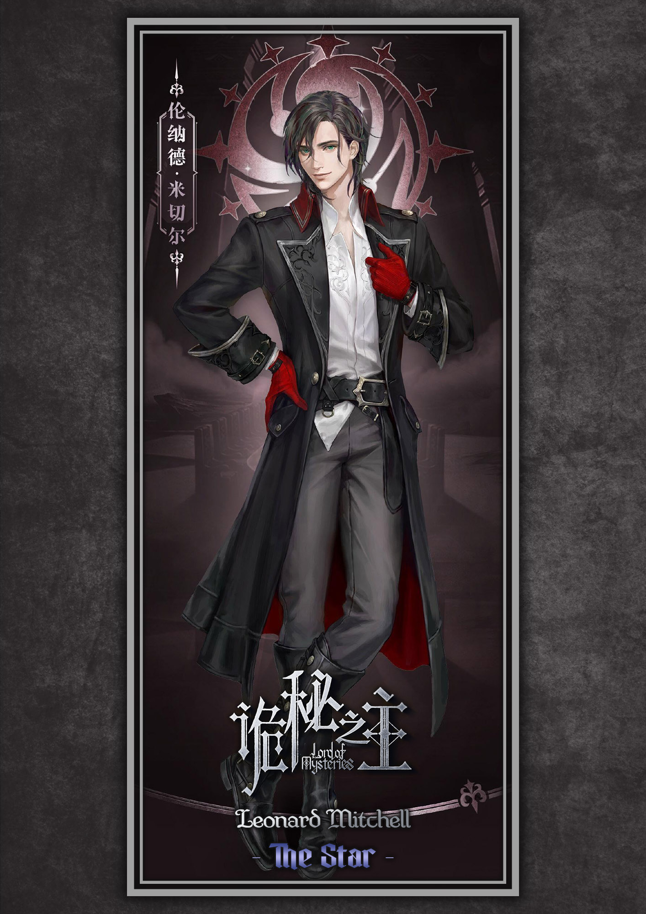

# Leonard Mitchell

<a href="../../Artwork/page-assets/characters/character-leonard-mitchell/leonard-mitchell-the-star-portrait.jpeg"></a>

## Metadata

Type: Character
Status: Active
First Mention Volume: 1
Subject Visible From: Novel V1 Ch10
Current Analysis Status: Repo-only pilot synthesized from existing glossary, investigation, board, volume, and artwork records; dedicated Leonard source investigation not started
Confidence Level: Strong Evidence
Spoiler Boundary: Lord of the Mysteries Book 1
Reader Knowledge Boundary: Novel V8 Ch1390; Donghua Season 1
Tags: volume-1, reader-knowledge, character, faction, pathway
Last Updated: 2026-07-07

Related Threads:
- [Church of Evernight](../Factions/faction-church-of-evernight.md)
- faction-nighthawks.md
- faction-tarot-club.md
- [Blackthorn Security Company](../Locations/location-blackthorn-security-company.md)
- [Dunn Smith](character-dunn-smith.md)
- [Old Neil](character-old-neil.md)
- character-klein-moretti.md
- character-seeka-tron.md
- [Sleepless Pathway](../Pathways/pathway-sleepless.md)
- [0-08](../Artifacts/artifact-0-08.md)
- [Divination](../Concepts/concept-divination.md)
- concept-tarot-cards.md

Related Investigations:
- [Sleepless Pathway Novel Volume 1 Reveal Timeline](../../Investigations/Pathways/pathway-sleepless/novel-volume-1-reveal-timeline.md)
- [Church of Evernight Volume 1 Reveal Timeline](../../Investigations/Factions/faction-church-of-evernight/novel-volume-1-reveal-timeline.md)
- [Dunn Smith Novel Volume 1 Reveal Timeline](../../Investigations/Characters/character-dunn-smith/novel-volume-1-reveal-timeline.md)
- [Blackthorn Security Company Novel Volume 1 Reveal Timeline](../../Investigations/Locations/location-blackthorn-security-company/novel-volume-1-reveal-timeline.md)
- [Tarot Club Preliminary Planning Investigation](../../Investigations/Factions/faction-tarot-club/preliminary-planning-investigation.md)

## Purpose

Track Leonard Mitchell as a Tingen Nighthawk, Midnight Poet, later Red Gloves applicant, and later Tarot Club member whose current repo-backed records already span early Volume 1 team evidence and late Book 1 Tarot Club planning.

This page is a repo-only pilot built from existing records. It should not import memory-known future explanations, source-search findings, or unverified later mystery material until a dedicated Leonard investigation reaches those points.

## Spoiler Boundary

This thread currently allows Lord of the Mysteries Book 1 material already present in repository records, plus Donghua Season 1 material already recorded on the 0-08 page.

Circle of Inevitability material and memory-known later details not already present in repository records remain outside this page. The page is not a complete Leonard investigation; it is a structured synthesis of existing repo-backed material.

## Reader Knowledge Boundary

- Novel Volume: Book 1, through Novel V8 Ch1390 where existing Tarot Club planning cross-checks membership order.
- Reader knowledge state: The reader can know Leonard as a Tingen Nighthawk and Sequence 8 Midnight Poet by early Volume 1, as a survivor whose later direction turns toward the Red Gloves after the Tingen crisis, and as the later Tarot Club member associated with `The Star`.
- Donghua: Season 1
- Donghua viewer knowledge state: The viewer has recorded Season 1 evidence for Leonard in the Elliott kidnapping chain, the 0-08 visual motif, and the hospital/Holy Cathedral wire aftermath. Exact full Leonard adaptation coverage remains incomplete.

## Overall Summary

Leonard Mitchell is one of the reader's earliest recurring Tingen Nighthawks: first encountered through the team's police-cover investigation, then made more specific when he identifies himself as `Sequence 8's Midnight Poet`. Through the current Volume 1 foundation records, he helps turn the Sleepless pathway from abstract Church doctrine into a person, a duty roster, and a practical ability profile.

Existing repository records make Leonard especially useful as a timing test case. He has early reader-safe Nighthawk and pathway data, a later Volume 1 consequence through the Holy Cathedral warning and Red Gloves decision, Donghua-specific 0-08/visual-transition material, and late Book 1 Tarot Club timing as `The Star`.

This page deliberately stops at what repository records already support. It does not explain Leonard's deeper later mystery thread unless and until that material is source-investigated or otherwise entered into the repository.

## Character Snapshot

- Current reader-safe identity: Leonard Mitchell, Tingen Nighthawk and later Tarot Club member `The Star`.
- Current role: Nighthawk field/team member in Volume 1; later Red Gloves applicant and Tarot Club participant according to existing repo records.
- Current affiliation / status: Church of Evernight / Tingen Nighthawks in early Volume 1; later associated with the Red Gloves pursuit and Tarot Club membership.
- Current location / base: Blackthorn Security Company / Tingen Nighthawks workplace in early Volume 1; guarding Chanis Gate in the Chapter 42 roster snapshot.
- Current pathway / ability state: Confirmed Sequence 8 Midnight Poet on the Sleepless pathway; singing/sleep-like influence is demonstrated in the current Volume 1 records.
- Current narrative function: Fellow Nighthawk, pathway example, field participant, Tingen survivor thread, and later Tarot Club identity timing test case.
- First appearance: Novel Volume 1, Chapter 10, as part of the police-cover investigation context recorded by existing Church/Nighthawks records.
- Main reader-safe uncertainty: The repository currently records Leonard's later mystery as a planned transformation arc, but does not yet contain source-backed details explaining it.

## First Appearance / First Meaningful Mention

### Novel

#### First Visual / Functional Appearance

- Volume: 1
- Chapter: 10
- Context: Existing Church records state that Dunn and Leonard first appear as police investigators during the opening Welch/Naya investigation.
- Reader knowledge state: Leonard is initially part of the apparent police-investigation surface around Klein, before the reader understands the full Church/Nighthawks context.

#### First Named Pathway/Sequence Identification

- Volume: 1
- Chapter: 21
- Context: Leonard introduces himself as `Sequence 8's Midnight Poet`.
- Reader knowledge state: The reader receives a concrete Sequence title for Leonard before the next chapter formally places Midnight Poet inside the Sleepless pathway ladder.

#### First Formal Pathway Placement

- Volume: 1
- Chapter: 22
- Context: Rozanne explains the Church's complete known pathway route as `Sleepless -> Midnight Poet -> Nightmare`.
- Reader knowledge state: Leonard's `Midnight Poet` title now resolves into the Sleepless pathway structure.

#### First Practical Ability Demonstration

- Volume: 1
- Chapter: 44
- Context: Leonard's singing can induce a sleep-like influence and leave targets rationalizing the effect afterward.
- Reader knowledge state: Midnight Poet becomes visible as an ability profile rather than only a Sequence title.

### Donghua

#### Elliott Kidnapping / 0-08 Motif Context

- Season: 1
- Episode: 2
- Release order: 2
- Timestamp: Around `00:25:41`
- Context: Existing 0-08 records say the spectral quill motif appears after Leonard incapacitates Elliott's kidnappers and before the kidnappers awaken, transform, and merge.
- Viewer knowledge state: The viewer sees an unexplained visual/audio intrusion tied to abnormal escalation, but cannot yet identify it as 0-08.

#### Holy Cathedral Wire and Red Gloves Decision

- Season: 1
- Episode: 13
- Release order: 13
- Timestamp: Around `00:22:31-00:22:45`
- Context: Seeka Tron gives Leonard an unencrypted Holy Cathedral wire in the hospital; the wire says the culprit has been identified and the Red Gloves are handling the case, and Leonard declares that he intends to join the Red Gloves.
- Viewer knowledge state: The Donghua preserves the institutional culprit-identification consequence while condensing the novel's explicit warning details.

## Names, Aliases & Titles

| Field | Value | First reveal / change point | Status | Confidence | Notes |
|---|---|---|---|---|---|
| Primary name | Leonard Mitchell | Novel V1 Ch10 / Ch21 | Current at boundary | Confirmed | Existing Church records place Leonard in the Chapter 10 police-cover appearance; Sleepless records emphasize his Chapter 21 Sequence introduction. |
| Sequence title | Midnight Poet | Novel V1 Ch21 | Current at boundary | Confirmed | Leonard identifies himself as Sequence 8's Midnight Poet. |
| Tarot Club identity | The Star | Novel V5 Ch951 / V5 Ch958 | Current at late-book boundary | Confirmed in planning record | Tarot Club planning records V5 Ch951 card draw and V5 Ch958 first regular gathering introduction. |
| Institutional role | Tingen Nighthawk | Novel V1 Ch10-22 | Current at Volume 1 boundary | Confirmed | Leonard is part of the Church/Nighthawks team context. |

## Physical Profile

| Field | Value | First reveal / change point | Status | Confidence | Notes |
|---|---|---|---|---|---|
| Species | Human | Novel V1 Ch10 | Current at boundary | Strong inference | Existing repository records do not indicate otherwise. |
| Sex | Male | Novel V1 Ch10 | Current at boundary | Strong inference | Presentation and references are masculine in existing records. |
| Age | Unknown | Novel V1 Ch10 | Unknown | Unknown | No repo-backed age data was found in the existing-data pass. |
| Birthday | Unknown | Novel V1 Ch10 | Unknown | Unknown | No repo-backed birthday data was found. |
| Height | Unknown | Novel V1 Ch10 | Unknown | Unknown | No repo-backed height data was found. |
| Weight | Unknown | Novel V1 Ch10 | Unknown | Unknown | No repo-backed weight data was found. |
| Hair color | Unknown | Novel V1 Ch10 | Unknown | Unknown | No repo-backed hair-color data was found. |
| Eye color | Unknown | Novel V1 Ch10 | Unknown | Unknown | No repo-backed eye-color data was found. |

## Status, Origin & Location

| Field | Value | First reveal / change point | Status | Confidence | Notes |
|---|---|---|---|---|---|
| Later institutional direction | Applies to join the Red Gloves | Novel V1 Ch211 / Donghua S1E13 | Later confirmed consequence | Confirmed | Repo records tie this to the Holy Cathedral warning/culprit identification aftermath. |
| Current Volume 1 duty snapshot | Guarding Chanis Gate | Novel V1 Ch42 | Duty assignment at that boundary | Confirmed | Keep Chanis Gate as contextual text for now; no dedicated location seed or page promotion. |
| Residence / base | Blackthorn Security Company / Tingen Nighthawks workplace | Novel V1 Ch10-22 | Current early base | Confirmed | Leonard belongs to the Tingen Nighthawks workplace context. |
| Occupation / institutional role | Nighthawk member | Novel V1 Ch10-22 | Current at Volume 1 boundary | Confirmed | Existing Church and Sleepless records support this role. |
| Vital status | Alive / survivor thread | Volume 1 summary / later records | Current repo-backed broad status | Strong evidence | Volume 1 page describes Leonard as a notable Tingen survivor and unresolved internal mystery. |
| Nationality | Unknown | Novel V1 Ch10 | Unknown | Unknown | No repo-backed nationality data was found. |
| Origin / birthplace | Unknown | Novel V1 Ch10 | Unknown | Unknown | No repo-backed origin data was found. |

## Affiliations

| Organization / faction | Relationship | First reveal / change point | Status | Confidence | Notes |
|---|---|---|---|---|---|
| Tarot Club | Member / The Star | Novel V5 Ch951 / V5 Ch958 | Later active membership | Confirmed in planning record | V5 Ch951 is the formal explanation/card draw; V5 Ch958 is first regular gathering introduction. |
| Red Gloves | Applicant / pursuit direction | Novel V1 Ch211 / Donghua S1E13 | Later consequence | Confirmed | Leonard resolves to apply/join after the Holy Cathedral culprit-identification aftermath. |
| Tingen Nighthawks | Member / field team participant | Novel V1 Ch10-22 | Current early affiliation | Confirmed | Leonard is part of the Tingen Nighthawks team context and duty roster. |
| Church of Evernight | Official Beyonder affiliation | Novel V1 Ch10-22 | Current early affiliation | Confirmed | The Nighthawks are under the Church of Evernight. |
| Blackthorn Security Company | Operational workplace/front | Novel V1 Ch10-22 | Current early workplace | Confirmed | Leonard operates through the Tingen Nighthawks/Blackthorn setting. |

## Pathway & Ability State

| Field | Value | First reveal / change point | Status | Confidence | Notes |
|---|---|---|---|---|---|
| Pathway | Sleepless pathway | Novel V1 Ch22 | Current early pathway | Confirmed | Chapter 22 places Midnight Poet in the Sleepless ladder. |
| Sequence | Sequence 8: Midnight Poet | Novel V1 Ch21 / Ch22 | Current early Sequence | Confirmed | Leonard identifies the title in Chapter 21; Chapter 22 places it in the pathway. |
| Ability state | Singing / sleep-like influence | Novel V1 Ch44 | Demonstrated capability | Confirmed | Existing Sleepless records describe the practical effect and rationalization afterward. |
| Earlier pathway clue | Sleepless status anecdote | Novel V1 Ch17 | Earlier concrete pathway example | Strong evidence | Rozanne recalls Leonard's first day after becoming Sleepless before the reader has the full ladder. |

## Associated Tarot Card

| Card image | Tarot card | Card target | Card number | Identity / alias | Assignment / reveal point | Status | Confidence | Notes |
|---|---|---|---|---|---|---|---|---|
| <a href="../../Artwork/page-assets/pathways/pathway-sleepless/star-tarot-card.png"></a> | <span style="font-size: 1.45em; font-weight: 700;">The Star</span> | tarot-card-the-star | <span style="font-size: 1.15em;">XVII (17)</span> | The Star | Novel V5 Ch951 assignment; V5 Ch958 first regular gathering introduction | Later active Tarot Club identity | Confirmed in planning record | Character-specific Tarot Club card identity; uses the same tarot-card crop as the Sleepless/Evernight/Darkness pathway association while remaining separate from the pathway-wide association row and Leonard's character portrait. |

## Ability Index

| Ability / skill | Source | First reveal / change point | Status | Confidence | Notes |
|---|---|---|---|---|---|
| Incapacitating field action | Nighthawk field capability | Donghua S1E2 around `00:25:41` | Adaptation-recorded action | Confirmed in 0-08 adaptation record | Existing 0-08 page notes Leonard has knocked out Elliott's kidnappers before the spectral-quill motif appears. |
| Sleep-like influence through singing | Midnight Poet capability | Novel V1 Ch44 | Current demonstrated capability | Confirmed | Targets can become torpid/serene and rationalize the effect afterward. |
| Nighthawk duty rotation / guarding | Institutional role | Novel V1 Ch42 | Current duty snapshot | Confirmed | Leonard is guarding Chanis Gate in the Chapter 42 team deployment snapshot. |

## Knowledge Sources & Documents

| Knowledge source / document | Type | Page target | First reveal / change point | Access / handling status | Graph relevance | Confidence | Notes |
|---|---|---|---|---|---|---|---|
| Holy Cathedral warning / wire | Institutional message | Data-only for now | Novel V1 Ch211 / Donghua S1E13 | Recipient / consequence trigger | Local event support | Confirmed | Novel records an explicit warning about Ince Zangwill and 0-08; Donghua preserves an unencrypted wire identifying the culprit and Red Gloves pursuit while condensing specifics. |

## Personality

| Trait / pattern | Evidence | First reveal / change point | Status | Confidence | Notes |
|---|---|---|---|---|---|
| Revenge-directed survivor response | Holy Cathedral warning / Red Gloves decision | Novel V1 Ch211 / Donghua S1E13 | Later current pattern | Confirmed | Leonard's response to the culprit-identification aftermath is to pursue the Red Gloves direction. |
| Casual but capable teammate | Midnight Poet introduction, duty roster, field response | Novel V1 Ch21-45 | Current early pattern | Strong evidence | Existing records show him as a working Nighthawk with Sequence identity, duty assignments, and field deployment. |
| Mystery-seeded presence | Volume summary / board planning | Volume 1 summary and board | Planned later-thread role | Strong evidence | The repository already flags Leonard as a Tingen survivor and transformation-arc subject, but details are not yet repo-backed. |

## Relationships

| Character / entity | Relationship | First reveal / change point | Status | Confidence | Notes |
|---|---|---|---|---|---|
| Tarot Club | Member / The Star | Novel V5 Ch951 / V5 Ch958 | Later active relationship | Confirmed in planning record | Existing Tarot Club planning records suspicion, explanation/card draw, and regular gathering introduction. |
| Red Gloves | Applicant / intended pursuer | Novel V1 Ch211 / Donghua S1E13 | Later consequence | Confirmed | Treat as institutional direction, not as a fully built faction page yet. |
| Seeka Tron | Message bearer in Donghua aftermath | Donghua S1E13 around `00:22:31` | Adaptation-recorded contact | Confirmed | Seeka hands Leonard the Holy Cathedral wire in the hospital scene. |
| Dunn Smith | Captain / colleague | Novel V1 Ch10 / Ch45 | Current early team relationship | Confirmed | Dunn page already tracks Leonard as a subordinate/colleague in opening and field-deployment contexts. |
| Klein Moretti | Nighthawk colleague / field-response participant | Novel V1 Ch43-46 | Current early team relationship | Confirmed | Leonard supports the Elliott/notebook field context around Klein's divination lead. |
| Sleepless pathway | Sequence holder | Novel V1 Ch21-22 | Current early pathway relationship | Confirmed | Leonard is the reader's first named Sequence 8 Midnight Poet example. |
| 0-08 | Consequence/reveal adjacency | Novel V1 Ch211 / Donghua S1E2 and S1E13 | Later consequence / adaptation adjacency | Confirmed with attribution boundaries | Leonard receives the institutional aftermath of the 0-08/Ince warning; Donghua visually links 0-08's final page to Leonard's hospital scene. |

## Major Events & Fights

| Event / fight | Event type | Event part | Role | First reveal / occurrence | Outcome / status | Confidence | Notes |
|---|---|---|---|---|---|---|---|
| Tingen Nighthawks police-cover opening | investigation | police-cover-introduction | Police-cover/Nighthawk participant | Novel V1 Ch10 | Establishes early team presence | Confirmed | Existing Church records place Dunn and Leonard in the opening police-investigator presentation. |
| Elliott kidnapping / field divination context | field-response | target-location-and-kidnapping-chain | Nighthawk participant | Novel V1 Ch43-44 / Donghua S1E2 | Resolved locally, later tied to 0-08 in Donghua records | Confirmed | Leonard knows the medium requirement and demonstrates sleep-like influence/singing in the field context; Donghua records him incapacitating kidnappers before the quill motif. |
| Antigonus notebook / Ray Bieber field response | field-response | notebook-lead-deployment | Field team participant | Novel V1 Ch45-47 | Active and unresolved at Chapter 47 | Confirmed | Dunn mobilizes Leonard with Old Neil, Frye, and Klein around the notebook lead. |
| Holy Cathedral culprit-identification aftermath | institutional-aftermath | red-gloves-decision | Recipient / revenge-directed survivor | Novel V1 Ch211 / Donghua S1E13 | Triggers Red Gloves direction | Confirmed | Existing 0-08 records track the warning/wire and Leonard's response. |
| Tarot Club onboarding as The Star | organization-onboarding | card-assignment-and-first-gathering | New member / The Star | Novel V5 Ch951 / V5 Ch958 | Later active membership | Confirmed in planning record | V5 Ch951 is the direct explanation/card draw; V5 Ch958 is first regular gathering introduction. |

## Chronological Development

### Novel

#### Chapter 10: Police-Cover Opening
<!-- timeline_id: leonard-police-cover-opening -->

- What the reader learns: Existing Church records place Leonard alongside Dunn in the opening police-investigation presentation.
- What changes: Leonard enters as part of the apparent official investigation surface before the reader fully understands the Nighthawks.
- What remains unknown: His Sequence, pathway, full role, and later importance are not yet known.
- Why it matters: Leonard's first repo-backed position is tied to the same police-cover-to-Nighthawks transition that frames the early Tingen team.

#### Chapters 17-22: Sleepless and Midnight Poet Identity
<!-- timeline_id: leonard-sleepless-midnight-poet-identity -->

- What the reader learns: Rozanne's anecdote connects Leonard to becoming Sleepless; Leonard then identifies himself as Sequence 8 Midnight Poet; Chapter 22 places Midnight Poet in the Sleepless pathway ladder.
- What changes: Leonard becomes the reader's first concrete named Sequence 8 example for the Church's complete Nighthawks pathway.
- What remains unknown: His full ability profile, advancement history, and complete personal arc remain unknown.
- Why it matters: Leonard helps the Sleepless pathway become a lived team structure rather than just doctrine.

#### Chapters 42-47: Duty Snapshot and Field Response
<!-- timeline_id: leonard-duty-snapshot-field-response -->

- What the reader learns: Leonard is guarding Chanis Gate in the Chapter 42 roster snapshot, knows divination needs a medium when a target is absent, demonstrates singing/sleep-like influence in the field context, and joins Dunn's notebook-response team.
- What changes: Leonard shifts from Sequence example to active operational teammate.
- What remains unknown: His full mission profile, exact personal stakes, and later survivor arc are outside the Chapter 47 boundary.
- Why it matters: The page's early Volume 1 foundation closes with Leonard as an active member of the thinly staffed Nighthawks machine.

#### Chapter 211: Holy Cathedral Warning and Red Gloves Direction
<!-- timeline_id: leonard-holy-cathedral-warning-red-gloves-direction -->

- What the reader learns: Existing 0-08 records say Leonard recognizes the implication of the Holy Cathedral warning after the Tingen crisis, resolves revenge, and decides to apply to the Red Gloves.
- What changes: Leonard's role expands from early Nighthawk teammate into a survivor with a forward institutional direction.
- What remains unknown: This page does not yet reconstruct the full emotional, institutional, or later mystery arc behind that decision.
- Why it matters: Leonard becomes a continuation thread out of the Tingen aftermath rather than only part of the early team roster.

#### Chapters 850-958: Tarot Club Suspicion, Explanation, and The Star
<!-- timeline_id: leonard-tarot-club-the-star -->

- What the reader learns: Existing Tarot Club planning records Leonard suspecting a Fool-linked tarot organization in Novel V4 Ch850, receiving direct explanation and drawing `The Star` in Novel V5 Ch951, and receiving his first regular gathering introduction in Novel V5 Ch958.
- What changes: Leonard gains a late-book Tarot Club identity that must be hidden at earlier reader boundaries.
- What remains unknown: This page does not source-reconstruct the intervening arc or any memory-known explanation not yet present in repo records.
- Why it matters: Leonard stress-tests the character template's ability to preserve late identity timing without contaminating early Tingen-reader views.

### Donghua

#### Season 1, Episode 2: Elliott Kidnapping and Spectral-Quill Motif
<!-- timeline_id: leonard-donghua-elliott-kidnapping-quill-motif -->

- Timestamp: Around `00:25:41`
- What the viewer learns: Existing 0-08 records say Leonard has already incapacitated Elliott's kidnappers when the unidentified spectral quill descends with its recurring audio cue.
- What changes: Leonard's field action becomes part of an adaptation-specific visual motif chain later tied to 0-08.
- What remains unknown: The viewer cannot identify 0-08 or the exact causal mechanism at this point.
- Why it matters: Donghua Leonard evidence diverges from the novel page by giving him a recorded visual/action context inside the 0-08 motif audit.

#### Season 1, Episode 13: Holy Cathedral Wire and Red Gloves Decision
<!-- timeline_id: leonard-donghua-holy-cathedral-wire-red-gloves -->

- Timestamp: Around `00:22:31-00:22:45`
- What the viewer learns: Seeka gives Leonard an unencrypted Holy Cathedral wire, says the culprit has been identified and Red Gloves are handling the case, and Leonard says he intends to join the Red Gloves.
- What changes: The Donghua preserves Leonard's institutional aftermath direction while condensing the novel's explicit warning details.
- What remains unknown: The dialogue itself does not name Ince or 0-08, and does not establish the same pre-battle warning specificity as the novel record.
- Why it matters: Leonard's survivor/redirection beat is present in both media, but the adaptation changes what the viewer explicitly knows.

## Open Questions

- Question: Should Leonard receive a dedicated source investigation before any deeper transformation-arc material is added?
- Current confidence: Strong yes.
- Needs EPUB verification: Yes, for any details beyond the repo-backed records summarized here.
- Related investigation: None dedicated yet.

- Question: Should Red Gloves become its own faction thread before Leonard's later institutional arc is expanded?
- Current confidence: Working theory.
- Needs EPUB verification: Later.
- Related investigation: [Church of Evernight Volume 1 Reveal Timeline](../../Investigations/Factions/faction-church-of-evernight/novel-volume-1-reveal-timeline.md)

- Question: Should Chanis Gate become a dedicated location page, a special institutional facility category, or remain under Church/Blackthorn location context?
- Current confidence: Open question.
- Needs EPUB verification: Later.
- Related investigation: [Blackthorn Security Company Novel Volume 1 Reveal Timeline](../../Investigations/Locations/location-blackthorn-security-company/novel-volume-1-reveal-timeline.md)

## Related Threads

### Directly Related

- [Church of Evernight](../Factions/faction-church-of-evernight.md)
- [Sleepless Pathway](../Pathways/pathway-sleepless.md)
- faction-nighthawks.md
- faction-tarot-club.md

### Associated Characters

- [Dunn Smith](character-dunn-smith.md)
- [Old Neil](character-old-neil.md)
- character-klein-moretti.md
- character-seeka-tron.md

### Associated Factions

- [Church of Evernight](../Factions/faction-church-of-evernight.md)
- faction-nighthawks.md
- faction-tarot-club.md

### Associated Locations

- [Blackthorn Security Company](../Locations/location-blackthorn-security-company.md)

### Associated Artifacts

- [0-08](../Artifacts/artifact-0-08.md)
- [Antigonus Notebook](../Artifacts/artifact-antigonus-notebook.md)

### Associated Concepts / Systems

- [Divination](../Concepts/concept-divination.md)
- concept-tarot-cards.md

### Associated Events

- [Klein Becomes a Seer](../Events/event-klein-becomes-a-seer.md)

### Associated Pathways

- [Sleepless Pathway](../Pathways/pathway-sleepless.md)

## Character Data Block

```yaml
character_profile:
  reader_boundary:
    medium: novel
    book: lotm-1
    volume: 8
    chapter: 1390
    notes: Repo-only pilot includes later Tarot Club planning records and Volume 1/Donghua evidence already present in the repository.
  state_sort_order: newest-to-oldest
  official_artwork:
    - image_number: 66
      label: Leonard Mitchell - The Star
      type: official-character-gallery
      file: Artwork/page-assets/characters/character-leonard-mitchell/leonard-mitchell-the-star-portrait.jpeg
      source_file: Artwork/Source/extracted/volume-5-red-priest/0066-spine-1216-characters-tarot9.jpeg
      usage: embedded-page-header
      notes: Promoted from the official EPUB image map row 66 for the Leonard character page.
  first_appearance_beats:
    - medium: novel
      beat_type: first-visual-functional-appearance
      title: Police-cover investigator context
      position: { book: lotm-1, volume: 1, chapter: 10 }
      context: Existing Church records place Dunn and Leonard in the opening police-investigation presentation.
      reader_knowledge_state: Leonard appears inside the apparent ordinary police investigation surface before his Nighthawk and pathway context is clear.
      graph_display:
        behavior: canonical-node
        label: Leonard Mitchell
        visible_from: { medium: novel, book: lotm-1, volume: 1, chapter: 10 }
      status: current-at-boundary
      confidence: confirmed
      related_timeline_entries: [leonard-police-cover-opening]
      related_claims: [leonard-police-cover-nighthawk-presence]
      source_refs:
        - { medium: repo, source: Glossary_Threads/Factions/faction-church-of-evernight.md, location: "Chapters 10-13: Police Cover and Identity Reveal" }
      notes: This repo-only pilot preserves the existing Church-page statement without rerunning source search.
    - medium: novel
      beat_type: explicit-identification
      title: Sequence 8 Midnight Poet
      position: { book: lotm-1, volume: 1, chapter: 21 }
      context: Leonard identifies himself as Sequence 8's Midnight Poet.
      reader_knowledge_state: The reader knows Leonard has a named Sequence title before the pathway ladder is fully explained.
      graph_display:
        behavior: canonical-node
        label: Leonard Mitchell
        visible_from: { medium: novel, book: lotm-1, volume: 1, chapter: 21 }
      status: current-at-boundary
      confidence: confirmed
      related_timeline_entries: [leonard-sleepless-midnight-poet-identity]
      related_claims: [leonard-midnight-poet-sequence-status]
      source_refs:
        - { medium: repo, source: Glossary_Threads/Pathways/pathway-sleepless.md, location: "Sequence 8: Midnight Poet" }
      notes: Chapter 22 confirms this title's place in the Sleepless ladder.
    - medium: donghua
      beat_type: adaptation-field-action
      title: Elliott kidnapping quill motif context
      position: { season: 1, episode: 2, release_order: 2, timestamp: "00:25:41" }
      context: Existing 0-08 records place the spectral-quill motif after Leonard incapacitates Elliott's kidnappers.
      viewer_knowledge_state: The viewer sees an unexplained audiovisual intrusion tied to abnormal escalation.
      graph_display:
        behavior: canonical-node
        label: Leonard Mitchell
        visible_from: { medium: donghua, season: 1, episode: 2, release_order: 2 }
      status: adaptation-recorded
      confidence: confirmed
      related_timeline_entries: [leonard-donghua-elliott-kidnapping-quill-motif]
      related_claims: [leonard-donghua-elliott-kidnapping-quill-context]
      source_refs:
        - { medium: repo, source: Glossary_Threads/Artifacts/artifact-0-08.md, location: "Season 1, Episode 2: First Spectral-Quill Appearance" }
      notes: This is adaptation evidence from the 0-08 audit, not a full Leonard Donghua sweep.
  identities:
    - field: primary-name
      value: Leonard Mitchell
      status: current-at-boundary
      confidence: confirmed
      availability:
        - medium: novel
          from: { book: lotm-1, volume: 1, chapter: 10 }
          status: police-cover-context
          confidence: confirmed
          notes: Existing Church records place Leonard in the opening police-investigator appearance.
        - medium: novel
          from: { book: lotm-1, volume: 1, chapter: 21 }
          status: named-sequence-holder
          confidence: confirmed
          notes: Sleepless records emphasize Leonard's Sequence 8 Midnight Poet introduction.
      notes: Preserve both the early police-cover context and the stronger Chapter 21 pathway-identification context.
    - field: tarot-club-identity
      value: The Star
      status: later-active-identity
      confidence: confirmed
      availability:
        - medium: novel
          from: { book: lotm-1, volume: 4, chapter: 850 }
          status: suspicion-before-membership
          confidence: confirmed
          notes: Tarot Club planning records Leonard suspecting a Fool-linked tarot organization.
        - medium: novel
          from: { book: lotm-1, volume: 5, chapter: 951 }
          status: card-assigned
          confidence: confirmed
          notes: Leonard draws The Star.
        - medium: novel
          from: { book: lotm-1, volume: 5, chapter: 958 }
          status: first-regular-gathering-introduction
          confidence: confirmed
          notes: Leonard is introduced in his first regular gathering.
      notes: This is a late-book identity and must remain hidden at early reader boundaries.
  physical_profile:
    - field: species
      value: human
      status: current-at-boundary
      confidence: strong-inference
      availability:
        - medium: novel
          from: { book: lotm-1, volume: 1, chapter: 10 }
          status: current-at-boundary
          confidence: strong-inference
          notes: No existing repo record indicates otherwise.
      notes: Keep as inference until a direct profile source is verified.
    - field: sex
      value: male
      status: current-at-boundary
      confidence: strong-inference
      availability:
        - medium: novel
          from: { book: lotm-1, volume: 1, chapter: 10 }
          status: current-at-boundary
          confidence: strong-inference
          notes: Existing records use masculine presentation.
      notes: Keep as inference until a direct profile source is verified.
  status_origin_location:
    - field: later-institutional-direction
      value: red-gloves-applicant
      status: later-confirmed-consequence
      confidence: confirmed
      availability:
        - medium: novel
          from: { book: lotm-1, volume: 1, chapter: 211 }
          status: resolves-revenge-and-applies
          confidence: confirmed
          notes: Existing 0-08 records state Leonard decides to apply to the Red Gloves after recognizing the warning's implication.
        - medium: donghua
          from: { season: 1, episode: 13, release_order: 13 }
          status: declares-intent-to-join
          confidence: confirmed
          adaptation_relationship: condensed
          notes: Donghua wire names culprit identification/Red Gloves pursuit but omits the novel's exact spoken Ince/0-08 warning.
      notes: Treat as later institutional direction rather than full Red Gloves article coverage.
    - field: current-volume-1-duty-snapshot
      value: guarding-chanis-gate
      status: duty-assignment-at-boundary
      confidence: confirmed
      availability:
        - medium: novel
          from: { book: lotm-1, volume: 1, chapter: 42 }
          status: duty-assignment-at-boundary
          confidence: confirmed
          notes: Chapter 42 roster snapshot places Leonard guarding Chanis Gate.
      notes: Keep Chanis Gate contextual; do not create a dedicated seed or pending page from Leonard alone.
  affiliations:
    - organization: faction-tarot-club
      relationship: member-the-star
      status: later-active-membership
      confidence: confirmed
      availability:
        - medium: novel
          from: { book: lotm-1, volume: 4, chapter: 850 }
          status: suspicion-before-membership
          confidence: confirmed
          graph_visibility: hidden
          notes: Suspicion is not membership yet.
        - medium: novel
          from: { book: lotm-1, volume: 5, chapter: 951 }
          status: card-assigned
          confidence: confirmed
          graph_visibility: full
          display_source_label: Leonard Mitchell
          display_target_label: Tarot Club
          display_relationship_type: member-of
          notes: Formal explanation and The Star card draw.
        - medium: novel
          from: { book: lotm-1, volume: 5, chapter: 958 }
          status: first-regular-gathering-introduction
          confidence: confirmed
          graph_visibility: full
          display_source_label: The Star / Leonard Mitchell
          display_target_label: Tarot Club
          display_relationship_type: member-of
          notes: First regular gathering introduction.
      notes: Pending faction page exists in current state; use as planned target.
    - organization: red-gloves
      relationship: applicant-pursuit-direction
      status: later-consequence
      confidence: confirmed
      availability:
        - medium: novel
          from: { book: lotm-1, volume: 1, chapter: 211 }
          status: resolves-to-apply
          confidence: confirmed
          graph_visibility: partial
          display_source_label: Leonard Mitchell
          display_target_label: Red Gloves
          display_relationship_type: applies-to
          notes: Existing 0-08 records tie this to the Holy Cathedral warning aftermath.
        - medium: donghua
          from: { season: 1, episode: 13, release_order: 13 }
          status: declares-intent-to-join
          confidence: confirmed
          graph_visibility: partial
          display_source_label: Leonard Mitchell
          display_target_label: Red Gloves
          display_relationship_type: intends-to-join
          notes: Donghua preserves the decision while condensing message specificity.
      notes: No dedicated Red Gloves page exists yet; keep visible page as text and seed omitted for now.
    - organization: faction-nighthawks
      relationship: member-field-team-participant
      status: current-early-affiliation
      confidence: confirmed
      availability:
        - medium: novel
          from: { book: lotm-1, volume: 1, chapter: 10 }
          status: police-cover-context
          confidence: confirmed
          graph_visibility: partial
          display_source_label: Leonard Mitchell
          display_target_label: Nighthawks
          display_relationship_type: member-of
          notes: Existing Church records place Leonard in the police-cover opening with Dunn.
        - medium: novel
          from: { book: lotm-1, volume: 1, chapter: 21 }
          status: sequence-identified-team-member
          confidence: confirmed
          graph_visibility: full
          display_source_label: Leonard Mitchell
          display_target_label: Nighthawks
          display_relationship_type: member-of
          notes: Leonard identifies as Sequence 8 Midnight Poet in Nighthawk workplace context.
      notes: Nighthawks page is pending; Church page remains current canonical parent.
    - organization: faction-church-of-evernight
      relationship: official-beyonder-affiliation
      status: current-early-affiliation
      confidence: confirmed
      availability:
        - medium: novel
          from: { book: lotm-1, volume: 1, chapter: 10 }
          status: police-cover-context
          confidence: confirmed
          graph_visibility: partial
          display_source_label: Leonard Mitchell
          display_target_label: Church of Evernight
          display_relationship_type: affiliated-with
          notes: Full Church/Nighthawk context resolves across Chapters 10-22.
        - medium: novel
          from: { book: lotm-1, volume: 1, chapter: 22 }
          status: pathway-institution-context
          confidence: confirmed
          graph_visibility: full
          display_source_label: Leonard Mitchell
          display_target_label: Church of Evernight
          display_relationship_type: affiliated-with
          notes: Midnight Poet is placed inside the Church's complete Sleepless route.
      notes: Church page is the existing canonical faction page.
  pathway_state:
    - pathway: sleepless
      target: pathway-sleepless
      relationship: pathway-status
      status: current-early-pathway
      confidence: confirmed
      availability:
        - medium: novel
          from: { book: lotm-1, volume: 1, chapter: 17 }
          status: sleepless-anecdote
          confidence: strong-evidence
          graph_visibility: partial
          display_source_label: Leonard Mitchell
          display_target_label: Sleepless Pathway
          display_relationship_type: pathway-status
          notes: Rozanne recalls Leonard's first day after becoming Sleepless, before the reader has the ladder.
        - medium: novel
          from: { book: lotm-1, volume: 1, chapter: 21 }
          status: sequence-title-identified
          confidence: confirmed
          graph_visibility: full
          display_source_label: Leonard Mitchell
          display_target_label: Midnight Poet
          display_relationship_type: sequence-status
          notes: Leonard identifies himself as Sequence 8 Midnight Poet.
        - medium: novel
          from: { book: lotm-1, volume: 1, chapter: 22 }
          status: pathway-placement-confirmed
          confidence: confirmed
          graph_visibility: full
          display_source_label: Leonard Mitchell
          display_target_label: Sleepless Pathway
          display_relationship_type: pathway-status
          notes: Rozanne's ladder places Midnight Poet inside Sleepless.
      notes: Preserve the Ch17 clue -> Ch21 title -> Ch22 pathway-placement progression.
  sequence_state:
    - sequence: 8
      sequence_name: Midnight Poet
      related_pathway: pathway-sleepless
      status: current-early-sequence
      confidence: confirmed
      availability:
        - medium: novel
          from: { book: lotm-1, volume: 1, chapter: 21 }
          status: sequence-title-identified
          confidence: confirmed
          notes: Leonard identifies himself as Sequence 8's Midnight Poet.
        - medium: novel
          from: { book: lotm-1, volume: 1, chapter: 22 }
          status: pathway-ladder-confirmed
          confidence: confirmed
          notes: Chapter 22 places Midnight Poet in the Sleepless ladder.
      notes: This is the main current exact Sequence state in existing records.
  associated_tarot_card:
    - card_name: The Star
      card_number: XVII / 17
      target: tarot-card-the-star
      identity_alias: The Star
      association_type: tarot-club-card-identity
      status: later-active-identity
      confidence: confirmed
      image:
        crop_file: Artwork/page-assets/pathways/pathway-sleepless/star-tarot-card.png
        source_crop_file: Artwork/Source/tarot-cards/pathways/star-sleepless-pathway.png
        alt: The Star tarot card crop
      character_artwork_file: Artwork/page-assets/characters/character-leonard-mitchell/leonard-mitchell-the-star-portrait.jpeg
      source_character_artwork_file: Artwork/Source/extracted/volume-5-red-priest/0066-spine-1216-characters-tarot9.jpeg
      availability:
        - medium: novel
          from: { book: lotm-1, volume: 5, chapter: 951 }
          status: card-assigned
          confidence: confirmed
          graph_visibility: full
          display_source_label: Leonard Mitchell
          display_target_label: The Star
          display_relationship_type: tarot-card-identity
          notes: Leonard draws The Star.
        - medium: novel
          from: { book: lotm-1, volume: 5, chapter: 958 }
          status: first-regular-gathering-introduction
          confidence: confirmed
          graph_visibility: full
          display_source_label: The Star / Leonard Mitchell
          display_target_label: Tarot Club
          display_relationship_type: member-card
          notes: First regular gathering introduction.
      notes: Reuse the Sleepless pathway Star card crop for the visual association, but keep this row as Leonard's character-specific Tarot Club identity rather than the pathway-wide association itself.
  ability_index:
    - ability: sleep-like-singing-influence
      source: midnight-poet
      status: demonstrated-capability
      confidence: confirmed
      availability:
        - medium: novel
          from: { book: lotm-1, volume: 1, chapter: 44 }
          status: demonstrated-capability
          confidence: confirmed
          notes: Leonard's singing can induce sleep-like influence and leave targets rationalizing it afterward.
      notes: Existing Sleepless records treat this as the first practical Midnight Poet ability expression.
    - ability: nighthawk-duty-guarding
      source: institutional-role
      status: duty-snapshot
      confidence: confirmed
      availability:
        - medium: novel
          from: { book: lotm-1, volume: 1, chapter: 42 }
          status: duty-snapshot
          confidence: confirmed
          notes: Leonard is guarding Chanis Gate.
      notes: Contextual duty row only.
  knowledge_sources_documents:
    - source: holy-cathedral-warning-wire
      target:
      type: institutional-message
      access_status: recipient-or-reader
      source_significance: major
      graph_relevance: local-event-support
      page_worthiness: possible-later
      confidence: confirmed
      availability:
        - medium: novel
          from: { book: lotm-1, volume: 1, chapter: 211 }
          access_status: recipient-after-crisis
          source_significance: major
          graph_relevance: local-event-support
          page_worthiness: possible-later
          confidence: confirmed
          graph_visibility: partial
          display_source_label: Holy Cathedral warning
          display_target_label: Leonard Mitchell
          display_relationship_type: informs
          notes: Novel record explicitly names Ince Zangwill and 0-08 and says the warning arrived before battle but went unread.
        - medium: donghua
          from: { season: 1, episode: 13, release_order: 13 }
          access_status: receives-wire-from-seeka
          source_significance: major
          graph_relevance: local-event-support
          page_worthiness: possible-later
          confidence: confirmed
          graph_visibility: partial
          display_source_label: Holy Cathedral wire
          display_target_label: Leonard Mitchell
          display_relationship_type: informs
          notes: Donghua wire identifies the culprit/Red Gloves pursuit but does not subtitle-confirm the same exact warning contents.
      notes: Keep data-only until knowledge-source taxonomy needs a dedicated Holy Cathedral warning page.
  personality:
    - trait: revenge-directed-survivor-response
      evidence: Holy Cathedral warning and Red Gloves decision
      status: later-current-pattern
      confidence: confirmed
      availability:
        - medium: novel
          from: { book: lotm-1, volume: 1, chapter: 211 }
          status: later-current-pattern
          confidence: confirmed
          notes: Leonard resolves revenge and applies to Red Gloves.
        - medium: donghua
          from: { season: 1, episode: 13, release_order: 13 }
          status: later-current-pattern
          confidence: confirmed
          notes: Leonard declares intent to join Red Gloves after Seeka gives him the wire.
      notes: Do not expand emotional interpretation beyond existing records yet.
  relationships:
    - target: faction-tarot-club
      relationship: member-the-star
      status: later-active-relationship
      confidence: confirmed
      availability:
        - medium: novel
          from: { book: lotm-1, volume: 5, chapter: 951 }
          status: card-assigned
          confidence: confirmed
          graph_visibility: full
          display_source_label: Leonard Mitchell
          display_target_label: Tarot Club
          display_relationship_type: member-of
          notes: Leonard draws The Star.
        - medium: novel
          from: { book: lotm-1, volume: 5, chapter: 958 }
          status: first-regular-gathering-introduction
          confidence: confirmed
          graph_visibility: full
          display_source_label: The Star / Leonard Mitchell
          display_target_label: Tarot Club
          display_relationship_type: member-of
          notes: First regular gathering introduction.
      notes: Planned faction page exists; source details remain in Tarot Club preliminary planning.
    - target: character-dunn-smith
      relationship: subordinate-colleague
      status: current-early-relationship
      confidence: confirmed
      availability:
        - medium: novel
          from: { book: lotm-1, volume: 1, chapter: 10 }
          status: police-cover-colleague-context
          confidence: confirmed
          graph_visibility: partial
          display_source_label: Leonard Mitchell
          display_target_label: Dunn Smith
          display_relationship_type: colleague-of
          notes: Opening investigation context.
        - medium: novel
          from: { book: lotm-1, volume: 1, chapter: 45 }
          status: field-team-relationship
          confidence: confirmed
          graph_visibility: full
          display_source_label: Leonard Mitchell
          display_target_label: Dunn Smith
          display_relationship_type: subordinate-of
          notes: Dunn mobilizes Leonard in field response.
      notes: Dunn page already owns the Dunn -> Leonard superior seed.
    - target: character-klein-moretti
      relationship: nighthawk-colleague-field-response
      status: current-early-relationship
      confidence: confirmed
      availability:
        - medium: novel
          from: { book: lotm-1, volume: 1, chapter: 43 }
          status: field-response-context
          confidence: confirmed
          graph_visibility: full
          display_source_label: Leonard Mitchell
          display_target_label: Klein Moretti
          display_relationship_type: colleague-of
          notes: Leonard participates around Klein's field-divination/notebook context.
      notes: Klein page pending; keep relationship simple.
    - target: character-seeka-tron
      relationship: message-bearer
      status: adaptation-recorded-contact
      confidence: confirmed
      availability:
        - medium: donghua
          from: { season: 1, episode: 13, release_order: 13 }
          status: message-bearer
          confidence: confirmed
          graph_visibility: full
          display_source_label: Seeka Tron
          display_target_label: Leonard Mitchell
          display_relationship_type: gives-message-to
          notes: Seeka hands Leonard the Holy Cathedral wire.
      notes: Seeka page pending.
    - target: artifact-0-08
      relationship: consequence-adjacent
      status: later-consequence
      confidence: confirmed
      availability:
        - medium: novel
          from: { book: lotm-1, volume: 1, chapter: 211 }
          status: warning-implication-recognized
          confidence: confirmed
          graph_visibility: partial
          display_source_label: Leonard Mitchell
          display_target_label: 0-08
          display_relationship_type: learns-culprit-warning
          notes: Leonard recognizes the implication of the Holy Cathedral warning.
        - medium: donghua
          from: { season: 1, episode: 13, release_order: 13 }
          status: visual-transition-adjacent
          confidence: confirmed
          graph_visibility: partial
          display_source_label: Leonard Mitchell
          display_target_label: 0-08
          display_relationship_type: visually-recontextualized-by
          notes: 0-08's loose page transitions into Leonard's hospital scene.
      notes: Keep attribution boundary clear; Donghua dialogue itself does not name 0-08 in the wire.
  major_events_fights:
    - event: tingen-nighthawks-police-cover-opening
      event_type: investigation
      event_part: police-cover-introduction
      role: police-cover-nighthawk-participant
      outcome_status: establishes-early-team-presence
      confidence: confirmed
      availability:
        - medium: novel
          from: { book: lotm-1, volume: 1, chapter: 10 }
          event_type: investigation
          event_part: police-cover-introduction
          outcome_status: establishes-early-team-presence
          confidence: confirmed
          graph_visibility: partial
          notes: Existing Church records place Dunn and Leonard in the opening police-investigation surface.
      notes: No dedicated event page yet.
    - event: elliott-kidnapping-field-divination-context
      event_type: field-response
      event_part: kidnapping-chain
      role: nighthawk-participant
      outcome_status: local-resolution-later-recontextualized
      confidence: confirmed
      availability:
        - medium: novel
          from: { book: lotm-1, volume: 1, chapter: 43 }
          event_type: field-response
          event_part: target-location
          outcome_status: supports-notebook-lead
          confidence: confirmed
          graph_visibility: full
          notes: Leonard knows divination generally needs a medium when the target is absent.
        - medium: novel
          from: { book: lotm-1, volume: 1, chapter: 44 }
          event_type: field-response
          event_part: sleep-like-influence
          outcome_status: ability-demonstrated
          confidence: confirmed
          graph_visibility: full
          notes: Leonard's singing demonstrates sleep-like influence.
        - medium: donghua
          from: { season: 1, episode: 2, release_order: 2 }
          event_type: field-response
          event_part: kidnappers-incapacitated
          outcome_status: later-recontextualized-by-quill-motif
          confidence: confirmed
          graph_visibility: partial
          notes: 0-08 audit records the quill motif after Leonard knocks out Elliott's kidnappers.
      notes: Keep 0-08 causal attribution at the confidence level recorded by the 0-08 page.
    - event: antigonus-notebook-ray-bieber-field-response
      event_type: field-response
      event_part: notebook-lead-deployment
      role: field-team-participant
      outcome_status: active-unresolved-at-chapter-47
      confidence: confirmed
      availability:
        - medium: novel
          from: { book: lotm-1, volume: 1, chapter: 45 }
          event_type: field-response
          event_part: notebook-lead-deployment
          outcome_status: active-unresolved-at-chapter-47
          confidence: confirmed
          graph_visibility: full
          notes: Dunn mobilizes Leonard with Old Neil, Frye, and Klein.
      notes: No dedicated event page yet.
    - event: holy-cathedral-culprit-identification-aftermath
      event_type: institutional-aftermath
      event_part: red-gloves-decision
      role: recipient-survivor
      outcome_status: triggers-red-gloves-direction
      confidence: confirmed
      availability:
        - medium: novel
          from: { book: lotm-1, volume: 1, chapter: 211 }
          event_type: institutional-aftermath
          event_part: warning-after-crisis
          outcome_status: resolves-to-apply
          confidence: confirmed
          graph_visibility: partial
          notes: Novel record explicitly ties the warning to Ince Zangwill and 0-08.
        - medium: donghua
          from: { season: 1, episode: 13, release_order: 13 }
          event_type: institutional-aftermath
          event_part: wire-in-hospital
          outcome_status: declares-intent-to-join
          confidence: confirmed
          graph_visibility: partial
          notes: Donghua condenses the warning but preserves the consequence.
      notes: Use 0-08 page as current canonical evidence owner.
    - event: tarot-club-onboarding-the-star
      event_type: organization-onboarding
      event_part: card-assignment-and-first-regular-gathering
      role: new-member-the-star
      outcome_status: later-active-membership
      confidence: confirmed
      availability:
        - medium: novel
          from: { book: lotm-1, volume: 5, chapter: 951 }
          event_type: organization-onboarding
          event_part: card-assignment
          outcome_status: card-assigned
          confidence: confirmed
          graph_visibility: full
          notes: Leonard draws The Star.
        - medium: novel
          from: { book: lotm-1, volume: 5, chapter: 958 }
          event_type: organization-onboarding
          event_part: first-regular-gathering
          outcome_status: first-regular-gathering-introduction
          confidence: confirmed
          graph_visibility: full
          notes: Leonard is introduced in regular gathering.
      notes: Source detail lives in Tarot Club preliminary planning.
  timeline_entries:
    - id: leonard-police-cover-opening
      title: Police-Cover Opening
      medium: novel
      from: { book: lotm-1, volume: 1, chapter: 10 }
      visibility:
        from: { medium: novel, book: lotm-1, volume: 1, chapter: 10 }
      entry_type: first-appearance
      summary: Existing Church records place Leonard in the opening police-investigation presentation with Dunn.
      reader_learns:
        - Leonard is part of the apparent official investigation surface.
      changes:
        - The early police investigation becomes the first repo-backed context for Leonard.
      remains_unknown:
        - His Nighthawk role, Sequence, pathway, and later importance are not yet known.
      why_it_matters: Leonard's earliest repo-backed appearance is tied to the police-cover-to-Nighthawks reveal structure.
      related_entities: [faction-church-of-evernight, faction-nighthawks, character-dunn-smith]
      related_claims: [leonard-police-cover-nighthawk-presence]
      source_refs:
        - { medium: repo, source: Glossary_Threads/Factions/faction-church-of-evernight.md }
      notes: Repo-only synthesis; no new source search.
    - id: leonard-sleepless-midnight-poet-identity
      title: Sleepless and Midnight Poet Identity
      medium: novel
      from: { book: lotm-1, volume: 1, chapter: 17 }
      to: { book: lotm-1, volume: 1, chapter: 22 }
      visibility:
        from: { medium: novel, book: lotm-1, volume: 1, chapter: 17 }
      entry_type: pathway-sequence-reveal
      summary: Leonard progresses from Sleepless anecdote to named Sequence 8 Midnight Poet to confirmed Sleepless pathway placement.
      reader_learns:
        - Leonard is connected to becoming Sleepless.
        - Leonard is Sequence 8 Midnight Poet.
        - Midnight Poet belongs inside the Sleepless pathway.
      changes:
        - Leonard becomes the reader's first named Sequence 8 example for the Church's complete route.
      remains_unknown:
        - Full ability profile and advancement history remain unknown.
      why_it_matters: Leonard makes the Sleepless pathway concrete through a character before the pathway has a complete article-level shape.
      related_entities: [pathway-sleepless, faction-church-of-evernight]
      related_claims: [leonard-midnight-poet-sequence-status]
      source_refs:
        - { medium: repo, source: Glossary_Threads/Pathways/pathway-sleepless.md }
      notes: Preserve Ch17 -> Ch21 -> Ch22 progression.
    - id: leonard-duty-snapshot-field-response
      title: Duty Snapshot and Field Response
      medium: novel
      from: { book: lotm-1, volume: 1, chapter: 42 }
      to: { book: lotm-1, volume: 1, chapter: 47 }
      visibility:
        from: { medium: novel, book: lotm-1, volume: 1, chapter: 42 }
      entry_type: field-response
      summary: Leonard appears in the Tingen deployment snapshot and field-response context around Elliott and the notebook lead.
      reader_learns:
        - Leonard guards Chanis Gate in the roster snapshot.
        - Leonard knows divination usually needs a medium when the target is absent.
        - Leonard's singing can create sleep-like influence.
        - Dunn mobilizes Leonard in the notebook/Ray Bieber field response.
      changes:
        - Leonard becomes active operational teammate rather than only pathway example.
      remains_unknown:
        - Full mission profile and later survivor arc remain unknown at the Chapter 47 boundary.
      why_it_matters: The early Leonard profile closes as a working piece of the Tingen Nighthawks field apparatus.
      related_entities: [character-dunn-smith, character-klein-moretti, character-old-neil, pathway-sleepless, concept-divination]
      related_claims: [leonard-midnight-poet-ability-demonstration]
      source_refs:
        - { medium: repo, source: Glossary_Threads/Pathways/pathway-sleepless.md }
        - { medium: repo, source: Glossary_Threads/Factions/faction-church-of-evernight.md }
        - { medium: repo, source: Glossary_Threads/Concepts/concept-divination.md }
      notes: Chanis Gate remains contextual here.
    - id: leonard-holy-cathedral-warning-red-gloves-direction
      title: Holy Cathedral Warning and Red Gloves Direction
      medium: novel
      from: { book: lotm-1, volume: 1, chapter: 211 }
      visibility:
        from: { medium: novel, book: lotm-1, volume: 1, chapter: 211 }
      entry_type: institutional-aftermath
      summary: Leonard recognizes the implication of the Holy Cathedral warning, resolves revenge, and applies to the Red Gloves.
      reader_learns:
        - The warning existed before the endgame but reached the surviving team too late.
        - Leonard's response becomes Red Gloves pursuit.
      changes:
        - Leonard becomes a forward survivor thread from the Tingen aftermath.
      remains_unknown:
        - Full later institutional and personal arc remains outside this repo-only pilot.
      why_it_matters: The existing 0-08 record connects Leonard to the consequences of the Tingen catastrophe without requiring a new source search.
      related_entities: [artifact-0-08, red-gloves, faction-church-of-evernight]
      related_claims: [leonard-red-gloves-direction-after-warning]
      source_refs:
        - { medium: repo, source: Glossary_Threads/Artifacts/artifact-0-08.md }
      notes: Do not expand beyond existing 0-08 record yet.
    - id: leonard-tarot-club-the-star
      title: Tarot Club Suspicion, Explanation, and The Star
      medium: novel
      from: { book: lotm-1, volume: 4, chapter: 850 }
      to: { book: lotm-1, volume: 5, chapter: 958 }
      visibility:
        from: { medium: novel, book: lotm-1, volume: 4, chapter: 850 }
      entry_type: organization-onboarding
      summary: Leonard suspects a Fool-linked tarot organization, later receives direct explanation, draws The Star, and is introduced at a regular gathering.
      reader_learns:
        - Novel V4 Ch850 is suspicion, not membership.
        - Novel V5 Ch951 is the formal explanation/card draw.
        - Novel V5 Ch958 is the first regular gathering introduction.
      changes:
        - Leonard gains a late-book Tarot Club identity.
      remains_unknown:
        - This page does not reconstruct the full intervening arc.
      why_it_matters: Leonard tests late identity hiding and reveal timing for character pages.
      related_entities: [faction-tarot-club, concept-tarot-cards]
      related_claims: [leonard-tarot-club-the-star-identity]
      source_refs:
        - { medium: repo, source: Investigations/Factions/faction-tarot-club/preliminary-planning-investigation.md }
      notes: Use planning record only until a dedicated Tarot Club/Leonard source investigation is performed.
    - id: leonard-donghua-elliott-kidnapping-quill-motif
      title: Donghua Elliott Kidnapping and Spectral-Quill Motif
      medium: donghua
      from: { season: 1, episode: 2, release_order: 2 }
      visibility:
        from: { medium: donghua, season: 1, episode: 2, release_order: 2 }
      entry_type: adaptation-field-action
      summary: The 0-08 page records a spectral-quill motif after Leonard incapacitates Elliott's kidnappers.
      reader_learns:
        - Leonard has field action in the kidnapping context.
        - The visual/audio motif is unexplained at that point.
      changes:
        - Donghua evidence creates an adaptation-specific Leonard/0-08 adjacency.
      remains_unknown:
        - The viewer cannot identify 0-08 or the exact causal mechanism yet.
      why_it_matters: The Donghua page shows Leonard participating in a visual motif chain without making the whole causal claim explicit at the early boundary.
      related_entities: [artifact-0-08]
      related_claims: [leonard-donghua-elliott-kidnapping-quill-context]
      source_refs:
        - { medium: repo, source: Glossary_Threads/Artifacts/artifact-0-08.md }
      notes: Adaptation data comes from the 0-08 audit.
    - id: leonard-donghua-holy-cathedral-wire-red-gloves
      title: Donghua Holy Cathedral Wire and Red Gloves Decision
      medium: donghua
      from: { season: 1, episode: 13, release_order: 13 }
      visibility:
        from: { medium: donghua, season: 1, episode: 13, release_order: 13 }
      entry_type: adaptation-institutional-aftermath
      summary: Seeka gives Leonard the Holy Cathedral wire; Leonard says he intends to join the Red Gloves.
      reader_learns:
        - The culprit has been identified.
        - Red Gloves are handling the case.
        - Leonard intends to join the Red Gloves.
      changes:
        - Donghua preserves Leonard's survivor direction while condensing the novel's specific warning.
      remains_unknown:
        - The dialogue does not name Ince or 0-08 in the wire.
      why_it_matters: This keeps novel and adaptation aftermath timing separate.
      related_entities: [character-seeka-tron, artifact-0-08, red-gloves]
      related_claims: [leonard-donghua-holy-cathedral-wire-red-gloves]
      source_refs:
        - { medium: repo, source: Glossary_Threads/Artifacts/artifact-0-08.md }
      notes: Follow 0-08 page attribution boundary.
```

## Relationship Seeds

```yaml
relationships:
  - source: character-leonard-mitchell
    target: faction-church-of-evernight
    relationship_type: affiliated-with
    start: { medium: novel, volume: 1, chapter: 10 }
    status: active
    confidence: confirmed
    projection_owner: character-leonard-mitchell
    projection_scope: canonical
    projection_source: character_profile.affiliations[faction-church-of-evernight]
    claim_id: leonard-police-cover-nighthawk-presence
    default_hidden_source_behavior: hide
    default_hidden_target_behavior: hide
    notes: Leonard is part of the Church/Nighthawks team context; full Church relationship resolves across the early Nighthawks reveal.
  - source: character-leonard-mitchell
    target: faction-nighthawks
    relationship_type: member-of
    start: { medium: novel, volume: 1, chapter: 21 }
    status: active
    confidence: confirmed
    projection_owner: character-leonard-mitchell
    projection_scope: canonical
    projection_source: character_profile.affiliations[faction-nighthawks]
    claim_id: leonard-police-cover-nighthawk-presence
    default_hidden_source_behavior: hide
    default_hidden_target_behavior: hide
    notes: Nighthawks page is pending; Leonard's Sequence 8 introduction makes the team/member context graph-worthy.
  - source: character-leonard-mitchell
    target: pathway-sleepless
    relationship_type: pathway-status
    start: { medium: novel, volume: 1, chapter: 17 }
    status: active
    confidence: confirmed
    projection_owner: character-leonard-mitchell
    projection_scope: canonical
    projection_source: character_profile.pathway_state[pathway-sleepless]
    claim_id: leonard-midnight-poet-sequence-status
    default_hidden_source_behavior: hide
    default_hidden_target_behavior: hide
    notes: The projected data row preserves Ch17 Sleepless clue, Ch21 Midnight Poet title, and Ch22 pathway confirmation.
  - source: character-leonard-mitchell
    target: faction-tarot-club
    relationship_type: member-of
    start: { medium: novel, volume: 5, chapter: 951 }
    status: active
    confidence: confirmed
    projection_owner: character-leonard-mitchell
    projection_scope: canonical
    projection_source: character_profile.relationships[faction-tarot-club]
    claim_id: leonard-tarot-club-the-star-identity
    default_hidden_source_behavior: hide
    default_hidden_target_behavior: hide
    notes: Novel V5 Ch951 is the formal explanation/card draw; V5 Ch958 is first regular gathering introduction. Faction page is pending.
  - source: character-leonard-mitchell
    target: tarot-card-the-star
    relationship_type: associated-tarot-card
    start: { medium: novel, volume: 5, chapter: 951 }
    status: active
    confidence: confirmed
    projection_owner: character-leonard-mitchell
    projection_scope: canonical
    projection_source: character_profile.associated_tarot_card[The Star]
    claim_id: leonard-tarot-club-the-star-identity
    default_hidden_source_behavior: hide
    default_hidden_target_behavior: hide
    notes: Character-specific Tarot Club card identity; do not confuse with the Sleepless pathway's associated tarot-card crop.
  - source: character-leonard-mitchell
    target: artifact-0-08
    relationship_type: connected-to
    start: { medium: novel, volume: 1, chapter: 211 }
    status: completed
    confidence: confirmed
    projection_owner: character-leonard-mitchell
    projection_scope: canonical
    projection_source: character_profile.relationships[artifact-0-08]
    claim_id: leonard-red-gloves-direction-after-warning
    default_hidden_source_behavior: hide
    default_hidden_target_behavior: hide
    notes: Consequence/reveal adjacency through the Holy Cathedral warning and Donghua visual transition; do not treat as direct possession or control.
```

## Evidence Index

- Novel V1 Ch10: Existing Church page records Leonard and Dunn first appearing as police investigators.
- Novel V1 Ch17: Existing Sleepless records use Rozanne's anecdote about Leonard becoming Sleepless.
- Novel V1 Ch21: Existing Sleepless/Church records identify Leonard as Sequence 8 Midnight Poet.
- Novel V1 Ch22: Existing records place Midnight Poet inside the Sleepless pathway.
- Novel V1 Ch42: Existing Church/Sleepless records place Leonard guarding Chanis Gate in the team snapshot.
- Novel V1 Ch43-44: Existing Divination/Sleepless records connect Leonard to medium requirements and singing/sleep-like influence.
- Novel V1 Ch45-47: Existing Dunn/Church records place Leonard in Dunn's field-response mobilization.
- Novel V1 Ch211: Existing 0-08 records state Leonard recognizes the warning implication and applies to Red Gloves.
- Novel V4 Ch850 / V5 Ch951 / V5 Ch958 / V8 Ch1390: Existing Tarot Club planning records Leonard's suspicion, explanation/card draw, first regular gathering introduction, and membership-order cross-check.
- Donghua S1E2: Existing 0-08 records place Leonard in the Elliott kidnapping/quill-motif context.
- Donghua S1E13: Existing 0-08 records place Leonard in the hospital/Holy Cathedral wire/Red Gloves decision scene.

## Reader Knowledge Ledger

### Knowledge Unit: Leonard Is a Tingen Nighthawk and Midnight Poet

```yaml
id: leonard-midnight-poet-sequence-status
claim: Leonard Mitchell is a Tingen Nighthawk and Sequence 8 Midnight Poet on the Sleepless pathway.
truth_status: true
confidence_level: confirmed
canon_scope: shared
occurs_at:
  medium: novel
  book: lotm-1
  volume: 1
  chapter: 21
  notes: Chapter 21 identifies Leonard as Sequence 8 Midnight Poet; Chapter 22 places Midnight Poet in the Sleepless pathway.
tags:
  - volume-1
  - reader-knowledge
  - character
  - pathway
disclosures:
  - medium: novel
    knowledge_state: clue
    disclosure_type: first-clue
    available_from: { book: lotm-1, volume: 1, chapter: 17 }
    superseded_at: { book: lotm-1, volume: 1, chapter: 21 }
    superseded_by: leonard-midnight-poet-sequence-status
  - medium: novel
    knowledge_state: confirmed-fact
    disclosure_type: explicit-identification
    available_from: { book: lotm-1, volume: 1, chapter: 21 }
    superseded_at: { book: lotm-1, volume: 1, chapter: 22 }
    superseded_by: leonard-midnight-poet-sequence-status
  - medium: novel
    knowledge_state: confirmed-fact
    disclosure_type: pathway-confirmation
    available_from: { book: lotm-1, volume: 1, chapter: 22 }
    superseded_at:
    superseded_by:
  - medium: donghua
    knowledge_state: open-question
    disclosure_type: first-mention
    available_from: { season: TBD, installment_type: episode, episode: TBD, release_order: TBD }
    superseded_at:
    superseded_by:
adaptation_relationships:
  - type: pending
    novel_claim_changed: false
    notes: Leonard's exact Donghua pathway/Sequence reveal timing has not been separately verified for this character page.
subject_attribution_from:
  - medium: novel
    position: { book: lotm-1, volume: 1, chapter: 21 }
related_investigations:
  - ../../Investigations/Pathways/pathway-sleepless/novel-volume-1-reveal-timeline.md
  - ../../Investigations/Factions/faction-church-of-evernight/novel-volume-1-reveal-timeline.md
related_boards:
  - ../../Boards/01_LoTM_Main_Reread_Board.md
evidence_basis:
  - source: repository
    location: Glossary_Threads/Pathways/pathway-sleepless.md
    summary: Sleepless page records Leonard's Sequence 8 Midnight Poet status and its placement in the Sleepless ladder.
    effect_on_confidence: Confirms status from existing repo-backed pathway synthesis.
confidence_history:
  - position: { medium: novel, volume: 1, chapter: 17 }
    confidence_before: unknown
    confidence_after: strong-evidence
    reason: Rozanne anecdote connects Leonard to becoming Sleepless.
    evidence: Existing Sleepless pathway records.
  - position: { medium: novel, volume: 1, chapter: 21 }
    confidence_before: strong-evidence
    confidence_after: confirmed
    reason: Leonard identifies as Sequence 8 Midnight Poet.
    evidence: Existing Sleepless pathway records.
  - position: { medium: novel, volume: 1, chapter: 22 }
    confidence_before: confirmed-title
    confidence_after: confirmed-pathway-placement
    reason: Rozanne's ladder places Midnight Poet inside Sleepless.
    evidence: Existing Sleepless pathway records.
last_updated: 2026-07-07
```

#### Reader-State History

- Chapter 17 gives a Sleepless-related Leonard clue before the reader has the full ladder.
- Chapter 21 identifies Leonard as Sequence 8 Midnight Poet.
- Chapter 22 confirms Midnight Poet as part of the Sleepless pathway.

#### Adaptation Analysis

- Donghua timing remains pending for Leonard's own pathway/Sequence reveal. Existing Donghua evidence on this page comes from the 0-08 audit rather than a Leonard-specific adaptation sweep.

### Knowledge Unit: Leonard's Singing Demonstrates Midnight Poet Ability

```yaml
id: leonard-midnight-poet-ability-demonstration
claim: Leonard's singing can induce sleep-like influence and leave targets rationalizing the effect afterward.
truth_status: true
confidence_level: confirmed
canon_scope: novel
occurs_at:
  medium: novel
  book: lotm-1
  volume: 1
  chapter: 44
  notes: Existing Sleepless records identify this as the first practical Midnight Poet ability expression.
tags:
  - volume-1
  - reader-knowledge
  - character
  - pathway
disclosures:
  - medium: novel
    knowledge_state: confirmed-fact
    disclosure_type: ability-demonstration
    available_from: { book: lotm-1, volume: 1, chapter: 44 }
    superseded_at:
    superseded_by:
adaptation_relationships:
  - type: pending
    novel_claim_changed: false
    notes: Donghua counterpart not verified for this character page.
subject_attribution_from:
  - medium: novel
    position: { book: lotm-1, volume: 1, chapter: 44 }
related_investigations:
  - ../../Investigations/Pathways/pathway-sleepless/novel-volume-1-reveal-timeline.md
related_boards:
  - ../../Boards/01_LoTM_Main_Reread_Board.md
evidence_basis:
  - source: repository
    location: Glossary_Threads/Pathways/pathway-sleepless.md
    summary: Sleepless page records Leonard's singing/sleep-like influence and rationalization effect.
    effect_on_confidence: Confirms ability demonstration from existing pathway synthesis.
confidence_history:
  - position: { medium: novel, volume: 1, chapter: 44 }
    confidence_before: unknown
    confidence_after: confirmed
    reason: Existing Sleepless records treat the singing as a practical Midnight Poet ability expression.
    evidence: Existing Sleepless pathway records.
last_updated: 2026-07-07
```

#### Reader-State History

- Chapter 44 turns Leonard's Sequence title into a visible effect.

#### Adaptation Analysis

- Donghua counterpart not yet verified for this character page.

### Knowledge Unit: Leonard Turns Toward the Red Gloves After the Tingen Warning

```yaml
id: leonard-red-gloves-direction-after-warning
claim: After the Tingen crisis, Leonard receives or understands the Holy Cathedral culprit-identification warning and turns toward the Red Gloves pursuit.
truth_status: true
confidence_level: confirmed
canon_scope: adaptation-variant
occurs_at:
  medium: novel
  book: lotm-1
  chapter: 211
  notes: Novel and Donghua preserve the consequence with different specificity.
tags:
  - volume-1
  - reader-knowledge
  - character
  - faction
disclosures:
  - medium: novel
    knowledge_state: confirmed-fact
    disclosure_type: consequence
    available_from: { book: lotm-1, volume: 1, chapter: 211 }
    superseded_at:
    superseded_by:
  - medium: donghua
    knowledge_state: confirmed-fact
    disclosure_type: adaptation-only-reveal
    available_from: { season: 1, installment_type: episode, episode: 13, release_order: 13 }
    superseded_at:
    superseded_by:
adaptation_relationships:
  - type: condensed
    novel_claim_changed: true
    notes: Donghua preserves the Holy Cathedral wire, culprit identification, and Leonard's Red Gloves decision while omitting the novel's explicit spoken warning naming Ince and 0-08.
  - type: recontextualized
    novel_claim_changed: true
    notes: Donghua visually connects 0-08's final page to Leonard's hospital scene, while the wire's dialogue itself refers only to the culprit.
subject_attribution_from:
  - medium: novel
    position: { book: lotm-1, volume: 1, chapter: 211 }
  - medium: donghua
    position: { season: 1, installment_type: episode, episode: 13, release_order: 13, timestamp: "00:22:31.15" }
related_investigations:
  - ../../Investigations/Artifacts/artifact-0-08/novel-volume-1-reveal-timeline.md
  - ../../Investigations/Artifacts/artifact-0-08/donghua-season-1-reveal-timeline.md
related_boards:
  - ../../Boards/01_LoTM_Main_Reread_Board.md
evidence_basis:
  - source: repository
    location: Glossary_Threads/Artifacts/artifact-0-08.md
    summary: 0-08 page records the Holy Cathedral warning and Leonard's Red Gloves decision in both novel and Donghua forms.
    effect_on_confidence: Confirms the consequence while preserving adaptation differences.
confidence_history:
  - position: { medium: novel, volume: 1, chapter: 211 }
    confidence_before: unknown
    confidence_after: confirmed
    reason: Existing 0-08 records preserve the novel warning and Leonard's response.
    evidence: Existing 0-08 page and investigations.
  - position: { medium: donghua, season: 1, episode: 13, release_order: 13 }
    confidence_before: pending
    confidence_after: confirmed-adaptation-variant
    reason: Existing 0-08 Donghua audit records Seeka handing Leonard the wire and Leonard declaring intent to join Red Gloves.
    evidence: Existing 0-08 page and Donghua investigation.
last_updated: 2026-07-07
```

#### Reader-State History

- Novel V1 Ch211 gives the specific warning and Leonard's consequence.
- Donghua Season 1 Episode 13 preserves the consequence but condenses the message contents.

#### Adaptation Analysis

- The novel explicitly names Ince/0-08 in the warning context and says the warning arrived before the battle.
- The Donghua preserves the hospital wire and Red Gloves decision but does not subtitle-confirm the same exact warning text.

### Knowledge Unit: Leonard Becomes The Star in the Tarot Club

```yaml
id: leonard-tarot-club-the-star-identity
claim: Leonard Mitchell later joins the Tarot Club as The Star.
truth_status: true
confidence_level: confirmed
canon_scope: novel
occurs_at:
  medium: novel
  book: lotm-1
  volume: 5
  chapter: 951
  notes: Novel V5 Ch951 is the formal explanation/card draw; V5 Ch958 is first regular gathering introduction.
tags:
  - reader-knowledge
  - character
  - faction
disclosures:
  - medium: novel
    knowledge_state: clue
    disclosure_type: speculation
    available_from: { book: lotm-1, volume: 4, chapter: 850 }
    superseded_at: { book: lotm-1, volume: 5, chapter: 951 }
    superseded_by: leonard-tarot-club-the-star-identity
  - medium: novel
    knowledge_state: confirmed-fact
    disclosure_type: explicit-identification
    available_from: { book: lotm-1, volume: 5, chapter: 951 }
    superseded_at: { book: lotm-1, volume: 5, chapter: 958 }
    superseded_by: leonard-tarot-club-the-star-identity
  - medium: novel
    knowledge_state: confirmed-fact
    disclosure_type: confirmation
    available_from: { book: lotm-1, volume: 5, chapter: 958 }
    superseded_at:
    superseded_by:
adaptation_relationships:
  - type: pending
    novel_claim_changed: false
    notes: No Donghua coverage for this late-book material in current records.
subject_attribution_from:
  - medium: novel
    position: { book: lotm-1, volume: 5, chapter: 951 }
related_investigations:
  - ../../Investigations/Factions/faction-tarot-club/preliminary-planning-investigation.md
related_boards:
  - ../../Boards/01_LoTM_Main_Reread_Board.md
evidence_basis:
  - source: repository
    location: Investigations/Factions/faction-tarot-club/preliminary-planning-investigation.md
    summary: Tarot Club planning record lists Leonard's suspicion, formal explanation/card draw, and first regular gathering introduction.
    effect_on_confidence: Confirms late-book identity from existing planning investigation.
confidence_history:
  - position: { medium: novel, volume: 4, chapter: 850 }
    confidence_before: unknown
    confidence_after: clue
    reason: Leonard suspects a Fool-linked tarot organization.
    evidence: Tarot Club preliminary planning record.
  - position: { medium: novel, volume: 5, chapter: 951 }
    confidence_before: clue
    confidence_after: confirmed
    reason: Leonard receives direct explanation and draws The Star.
    evidence: Tarot Club preliminary planning record.
  - position: { medium: novel, volume: 5, chapter: 958 }
    confidence_before: confirmed
    confidence_after: confirmed
    reason: First regular gathering introduction confirms active membership display.
    evidence: Tarot Club preliminary planning record.
last_updated: 2026-07-07
```

#### Reader-State History

- Novel V4 Ch850 is suspicion, not membership.
- Novel V5 Ch951 is direct explanation and card assignment.
- Novel V5 Ch958 is first regular gathering introduction.

#### Adaptation Analysis

- No Donghua coverage for this late-book material in current records.

<details>
<summary>Maintainer Notes</summary>

- Search mode for this pilot: repo-only existing-data pass.
- Initial allowed terms were `Leonard`, `Leonard Mitchell`, and `Mitchell`; later terms such as `Midnight Poet`, `The Star`, `Red Gloves`, `Holy Cathedral`, `Seeka`, `Chanis Gate`, and `Elliott` were used only after surfacing in repository hits.
- Do not add memory-known later mystery material until a dedicated Leonard investigation records it.
- Keep Chanis Gate contextual for now. Do not promote `location-chanis-gate.md` or add a Chanis Gate relationship seed from this page alone.
- The official Volume 5 Leonard/The Star artwork has been promoted from the image map source asset into `Artwork/page-assets/characters/character-leonard-mitchell/` and embedded as the page header.

</details>
