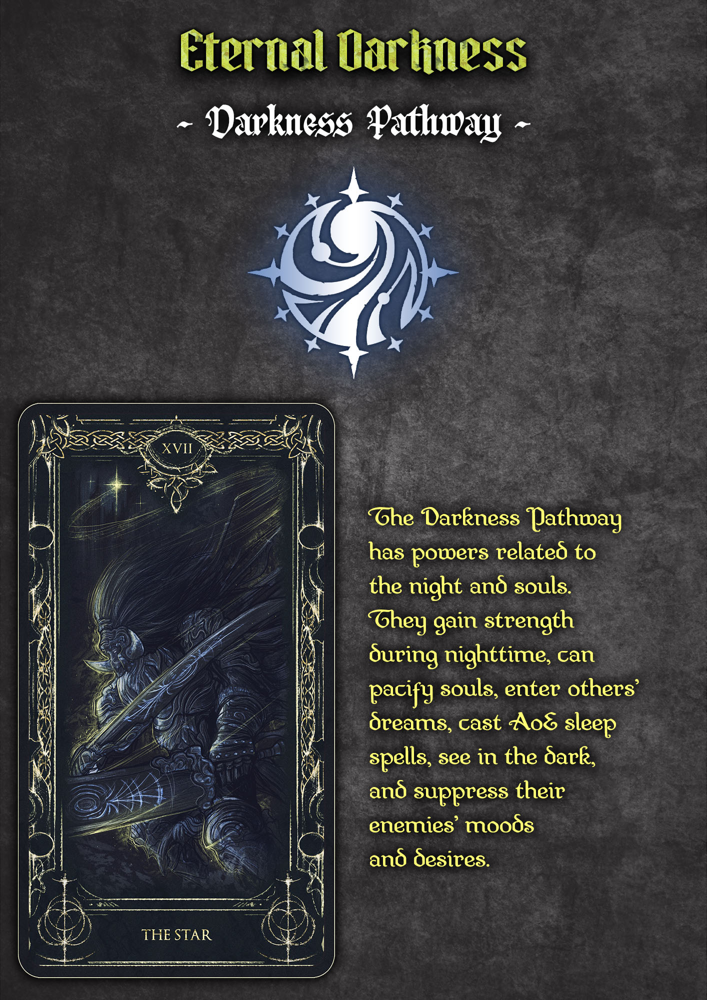
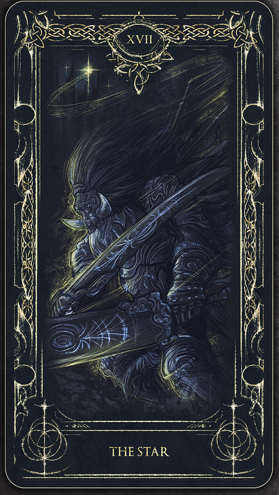

# Sleepless Pathway



## Metadata

Type: Pathway
Status: Active
First Mention Volume: 1
Current Analysis Status: Novel reveal timeline verified through Chapter 47; Donghua verification not started
Confidence Level: Strong Evidence
Spoiler Boundary: Volume 1
Reader Knowledge Boundary: Novel Chapter 47; Donghua Season 1
Tags: volume-1, reader-knowledge, pathway, faction
Last Updated: 2026-07-03

Related Threads:
- [Church of Evernight](../Factions/faction-church-of-evernight.md)
- [Dunn Smith](../Characters/character-dunn-smith.md)
- [Blackthorn Security Company](../Locations/location-blackthorn-security-company.md)
- [Beyonders](../Concepts/concept-beyonders.md)
- [Seer Pathway](pathway-seer.md)
- character-leonard-mitchell.md
- character-kenley-white.md
- character-royale-reideen.md
- character-seeka-tron.md

Related Investigations:
- [Sleepless Pathway Novel Volume 1 Reveal Timeline](../../Investigations/Pathways/pathway-sleepless/novel-volume-1-reveal-timeline.md)
- [Sleepless / Evernight Pathway Name Arbitration](../../Investigations/Pathways/pathway-sleepless/name-arbitration-sleepless-evernight.md)
- [Church of Evernight Volume 1 Reveal Timeline](../../Investigations/Factions/faction-church-of-evernight/novel-volume-1-reveal-timeline.md)
- [Dunn Smith Novel Volume 1 Reveal Timeline](../../Investigations/Characters/character-dunn-smith/novel-volume-1-reveal-timeline.md)
- [Blackthorn Security Company Novel Volume 1 Reveal Timeline](../../Investigations/Locations/location-blackthorn-security-company/novel-volume-1-reveal-timeline.md)

## Purpose

Track the Sleepless pathway as it is revealed to the reader through the Church of Evernight, including early term usage, known Sequence ladder, basic abilities, institutional access, and named Tingen team examples.

This page should preserve the pathway's reveal order. Later pathway names may appear only in the `Pathway Names / Reader Display Timeline` as inactive future-display rows until the reader boundary reaches them; higher Sequence structure and future reinterpretations should not be imported into the active Chapter 47 pathway content.

## Spoiler Boundary

This thread currently allows only Volume 1 knowledge up to Novel Chapter 47 and Donghua Season 1 knowledge after separate verification.

Later Sleepless pathway names, higher Sequences, deeper Church pathway lore, and later character-specific confirmations must not be added until the boundary is deliberately advanced.

## Reader Knowledge Boundary

- Novel Volume: 1
- Novel Chapter: 47
- Reader knowledge state: The reader knows `Sleepless` as the Church of Evernight's complete starting pathway for the Nighthawks, with `Sequence 9 Sleepless`, `Sequence 8 Midnight Poet`, and `Sequence 7 Nightmare` known by Chapter 22. The reader knows basic Sleepless traits, Leonard's Midnight Poet status, Dunn's confirmed pathway affiliation and strongly implied Nightmare status, and the Chapter 42 team snapshot placing Royale Reideen, Kenley White, and Seeka Tron on the same pathway ladder.
- Donghua: Season 1
- Donghua viewer knowledge state: Not yet verified for this pathway thread.

## Pathway Snapshot

- Current reader-safe status: The Church of Evernight's complete Nighthawks pathway route begins with `Sleepless` and is known through `Nightmare` at the current boundary.
- Institutional access status: The Church/Nighthawks regulate access to the pathway; Klein could wait for a future opening rather than choose an immediately available incomplete option.
- Known continuation status: The reader knows Sequence 9 through Sequence 7. Higher Sequences remain unknown at this boundary.
- Primary reader-facing function: Night, darkness, reduced sleep, physical endurance, intuition, mental capability, and sleep/dream-related operational effects.
- Main uncertainty: Dunn's exact `Nightmare` Sequence is strongly supported but not directly profile-confirmed through Chapter 47.

## Pathway Names / Reader Display Timeline

This pathway keeps `pathway-sleepless.md` as the stable slug while allowing future reader-boundary tooling to change the displayed title once later names become reader-safe.

| Name | Usage type | First reader-safe reveal | Display active range | Confidence | Notes |
| --- | --- | --- | --- | --- | --- |
| Sleepless Pathway | reader-display; early/common name | Novel Volume 1, Chapter 22; term appears earlier in Chapters 15 and 17 | Novel Volume 1, Chapter 22 through Novel Volume 2, Chapter 216 | confirmed | Current reader-safe title at Chapter 47; Church/Nighthawks-facing name for the known ladder before the exact `Evernight pathway` phrase becomes reader-safe. |
| Evernight association | implied reader-display / association | Novel Volume 1, Chapter 203 | Novel Volume 1, Chapter 203 through Novel Volume 2, Chapter 216 | strong evidence | Azik's letter uses Evernight-pathway wording and Klein ties Death/Corpse Collector interchangeability to the Sleepless pathway. A frontend may show this as an implied/associated name before switching the title fully. |
| Evernight Pathway | later reader-display; global/high-sequence name | Novel Volume 2, Chapter 217; Chapter 203 already links the pathway to Evernight wording | Novel Volume 2, Chapter 217 onward | confirmed | Exact phrase first appears in Chapter 217. Chapter 526 ties Nightmare effects to the Evernight pathway, and Chapter 530 explicitly pairs the Death and Evernight pathways as high-Sequence switch options. |
| Darkness Pathway | artwork-label; formal label | Official EPUB Volume 1 Pathways Guide | Not reader-display from main text; artwork/search alias | confirmed artwork label | Official pathway-guide artwork label; `darkness pathway` had zero main-text phrase hits in the arbitration check. |

## Associated Tarot Card

| Card image | Details |
| --- | --- |
| <a href="../../Artwork/tarot-cards/pathways/star-sleepless-pathway.png"></a> | <span style="font-size: 1.45em; font-weight: 700;">The Star</span><br><span style="font-size: 1.15em;">XVII (17)</span><br><br>- Associated pathway labels: Sleepless / Evernight / Darkness pathway<br>- Confidence: confirmed<br>- Notes: Derived from the official Volume 1 Darkness pathway guide image. |

## Associated Higher-Order Entities

| Entity | Page / target | Relationship layer | First reader-safe reveal | Status | Confidence | Notes |
| --- | --- | --- | --- | --- | --- | --- |
| Evernight Goddess | deity-s0-evernight-goddess.md | Sequence 0 / true god endpoint | Novel Volume 1, Chapter 28; official EPUB Volume 1 Pathways Guide | planned page; reader-safe deity association and official artwork association | confirmed / confirmed artwork | Dunn says Sleepless is the first complete Sequence the Goddess bestowed on the Nighthawks. The official Darkness pathway guide maps this route to the planned Evernight Goddess page. |
| Eternal Darkness | deity-ats-eternal-darkness.md | Above the Sequences / Great Old One title cluster | Official EPUB Volume 1 Pathways Guide | planned page; official artwork association | confirmed artwork | The artwork map links the Darkness/Sleepless/Evernight pathway group to Eternal Darkness. Preserve as later/pathway-cosmology scaffolding, not as active Chapter 47 novel knowledge. |

## First Appearance / First Meaningful Mention

### Novel

#### First Word-Level Mention

- Volume: 1
- Chapter: 15
- Context: Dunn jokes that even Sleepless are not immune to dry, boring old documents putting people to sleep.
- Reader knowledge state: `Sleepless` first appears as an unexplained term inside Nighthawk workplace conversation.

#### First Practical Character Example

- Volume: 1
- Chapter: 17
- Context: Rozanne recalls Leonard's first day after becoming a `Sleepless`, when he tried to rush down the stairs before mastering his new powers.
- Reader knowledge state: The reader can connect `Sleepless` to a concrete Nighthawk member and a potion/status change, but still lacks the Sequence ladder and ability profile.

#### First Formal Pathway Explanation

- Volume: 1
- Chapter: 22
- Context: Rozanne explains that the Church's complete Sequence starts with `Sequence 9 Sleepless`, then `Sequence 8 Midnight Poet`, then `Sequence 7 Nightmare`.
- Reader knowledge state: The reader now understands Sleepless as the start of a Church-held pathway ladder with named higher steps and basic abilities.

### Donghua

- Season: 1
- Episode: TBD
- Release order: TBD
- Timestamp: TBD
- Context: Requires Donghua subtitle and visual verification.
- Viewer knowledge state: Exact first mention, translation choice, and adaptation timing are not yet verified.

## Known Sequences

### Sequence 9: Sleepless

- First reader-safe reveal: Novel Volume 1, Chapter 22 formally explains `Sleepless` as the Church's complete starting Sequence; the term appears earlier in Chapters 15 and 17.
- Confidence: confirmed
- Formula / potion details: No formula or ingredient details recorded at the current boundary.
- Confirmed abilities or traits: Reduced sleep requirement, darkness vision, and stronger physical strength, intuition, and mental capabilities deeper into the night.
- Practical demonstrations: Chapter 33 uses Sleepless as a contrast for non-Sleepless exhaustion after Spirit Vision practice.
- Training or practice requirements: Leonard's Chapter 17 anecdote implies new Sleepless powers require adjustment, but no formal training method is recorded at this boundary.
- Limitations: The exact recovery advantage and the line between Sequence 9 traits and later Sequence traits remain unclear.
- Reader-safe unknowns: Potion formula details and how advancement slots open.
- Notes: Sequence 9 is the known starting point of the Church's complete Nighthawks pathway.

### Sequence 8: Midnight Poet

- First reader-safe reveal: Novel Volume 1, Chapter 21, when Leonard introduces himself as `Sequence 8's Midnight Poet`; Chapter 22 places Midnight Poet inside the Sleepless ladder.
- Confidence: confirmed
- Formula / potion details: No formula or ingredient details recorded at the current boundary.
- Confirmed abilities or traits: Sleep-like influence through singing is demonstrated, but the full Midnight Poet ability profile remains incomplete.
- Practical demonstrations: Leonard's Chapter 44 singing can induce sleep-like influence and leave targets rationalizing the effect afterward.
- Training or practice requirements: Not recorded at this boundary.
- Limitations: Exact full capabilities of Midnight Poet remain unknown.
- Reader-safe unknowns: Formula details, full ability set, and advancement history for known holders.
- Notes: Leonard is the reader's first named Sequence 8 example before the pathway ladder is formally explained.

### Sequence 7: Nightmare

- First reader-safe reveal: Novel Volume 1, Chapter 22, when Rozanne names `Nightmare` as Sequence 7.
- Confidence: confirmed for the Sequence name; strong evidence for Dunn's exact status.
- Formula / potion details: No formula or ingredient details recorded at the current boundary.
- Confirmed abilities or traits: Dream guidance/manipulation is strongly associated with Nightmare through Klein's inference about Dunn.
- Practical demonstrations: Dunn's earlier dream guidance supports the Nightmare inference.
- Training or practice requirements: Not recorded at this boundary.
- Limitations: Dunn's exact Sequence is not directly profile-confirmed through Chapter 47.
- Reader-safe unknowns: Full Nightmare ability set, formula details, and higher Sequences above Nightmare.
- Notes: Preserve the distinction between confirmed Sequence name and strong-evidence character assignment.

## Institutional Access

| Institution / faction | Access type | First reader-safe reveal | Confidence | Notes |
| --- | --- | --- | --- | --- |
| [Church of Evernight](../Factions/faction-church-of-evernight.md) / Nighthawks | Complete pathway route and regulated institutional access | Novel Volume 1, Chapter 22; expanded Chapter 28 | confirmed | Chapter 22 explains the ladder; Chapter 28 clarifies Sleepless as the complete first Sequence bestowed on the Nighthawks. |

## Affiliated Factions

| Faction / organization | Affiliation type | First reader-safe reveal | Confidence | Notes |
| --- | --- | --- | --- | --- |
| [Church of Evernight](../Factions/faction-church-of-evernight.md) | Parent institutional affiliation | Novel Volume 1, Chapter 22 | confirmed | Rozanne identifies Sleepless as the Church's complete starting Sequence. |
| faction-nighthawks.md | Complete operational route | Novel Volume 1, Chapter 28 | confirmed | Dunn clarifies Sleepless as the complete first Sequence bestowed on the Nighthawks. |
| Higher-level Church pathway structure | Unknown continuation context | Novel Volume 1, Chapter 22 | unknown | The reader does not know pathway structure above Sequence 7 at this boundary. |

## Known Holders

| Character | Status / Sequence | First reader-safe reveal | Confidence | Notes |
| --- | --- | --- | --- | --- |
| [Leonard Mitchell](../Characters/character-leonard-mitchell.md) | Sequence 8 Midnight Poet | Novel Volume 1, Chapter 21 | confirmed | Chapter 22 confirms Midnight Poet belongs to the Sleepless pathway. |
| [Dunn Smith](../Characters/character-dunn-smith.md) | Advanced Sleepless; Nightmare strongly implied | Novel Volume 1, Chapter 22; confirmed pathway Chapter 45 | confirmed pathway, strong evidence exact Sequence | Chapter 22 supports Nightmare inference; Chapter 45 confirms Dunn is an advanced Sleepless. |
| character-royale-reideen.md | Sequence 9 Sleepless | Novel Volume 1, Chapter 42 | confirmed | Identified in the Tingen deployment snapshot. |
| character-kenley-white.md | Sequence 9 Sleepless | Novel Volume 1, Chapter 42 | confirmed | Identified in the Tingen deployment snapshot. |
| character-seeka-tron.md | Sequence 8 Midnight Poet | Novel Volume 1, Chapter 42 | confirmed | Chapter 22 places Midnight Poet inside the Sleepless ladder. |

## Associated Uniqueness

Track the pathway's Uniqueness here when it becomes reader-safe. No Sleepless pathway Uniqueness information is reader-safe at the current boundary.

## Associated Mythical Creature

Track the pathway's associated mythical creature form here when it becomes reader-safe. No Sleepless pathway mythical creature information is reader-safe at the current boundary.

## Pathway Data Block

```yaml
pathway_profile:
  reader_boundary:
    medium: novel
    book: lotm-1
    volume: 1
    chapter: 47
  stable_slug: pathway-sleepless
  official_artwork:
    - image_number: 9
      label: Darkness pathway guide page
      type: pathway_guide
      file: Artwork/extracted/volume-1-clown/0009-spine-0223-pathways-pathways3.jpeg
      usage: primary_pathway_image
  associated_tarot_card:
    card_name: The Star
    card_number: XVII (17)
    source_image_number: 9
    crop_number: TC-003
    crop_file: Artwork/tarot-cards/pathways/star-sleepless-pathway.png
    confidence: confirmed
    notes: Derived from the official Volume 1 Darkness pathway guide page.
  associated_higher_order_entities:
    - display_name: Evernight Goddess
      entity: deity-s0-evernight-goddess
      relationship_layer: sequence_0
      reveal:
        medium: novel
        volume: 1
        chapter: 28
      status: planned_page_reader_safe_deity_association
      confidence: confirmed
      notes: Dunn says Sleepless is the first complete Sequence the Goddess bestowed on the Nighthawks; official artwork also maps the Darkness pathway guide to the Evernight Goddess page.
    - display_name: Eternal Darkness
      entity: deity-ats-eternal-darkness
      relationship_layer: ats
      reveal:
        medium: official-epub-artwork
        volume: 1
        chapter: artwork-image-9
      status: planned_page_official_artwork_association
      confidence: confirmed_artwork
      notes: Official pathway guide/map links the Darkness/Sleepless/Evernight pathway group to Eternal Darkness.
  name_timeline:
    - name: Sleepless Pathway
      usage_type: "reader-display; early-common-name"
      reveal:
        medium: novel
        volume: 1
        chapter: 22
      display_active:
        from: novel-volume-1-chapter-22
        until: novel-volume-2-chapter-216
      confidence: confirmed
      display_behavior:
        primary_title: true
        hint_label: null
      notes: Term appears earlier in Chapters 15 and 17, but Chapter 22 formally explains it as the Church's complete starting Sequence. Use as the reader-facing display name until the exact Evernight pathway phrase becomes reader-safe in Chapter 217.
    - name: Evernight association
      usage_type: "implied-reader-display; association"
      reveal:
        medium: novel
        volume: 1
        chapter: 203
      display_active:
        from: novel-volume-1-chapter-203
        until: novel-volume-2-chapter-216
      confidence: strong-evidence
      display_behavior:
        primary_title: false
        hint_label: implied Evernight association
      notes: Azik's letter uses Evernight-pathway wording and Klein ties Death/Corpse Collector interchangeability to the Sleepless pathway. Future UI can show this as an implied or associated name while keeping Sleepless as the main title until Chapter 217.
    - name: Evernight Pathway
      usage_type: "later-reader-display; global-pathway-name"
      reveal:
        medium: novel
        volume: 2
        chapter: 217
      display_active:
        from: novel-volume-2-chapter-217
        until: null
      confidence: confirmed-full-book-term
      display_behavior:
        primary_title: true
        hint_label: null
      notes: Chapter 203 first makes Evernight wording reader-safe for this route, but Chapter 217 is the first exact Evernight pathway phrase. Later Chapters 526 and 530 confirm the term as the umbrella label for Nightmare/Sleepless-related effects and high-Sequence switching.
    - name: Darkness Pathway
      usage_type: "artwork-label; formal-label"
      reveal:
        medium: official-epub-artwork
        volume: 1
        chapter: null
      display_active:
        from: null
        until: null
      confidence: confirmed-artwork-label
      display_behavior:
        primary_title: false
        hint_label: official artwork label
      notes: Official pathway-guide artwork label; the exact phrase darkness pathway had zero main-text hits in the arbitration check.
  sequences:
    - sequence: 9
      name: Sleepless
      reveal:
        medium: novel
        volume: 1
        chapter: 22
      confidence: confirmed
      formula_details:
        - No formula or ingredient details recorded at the current boundary.
      ability_profile:
        confirmed_traits:
          - reduced sleep requirement
          - darkness vision
          - stronger physical strength, intuition, and mental capabilities deeper into the night
        practical_demonstrations:
          - Chapter 33 uses Sleepless as a contrast for non-Sleepless exhaustion after Spirit Vision practice.
        training_or_practice:
          - Leonard's Chapter 17 anecdote implies new Sleepless powers require adjustment.
        limitations:
          - Exact recovery advantage and division between Sequence 9 and later traits remain unclear.
        unknowns:
          - potion formula details
          - how advancement slots open
      notes: Term appears earlier, but Chapter 22 formally explains it as the Church's complete starting Sequence.
    - sequence: 8
      name: Midnight Poet
      reveal:
        medium: novel
        volume: 1
        chapter: 21
      confidence: confirmed
      formula_details:
        - No formula or ingredient details recorded at the current boundary.
      ability_profile:
        confirmed_traits:
          - sleep-like influence through singing
        practical_demonstrations:
          - Leonard's Chapter 44 singing induces sleep-like influence and later rationalization.
        training_or_practice:
          - Not recorded at this boundary.
        limitations:
          - Exact full capabilities of Midnight Poet remain unknown.
        unknowns:
          - formula details
          - full ability set
          - advancement history for known holders
      notes: Leonard names himself as Sequence 8; Chapter 22 places Midnight Poet in the Sleepless ladder.
    - sequence: 7
      name: Nightmare
      reveal:
        medium: novel
        volume: 1
        chapter: 22
      confidence: confirmed
      formula_details:
        - No formula or ingredient details recorded at the current boundary.
      ability_profile:
        confirmed_traits:
          - dream guidance/manipulation is strongly associated with Nightmare through Klein's inference about Dunn
        practical_demonstrations:
          - Dunn's earlier dream guidance supports the Nightmare inference.
        training_or_practice:
          - Not recorded at this boundary.
        limitations:
          - Dunn's exact Sequence is not directly profile-confirmed through Chapter 47.
        unknowns:
          - full Nightmare ability set
          - formula details
          - higher Sequences above Nightmare
      notes: The Sequence name is confirmed; Dunn's exact status remains strong evidence rather than direct profile confirmation.
  institutional_access:
    - faction: faction-church-of-evernight
      access_type: complete-route
      reveal:
        medium: novel
        volume: 1
        chapter: 22
      confidence: confirmed
      notes: Chapter 28 clarifies Sleepless as the complete first Sequence bestowed on the Nighthawks.
  affiliated_factions:
    - faction: faction-church-of-evernight
      affiliation_type: parent-institutional-affiliation
      reveal:
        medium: novel
        volume: 1
        chapter: 22
      confidence: confirmed
      notes: Rozanne identifies Sleepless as the Church's complete starting Sequence.
    - faction: faction-nighthawks
      affiliation_type: complete-operational-route
      reveal:
        medium: novel
        volume: 1
        chapter: 28
      confidence: confirmed
      notes: Dunn clarifies Sleepless as the complete first Sequence bestowed on the Nighthawks.
    - faction: higher-level-church-pathway-structure
      affiliation_type: unknown-continuation-context
      reveal:
        medium: novel
        volume: 1
        chapter: 22
      confidence: unknown
      notes: The reader does not know pathway structure above Sequence 7 at this boundary.
  known_holders:
    - character: character-leonard-mitchell
      status: Sequence 8 Midnight Poet
      sequence: 8
      sequence_name: Midnight Poet
      reveal:
        medium: novel
        volume: 1
        chapter: 21
      confidence: confirmed
      notes: Chapter 22 connects Midnight Poet to Sleepless.
    - character: character-dunn-smith
      status: Advanced Sleepless; Nightmare strongly implied
      sequence: 7
      sequence_name: Nightmare
      reveal:
        medium: novel
        volume: 1
        chapter: 22
      confidence: strong-evidence
      notes: Chapter 45 confirms Dunn is an advanced Sleepless; exact Sequence remains not directly profile-confirmed.
    - character: character-royale-reideen
      status: Sequence 9 Sleepless
      sequence: 9
      sequence_name: Sleepless
      reveal:
        medium: novel
        volume: 1
        chapter: 42
      confidence: confirmed
      notes: Identified in the Tingen team deployment snapshot.
    - character: character-kenley-white
      status: Sequence 9 Sleepless
      sequence: 9
      sequence_name: Sleepless
      reveal:
        medium: novel
        volume: 1
        chapter: 42
      confidence: confirmed
      notes: Identified in the Tingen team deployment snapshot.
    - character: character-seeka-tron
      status: Sequence 8 Midnight Poet
      sequence: 8
      sequence_name: Midnight Poet
      reveal:
        medium: novel
        volume: 1
        chapter: 42
      confidence: confirmed
      notes: Chapter 22 places Midnight Poet inside the Sleepless ladder.
  associated_uniqueness:
    reader_safe_name: null
    reveal: null
    status: unknown
    dedicated_article: null
    holder_or_accommodation_state: null
    related_deity: null
    related_ats_formula: null
    notes: No Sleepless pathway Uniqueness information is reader-safe at the current boundary.
  associated_mythical_creature:
    reader_safe_name: null
    reveal: null
    status: unknown
    dedicated_article: null
    notes: No Sleepless pathway mythical creature information is reader-safe at the current boundary.
```

## Chronological Development

### Novel

#### Chapter 15: First Loose Term

- What the reader learns: Dunn uses `Sleepless` casually while explaining why the Nighthawks need someone with historical and archaeological education.
- What changes: The term enters the reader's vocabulary before its formal meaning is explained.
- What remains unknown: Whether Sleepless is a pathway, rank, job role, or informal nickname remains unclear.
- Why it matters: The first mention is deliberately low-context, matching the reader's early partial understanding of Nighthawk terminology.

#### Chapter 17: Leonard as First Practical Example

- What the reader learns: Rozanne says Leonard had trouble on the stairs on his first day after becoming a `Sleepless`.
- What changes: Sleepless becomes tied to a person, potion-like status change, and new powers that require adjustment.
- What remains unknown: Leonard's exact Sequence, the ability set, and the pathway ladder remain unknown.
- Why it matters: The pathway first becomes concrete through workplace anecdote rather than exposition.

#### Chapter 21: Leonard Identifies as Midnight Poet

- What the reader learns: Leonard introduces himself as `Sequence 8's Midnight Poet`.
- What changes: Leonard is no longer only linked to Sleepless by Rozanne's anecdote; he now has a named Sequence 8 status.
- What remains unknown: Whether Midnight Poet belongs to the Sleepless chain is not confirmed until Chapter 22.
- Why it matters: This sets up the reveal that the Church's complete pathway is a ladder rather than a single potion name.

#### Chapter 22: Church Pathway Ladder and Abilities

- What the reader learns: Rozanne explains the Church's complete known pathway as `Sequence 9 Sleepless`, `Sequence 8 Midnight Poet`, and `Sequence 7 Nightmare`. She says Sleepless need only three to four hours of rest during the day, can see through darkness without lights, and become stronger deeper into the night in physical strength, intuition, and mental capabilities.
- What changes: The reader can now connect Leonard's Midnight Poet title to Sleepless and can strongly infer Dunn's association with Nightmare because Klein remembers Dunn guiding his dreams.
- What remains unknown: Higher Sequences above Nightmare, exact full capabilities of Midnight Poet and Nightmare, and Dunn's precise Sequence statement remain incomplete.
- Why it matters: Chapter 22 is the pathway's first real information payload: ladder, abilities, Church ownership, and character mapping.

#### Chapter 28: Complete Church Route Versus Incomplete Options

- What the reader learns: Dunn says Klein can give up his immediate chance and wait until there is sufficient room to become a `Sleepless`, which he calls the first complete Sequence the Goddess bestowed on the Nighthawks. He contrasts that with the locally available incomplete options `Mystery Pryer`, `Corpse Collector`, and `Seer`.
- What changes: Sleepless becomes the Church/Nighthawks' complete institutional route rather than only a named ladder.
- What remains unknown: How slots open, what formal-team constraints control access, and whether Klein could realistically wait for Sleepless remain unclear.
- Why it matters: This distinguishes pathway access from pathway knowledge: the Church knows the route, but institutional capacity governs who can take it.

#### Chapter 33: Contrast With Non-Sleepless Exhaustion

- What the reader learns: Old Neil reminds Klein that they are not Sleepless after Spirit Vision practice exhausts him.
- What changes: The pathway's reduced-sleep endurance becomes a practical contrast with Seer training fatigue.
- What remains unknown: How much recovery advantage belongs to Sequence 9 Sleepless versus later steps remains unclear.
- Why it matters: Sleepless remains relevant as a benchmark even after Klein chooses another pathway.

#### Chapter 42: Team Snapshot

- What the reader learns: Rozanne's staffing snapshot names Royale Reideen and Kenley White as `Sleepless`, and Seeka Tron as a `Midnight Poet`.
- What changes: Sleepless becomes a visible team-distribution pattern rather than only Leonard/Dunn context.
- What remains unknown: Complete roster details, individual ability profiles, and exact advancement history for each team member remain unknown.
- Why it matters: The pathway is shown as the Nighthawks' local backbone, distributed across police assistance, leave, Chanis Gate guarding, and cemetery patrol.

#### Chapters 44-45: Leonard's Abilities and Dunn's Confirmed Pathway Affiliation

- What the reader learns: Leonard's singing can lull targets into sleep-like influence and leave them rationalizing the effect afterward. Leonard also calls Dunn an advanced Sleepless who needs only two hours of sleep during the day.
- What changes: Midnight Poet gains a first practical ability expression, and Dunn's membership in the Sleepless pathway is confirmed more directly than the Chapter 22 Nightmare inference.
- What remains unknown: Whether Dunn's exact Sequence should be treated as confirmed remains unresolved; `Nightmare` is strongly supported, but the current boundary still lacks a direct Dunn profile statement.
- Why it matters: The pathway becomes operational in the Elliott case and strengthens the reader's character-to-pathway mapping.

### Donghua

#### Season 1: Foundation Pending

- Timestamp: TBD
- What the viewer learns: Not yet verified.
- What changes: Not yet verified.
- What remains unknown: Exact first mention, translation choices for Sequence names, visual presentation, and adaptation timing.
- Why it matters: The Donghua may emphasize pathway identity through visuals, cards, or condensed dialogue differently from the novel.

## Open Questions

- Question: Should Dunn's exact `Nightmare` Sequence be treated as confirmed or strong evidence through Chapter 47?
- Current confidence: Strong Evidence. Chapter 22 links Dunn's dream guidance to `Nightmare`; Chapter 45 confirms Dunn is an advanced Sleepless; however, the current boundary still lacks a direct "Dunn is Sequence 7 Nightmare" profile statement.
- Needs EPUB verification: Completed through Chapter 47
- Related investigation: [Sleepless Pathway Novel Volume 1 Reveal Timeline](../../Investigations/Pathways/pathway-sleepless/novel-volume-1-reveal-timeline.md)

- Question: Should Leonard, Royale, Kenley, and Seeka become character pages before the Church arc advances further?
- Current confidence: Working Theory. Their pathway statuses are now useful graph nodes, but dedicated character pages should still be created only when selected or naturally required by the next investigation.
- Needs EPUB verification: Later character-specific sweeps
- Related investigation: [Sleepless Pathway Novel Volume 1 Reveal Timeline](../../Investigations/Pathways/pathway-sleepless/novel-volume-1-reveal-timeline.md)

## Related Threads

### Directly Related

- [Church of Evernight](../Factions/faction-church-of-evernight.md)
- [Dunn Smith](../Characters/character-dunn-smith.md)
- [Blackthorn Security Company](../Locations/location-blackthorn-security-company.md)
- [Beyonders](../Concepts/concept-beyonders.md)
- character-leonard-mitchell.md
- character-kenley-white.md
- character-royale-reideen.md
- character-seeka-tron.md

### Historical Connections

-

### Associated Mysteries

-

### Associated Artifacts

-

### Associated Factions

- [Church of Evernight](../Factions/faction-church-of-evernight.md)
- faction-nighthawks.md

### Associated Characters

- [Dunn Smith](../Characters/character-dunn-smith.md)
- character-leonard-mitchell.md
- character-kenley-white.md
- character-royale-reideen.md
- character-seeka-tron.md

### Associated Pathways

- [Seer Pathway](pathway-seer.md)
- pathway-mystery-pryer.md
- pathway-corpse-collector.md

## Relationship Seeds

```yaml
relationships:
  - source: pathway-sleepless
    target: tarot-card-the-star
    relationship_type: associated-tarot-card
    start:
      medium: official-epub-artwork
      volume: 1
      chapter: artwork-image-9
    status: active
    confidence: confirmed
    notes: Official Darkness pathway guide artwork associates the Sleepless/Evernight/Darkness pathway with The Star / XVII card; crop TC-003 preserves the card image.
  - source: pathway-sleepless
    target: deity-s0-evernight-goddess
    relationship_type: associated-sequence-0
    start:
      medium: novel
      volume: 1
      chapter: 28
    status: active
    confidence: confirmed
    notes: Dunn says Sleepless is the first complete Sequence the Goddess bestowed on the Nighthawks; official Darkness pathway guide artwork also maps this pathway to the Evernight Goddess page.
  - source: pathway-sleepless
    target: deity-ats-eternal-darkness
    relationship_type: associated-ats
    start:
      medium: official-epub-artwork
      volume: 1
      chapter: artwork-image-9
    status: active
    confidence: confirmed-artwork
    notes: Official Darkness pathway guide/map associates the Sleepless/Evernight/Darkness pathway group with the Eternal Darkness ATS title cluster.
  - source: faction-church-of-evernight
    target: pathway-sleepless
    relationship_type: regulates-access-to
    start:
      medium: novel
      volume: 1
      chapter: 22
    status: active
    confidence: confirmed
    notes: Rozanne identifies Sleepless as the start of the Church's complete pathway, and Chapter 28 clarifies it as the complete first Sequence bestowed on the Nighthawks.
  - source: pathway-sleepless
    target: concept-beyonders
    relationship_type: access-route-to
    start:
      medium: novel
      volume: 1
      chapter: 22
    status: active
    confidence: confirmed
    notes: Sleepless is a Sequence 9 potion/pathway route for becoming a Beyonder within the Church of Evernight's complete Nighthawks chain.
  - source: character-leonard-mitchell
    target: pathway-sleepless
    relationship_type: pathway-status
    start:
      medium: novel
      volume: 1
      chapter: 21
    status: active
    confidence: confirmed
    notes: Leonard introduces himself as Sequence 8 Midnight Poet; Chapter 22 places Midnight Poet in the Sleepless pathway.
  - source: character-dunn-smith
    target: pathway-sleepless
    relationship_type: pathway-status
    start:
      medium: novel
      volume: 1
      chapter: 22
    status: active
    confidence: confirmed
    notes: Chapter 22 strongly implies Dunn's Nightmare association, and Chapter 45 confirms him as an advanced Sleepless. Exact Sequence remains strong evidence rather than direct profile confirmation.
  - source: character-royale-reideen
    target: pathway-sleepless
    relationship_type: pathway-status
    start:
      medium: novel
      volume: 1
      chapter: 42
    status: active
    confidence: confirmed
    notes: Chapter 42 identifies Royale Reideen as a Sleepless while describing the Tingen team's current deployment.
  - source: character-kenley-white
    target: pathway-sleepless
    relationship_type: pathway-status
    start:
      medium: novel
      volume: 1
      chapter: 42
    status: active
    confidence: confirmed
    notes: Chapter 42 identifies Kenley White as a Sleepless while describing the Tingen team's current deployment.
  - source: character-seeka-tron
    target: pathway-sleepless
    relationship_type: pathway-status
    start:
      medium: novel
      volume: 1
      chapter: 42
    status: active
    confidence: confirmed
    notes: Chapter 42 identifies Seeka Tron as a Midnight Poet, which Chapter 22 places in the Sleepless pathway.
  - source: pathway-sleepless
    target: pathway-seer
    relationship_type: connected-to
    start:
      medium: novel
      volume: 1
      chapter: 28
    status: active
    confidence: confirmed
    notes: Dunn frames Sleepless as the complete Nighthawks route Klein could wait for, while Seer is one of the incomplete options Klein can choose immediately.
```

## Evidence Index

- Novel Chapters: 15, 17, 21-22, 28, 33, 42, 44-45
- Donghua Episodes: TBD

## Reader Knowledge Ledger

### Knowledge Unit: Sleepless First Appears as Unexplained Nighthawk Vocabulary

```yaml
id: sleepless-first-word-level-reference
claim: Sleepless first appears as an unexplained term in Dunn's Chapter 15 recruitment conversation.
truth_status: true
confidence_level: confirmed
canon_scope: novel
occurs_at:
  medium: novel
  book: lotm-1
  volume: 1
  chapter: 15
  notes: Dunn jokes that boring documents put people to sleep even if they are Sleepless.
tags:
  - volume-1
  - reader-knowledge
  - reveal-order
  - pathway
disclosures:
  - medium: novel
    knowledge_state: open-question
    disclosure_type: first-mention
    available_from:
      book: lotm-1
      volume: 1
      chapter: 15
    superseded_at:
      book: lotm-1
      volume: 1
      chapter: 22
    superseded_by: sleepless-church-complete-pathway-ladder
adaptation_relationships:
  - type: pending
    novel_claim_changed: false
    notes: Donghua timing not yet verified.
related_investigations:
  - ../../Investigations/Pathways/pathway-sleepless/novel-volume-1-reveal-timeline.md
related_boards:
last_updated: 2026-07-02
```

#### Reader-State History

- Chapter 15 gives the term without explaining whether it is a pathway, rank, or nickname.
- Chapter 17 makes it a practical Nighthawk status through Leonard.
- Chapter 22 resolves the term into a formal Sequence 9 pathway name.

#### Adaptation Analysis

- Donghua comparison is pending.

### Knowledge Unit: Church Complete Pathway Ladder

```yaml
id: sleepless-church-complete-pathway-ladder
claim: The Church of Evernight's complete known pathway begins with Sequence 9 Sleepless, followed by Sequence 8 Midnight Poet and Sequence 7 Nightmare.
truth_status: true
confidence_level: confirmed
canon_scope: novel
occurs_at:
  medium: novel
  book: lotm-1
  volume: 1
  chapter: 22
  notes: Rozanne explains the ladder through Sequence 7 and its basic Sequence 9 traits.
tags:
  - volume-1
  - reader-knowledge
  - reveal-order
  - pathway
  - faction
disclosures:
  - medium: novel
    knowledge_state: confirmed-fact
    disclosure_type: explicit-reveal
    available_from:
      book: lotm-1
      volume: 1
      chapter: 22
    superseded_at:
    superseded_by:
  - medium: novel
    knowledge_state: expanded-fact
    disclosure_type: expansion
    available_from:
      book: lotm-1
      volume: 1
      chapter: 28
    superseded_at:
    superseded_by:
adaptation_relationships:
  - type: pending
    novel_claim_changed: false
    notes: Donghua timing not yet verified.
related_investigations:
  - ../../Investigations/Pathways/pathway-sleepless/novel-volume-1-reveal-timeline.md
  - ../../Investigations/Factions/faction-church-of-evernight/novel-volume-1-reveal-timeline.md
related_boards:
last_updated: 2026-07-02
```

#### Reader-State History

- Chapter 22 gives the first explicit ladder and basic Sleepless ability profile.
- Chapter 28 clarifies that this is the complete Church/Nighthawks route, distinct from the incomplete pathways Klein can choose immediately.

#### Adaptation Analysis

- Donghua comparison is pending.

### Knowledge Unit: Leonard Is a Midnight Poet

```yaml
id: sleepless-leonard-midnight-poet
claim: Leonard Mitchell is a Sequence 8 Midnight Poet, placing him in the Sleepless pathway once the Chapter 22 ladder is known.
truth_status: true
confidence_level: confirmed
canon_scope: novel
occurs_at:
  medium: novel
  book: lotm-1
  volume: 1
  chapter: 21
  notes: Leonard introduces himself as Sequence 8 Midnight Poet; Chapter 22 connects Midnight Poet to the Sleepless pathway.
tags:
  - volume-1
  - reader-knowledge
  - reveal-order
  - pathway
  - character
disclosures:
  - medium: novel
    knowledge_state: confirmed-fact
    disclosure_type: explicit-reveal
    available_from:
      book: lotm-1
      volume: 1
      chapter: 21
    superseded_at:
    superseded_by:
  - medium: novel
    knowledge_state: expanded-fact
    disclosure_type: context-link
    available_from:
      book: lotm-1
      volume: 1
      chapter: 22
    superseded_at:
    superseded_by:
adaptation_relationships:
  - type: pending
    novel_claim_changed: false
    notes: Donghua timing not yet verified.
related_investigations:
  - ../../Investigations/Pathways/pathway-sleepless/novel-volume-1-reveal-timeline.md
related_boards:
last_updated: 2026-07-02
```

#### Reader-State History

- Chapter 17 links Leonard to Sleepless as a broad status.
- Chapter 21 names his Sequence 8 title.
- Chapter 22 places that title inside the Sleepless ladder.
- Chapter 44 shows a first practical expression of Leonard's singing/sleep influence.

#### Adaptation Analysis

- Donghua comparison is pending.

### Knowledge Unit: Dunn Is Confirmed on the Sleepless Pathway

```yaml
id: sleepless-dunn-pathway-affiliation
claim: Dunn Smith is on the Sleepless pathway, with Nightmare strongly implied but not directly profile-confirmed through Chapter 47.
truth_status: true
confidence_level: confirmed
canon_scope: novel
occurs_at:
  medium: novel
  book: lotm-1
  volume: 1
  chapter: 45
  notes: Chapter 22 strongly implies Nightmare; Chapter 45 has Leonard call Dunn an advanced Sleepless.
tags:
  - volume-1
  - reader-knowledge
  - reveal-order
  - pathway
  - character
disclosures:
  - medium: novel
    knowledge_state: strong-inference
    disclosure_type: inference
    available_from:
      book: lotm-1
      volume: 1
      chapter: 22
    superseded_at:
      book: lotm-1
      volume: 1
      chapter: 45
    superseded_by: sleepless-dunn-pathway-affiliation
  - medium: novel
    knowledge_state: confirmed-fact
    disclosure_type: confirmation
    available_from:
      book: lotm-1
      volume: 1
      chapter: 45
    superseded_at:
    superseded_by:
adaptation_relationships:
  - type: pending
    novel_claim_changed: false
    notes: Donghua timing not yet verified.
related_investigations:
  - ../../Investigations/Pathways/pathway-sleepless/novel-volume-1-reveal-timeline.md
  - ../../Investigations/Characters/character-dunn-smith/novel-volume-1-reveal-timeline.md
related_boards:
last_updated: 2026-07-02
```

#### Reader-State History

- Chapter 12-13 show Dunn entering/guiding Klein's dream before the reader knows the ladder.
- Chapter 22 connects dream-related capability to `Nightmare` and implies Dunn's Sequence 7 status.
- Chapter 45 confirms Dunn is an advanced Sleepless, strengthening the pathway-status claim while preserving the exact-Sequence boundary.

#### Adaptation Analysis

- Donghua comparison is pending.

### Knowledge Unit: Tingen Team Includes Multiple Sleepless Pathway Members

```yaml
id: sleepless-tingen-team-distribution
claim: By Chapter 42, the reader knows several Tingen Nighthawks occupy Sleepless-pathway positions, including Royale Reideen, Kenley White, and Seeka Tron.
truth_status: true
confidence_level: confirmed
canon_scope: novel
occurs_at:
  medium: novel
  book: lotm-1
  volume: 1
  chapter: 42
  notes: The team deployment snapshot identifies Royale and Kenley as Sleepless and Seeka as Midnight Poet.
tags:
  - volume-1
  - reader-knowledge
  - reveal-order
  - pathway
  - faction
  - character
disclosures:
  - medium: novel
    knowledge_state: confirmed-fact
    disclosure_type: expansion
    available_from:
      book: lotm-1
      volume: 1
      chapter: 42
    superseded_at:
    superseded_by:
adaptation_relationships:
  - type: pending
    novel_claim_changed: false
    notes: Donghua timing not yet verified.
related_investigations:
  - ../../Investigations/Pathways/pathway-sleepless/novel-volume-1-reveal-timeline.md
  - ../../Investigations/Locations/location-blackthorn-security-company/novel-volume-1-reveal-timeline.md
related_boards:
last_updated: 2026-07-02
```

#### Reader-State History

- Chapter 42 turns the pathway from a few named examples into a visible part of the Tingen team's staffing pattern.
- The same chapter reinforces the Nighthawks' thin staffing and rotating operational duties.

#### Adaptation Analysis

- Donghua comparison is pending.

## Future Automation Notes

- This pathway page should help test graph extraction for pathway-status relationships involving pending character nodes.
- The `Pathway Data Block` should remain aligned with the pathway snapshot sections, relationship seeds, and reader knowledge ledger.

## Notes

- Pilot pathway page for testing a non-protagonist pathway with multiple character edges, institutional access, and partial Sequence confidence.
