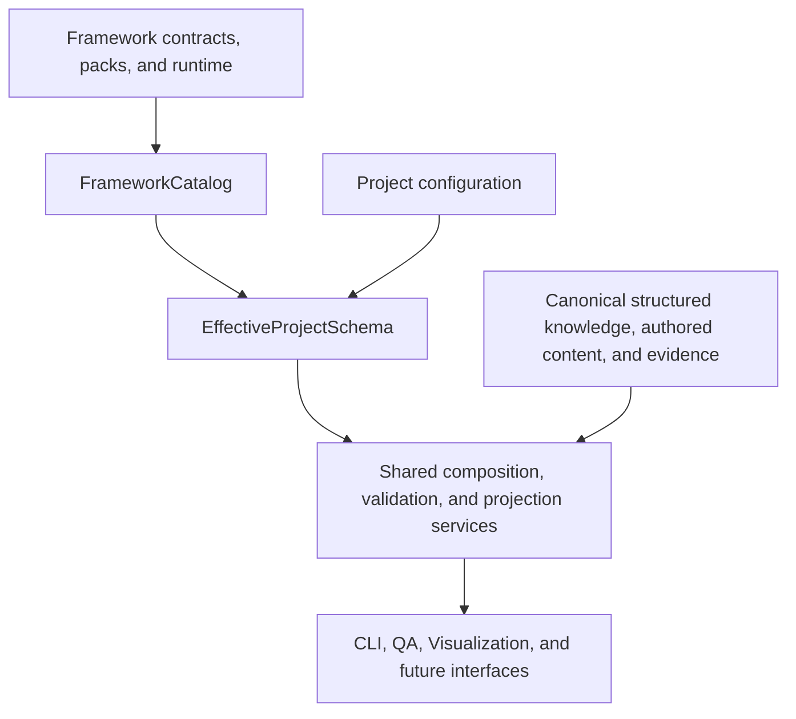
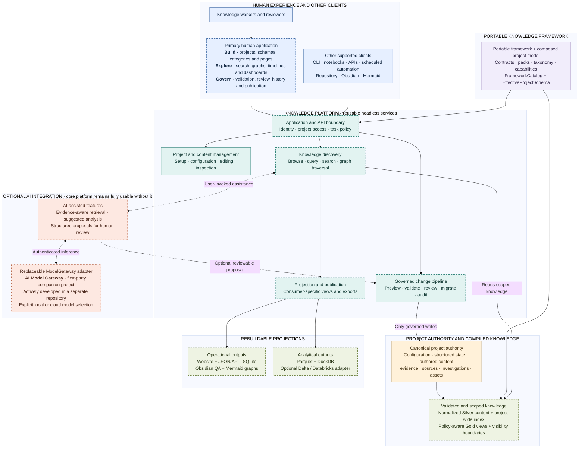

# Knowledge Framework And Platform

This repository develops a reusable, schema-driven framework and supporting platform for building
evidence-aware, temporally bounded knowledge systems across narrative, technical, legal, medical,
and other domains.

The first reference implementation is a spoiler-aware **Lord of the Mysteries** knowledge base. It
acts as both a real analysis project and a proving ground for source authority, chronology,
identity, reader knowledge, adaptation comparison, structured relationships, authored prose, QA,
and visualization.

## What This Repository Builds

| Layer | Responsibility |
| --- | --- |
| **Knowledge framework** | Portable contracts, schema packs, controlled vocabulary, registries, loaders, conformance suites, and reusable semantic services. |
| **Knowledge platform** | Catalog and project-schema composition, inspection, validation, QA, visualization, compatibility, and the planned mutation, migration, packaging, and interface services built over the framework. |
| **LoTM reference project** | Project configuration, canonical structured knowledge, authored analysis, evidence, source policy, artwork, investigations, and spoiler-aware projections used to exercise the framework and platform against real content. |

The framework is intended to remain free of LoTM-specific vocabulary and paths. LoTM configuration
and content consume the framework in the same way that future IT or other domain projects should.

## Current Status

The repository is under active architectural development.

### Implemented

- The portable semantic kernel has been developed and pressure-tested through framework V50.
- Platform Phases 1 through 3 are complete.
- `FrameworkCatalog` inventories installed packs independently of any project.
- `EffectiveProjectSchema` composes one project's selected packs, capabilities, taxonomy, resources,
  and diagnostics.
- `FrameworkCatalogProjectView` attaches project state to the catalog without mutating either
  source view.
- QA and Visualization consume the same effective project schema while retaining legacy
  Markdown/YAML content adapters.
- Python, PowerShell 7, and Windows PowerShell 5.1 conformance and compatibility coverage protect
  the repository's paired-runtime contracts.
- The reusable kernel has passed an isolated extraction rehearsal without LoTM content or
  configuration.

### Current Work

Platform Phase 4 is reconciling the existing LoTM templates and pages with reusable field, module,
authored-content, default, rendering, and validation contracts. The current
[Page Schema Discovery Inventory](Framework/page-schema-discovery-inventory.md) records evidence and
conflicts for maintainer review; it is not itself canonical schema.

Structured knowledge and human-authored prose are separate first-class canonical content surfaces.
Presentation and maintainer guidance remain distinct from both. Phase 4 preserves the existing LoTM
pages, templates, Relationship Seeds, QA behavior, and Visualization behavior while those logical
contracts are established.

### Not Yet Complete

- The project-wide normalized content index and generalized relationship model are planned work.
- QA graph construction has not yet been fully consolidated into one reusable Visualization engine.
- Persisted page IDs, mutation planning, migrations, project packaging, and category/page editors
  remain future platform phases.
- Streamlit is a planned client, not an implemented architecture layer.
- The isolated kernel is ready to copy and exercise, but the complete platform is not yet ready to
  split into its final standalone repository.
- No IT, medical, or legal schema pack is currently implemented; the IT proof of concept remains a
  later platform phase.

See [Extraction Readiness](Framework/extraction_readiness.md) for the proven portable boundary and
its current limits.

## Current Architecture



Canonical framework files, project configuration, structured knowledge, authored content, and
evidence own durable meaning. Catalogs, effective schemas, reports, Obsidian exports, graphs, and
future interface views are generated or diagnostic projections and must not become competing
sources of truth.

The authoritative component and dependency boundaries are defined in the
[Architecture Contract](ARCHITECTURE.md).

## Eventual Platform Architecture

The current foundation is intended to grow into the complete knowledge platform below. Dashed
nodes represent planned platform capabilities, dotted nodes represent optional integrations, and
generated projections remain rebuildable rather than becoming competing sources of truth. The
human application and headless services remain fully usable without enabling AI integration.



## Explore The Repository

| Goal | Start here |
| --- | --- |
| Understand the reusable framework | [Framework overview](Framework/README.md) |
| Understand architectural ownership | [Architecture Contract](ARCHITECTURE.md) |
| See the phased platform roadmap | [Platform Implementation Plan](Framework/platform-implementation-plan.md) |
| Review completed platform work | [Platform Evolution History](Framework/platform_evolution.md) |
| Review framework versions and pressure tests | [Framework Evolution History](Framework/framework_evolution.md) |
| Understand the test lifecycle | [Framework Testing Methodology](Framework/testing_methodology.md) |
| Browse LoTM content | [Project Index](INDEX.md) |
| Review current LoTM work | [Current State](CURRENT_STATE.md) |
| Inspect graphs and graph rules | [Visualization](Visualization/README.md) |
| Use repository tools | [Tooling Reference](Tools/TOOLING_REFERENCE.md) |

## Framework And Platform Documentation

Maintainer framework/schema iterations enter through the
[Framework Improvement Lifecycle](Framework/framework_improvement_lifecycle.md). The
[Framework Testing Methodology](Framework/testing_methodology.md) owns cumulative conformance,
compatibility, parity, pressure-scenario, comparison, and test-retention requirements. Numbered
semantic/model versions and their pressure-test history live in the
[Framework Evolution History](Framework/framework_evolution.md).

The [Platform Implementation Plan](Framework/platform-implementation-plan.md) owns the ordered
execution checklist from effective schema composition through page modeling, normalized content,
consumer migration, LoTM physical migration, add-on packs, the IT proof of concept, project
packaging, and future interfaces. The [Platform Evolution History](Framework/platform_evolution.md)
records completed platform phases separately from numbered framework versions.

Implementation-local follow-ups, defects, questions, assumptions, workarounds, review needs, and
verification needs follow the
[Todo Tree And GitHub Working Convention](WORK_ANNOTATION_STANDARDS.md). Todo Tree is a source-local
intake layer; content planning, framework evolution, permanent testing obligations, and promoted
engineering work remain in their owning artifacts.

## LoTM Reference Implementation

The LoTM project is focused on investigation rather than simple summary:

- chronology and historical causality;
- reveal order and reader knowledge state;
- character development and relationships;
- family lineages, factions, pathways, locations, artifacts, items, and knowledge sources;
- themes and unresolved mysteries;
- novel and Donghua disclosure differences; and
- spoiler-aware knowledge timelines by chapter and episode.

The current project model is franchise-, continuity-, and work-aware. It focuses primarily on
**Lord of the Mysteries (Book 1)** while preserving source-model space for
**Circle of Inevitability (Book 2)**, adaptations, spinoffs, and possible later works.

### Reader Boundary

The maintainer has completed all eight volumes of **Lord of the Mysteries (Book 1)** but has not
completed all of **Circle of Inevitability (Book 2)**. Avoid COI spoilers unless explicitly
requested.

### Research And Evidence Workflow

LoTM investigations commonly begin with:

```text
Memory reconstruction
-> Working theory
-> Source verification, when needed
-> Canonical content or investigation update
```

The EPUB is the canonical source for novel verification. Local `.ass` subtitle files are the
canonical source for dialogue, translated text, and timestamps contained in the Donghua subtitle
release. Silent visual details require separate visual verification from the episode.

External summaries, wikis, fandom pages, Reddit posts, and memory are not used as evidence when
source verification is required.

## QA And Visualization

Generated repository visualization artifacts live in
[Visualization](Visualization/README.md). The current GitHub-visible graph is the
[Volume 1 Knowledge Graph](Visualization/graphs/volume-1-knowledge-graph.mmd). It is generated from
canonical project records and compatibility-era page structures; it is not a source of truth.

Local Obsidian QA mirrors are generated with
[obsidian_qa_export.py](Tools/Commands/QA/obsidian_qa_export.py), or the PowerShell fallback
[Obsidian-QA-Export.ps1](Tools/Commands/QA/Obsidian-QA-Export.ps1), into the ignored
`Obsidian_Export\` folder. These mirrors include relationship graphs, anomaly reports, bounded
views, repository graph dry runs, and a deterministic Markdown view of the effective project
schema. They are compiled inspection artifacts, not canonical records.

Graph construction rules shared by maintainer graph work and access-layer agent requests live in
the [Graph Authoring Standard](Visualization/graph-authoring-standard.md).

## Repository Map

| Path | Purpose |
| --- | --- |
| `Framework\` | Portable contracts, packs, runtime data, framework/platform plans, testing methodology, and evolution history. |
| `Project_Config\` | LoTM project identity, pack selection, capability activation, taxonomy, resources, sources, chronology, occurrences, entities, hosting, interpretations, reconciliation, and provenance. |
| `Glossary_Threads\` | Canonical LoTM subject pages using the current compatibility-era page model. |
| `Investigations\` | Source-bounded research records and working analytical conclusions. |
| `Boards\` and `Volumes\` | Authored analysis boards and volume-level aggregation. |
| `Tools\` | Commands, shared runtimes, conformance suites, compatibility checks, static validation, and tooling documentation. |
| `Visualization\` | Graph configuration, source artifacts, generated Mermaid graphs, and rendered outputs. |
| `Artwork\` | Tracked page-ready artwork and artwork metadata; bulk source staging remains local. |
| `Source\` | Local evidence materials excluded from version control except explicitly tracked documentation metadata. |
| `Experiments\` | Noncanonical experiments, including exploratory machine-learning work. |
| `Testing\` and `UX\` | Local testing artifacts and interface-design exploration where applicable. |
| `.github\` and `.vscode\` | Repository validation workflows and shared editor policy. |

Detailed content navigation belongs in the [Project Index](INDEX.md), while each major subsystem
documents its own internal structure in its README.

## For Contributors And AI Agents

AI assistants opening this repository from a zip, archive, project folder, or file set must begin
with [Read First: AI Agent Bootstrap](00_READ_FIRST_AI_AGENT_BOOTSTRAP.md), then follow the
[README AI Agent Specification](README-AI-Agent-Specification.md) before answering substantive
repository questions.

[PROJECT_RULES.md](PROJECT_RULES.md) owns LoTM-specific authoring, evidence, taxonomy, spoiler, and
content-modeling rules. [MAINTAINER_CONTEXT.md](MAINTAINER_CONTEXT.md) contains maintainer tooling
context and is not the AI operating contract.

For graph, Mermaid, relationship-map, pathway-map, or rendered-image requests, follow the
[Visualization workflow](Visualization/README.md). Reusable helper commands, switch maps, output
side effects, and Python/PowerShell parity notes are tracked in the
[Tooling Reference](Tools/TOOLING_REFERENCE.md).

## Repository And Source Policy

This is an independent analysis and knowledge-platform development project. No novel, subtitle, or
other bulk source files are distributed in the repository.

The root `Source\` directory is ignored so EPUBs, Donghua subtitles, and future local source
materials cannot be committed accidentally. Only explicitly tracked documentation metadata, such
as `Source\README.md` and `Source\.order`, is public.

Bulk official artwork staging is also ignored. `Artwork\Source\` is the local-only workspace for
extracted official artwork and derived working crops; only deliberately selected page-ready assets
under `Artwork\page-assets\` should be tracked.

Generated Obsidian QA exports are ignored. Regenerate them locally from canonical repository
records rather than editing or committing `Obsidian_Export\`.

Git commits should represent durable framework, platform, tooling, configuration, or project-content
changes rather than ordinary discussion.

Original repository materials are covered by [LICENSE](LICENSE). Third-party names, artwork,
terminology, and related fan-reference materials are covered by the repository
[NOTICE](NOTICE.md).
