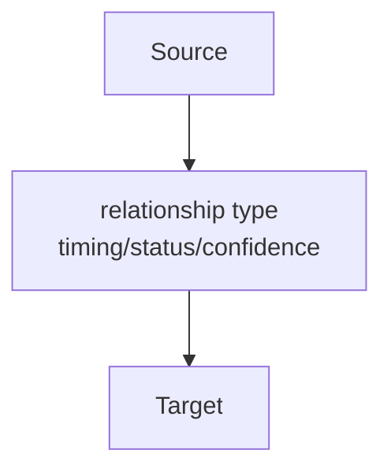

# Visualization

This folder contains generated visualization artifacts for the Lord of the Mysteries re-read analysis project.

Generated graph files are not the source of truth. The canonical project data remains in:

- Glossary thread metadata
- Embedded Reader Knowledge Ledger sections in glossary threads
- Type-specific data blocks and their row-level `availability` entries
- Relationship Seeds
- The controlled relationship taxonomy in `PROJECT_RULES.md`

Generated Mermaid graphs are generated from glossary metadata, Relationship Seeds, and projected type-specific data-block availability. If a canonical graph refresh exposes missing, stale, or incorrect information, fix the glossary thread, investigation record, data block, or relationship seed first, then regenerate the graph. Manual maintainer graphs may include clearly marked graph-local evidence before those project-data updates are confirmed.

Page-level reader visibility belongs to glossary metadata through `Subject Visible From`; do not model it as a Relationship Seed. Filtered graph views use that metadata as the node-level gate before applying relationship or claim-level timing.

Configured graph views may declare a `readerBoundary` in `config/render-settings.json`. When present, generation includes only nodes whose `Subject Visible From` is eligible for that medium/volume/chapter boundary. Relationship Seeds that declare `projection_source` read their timing, confidence, and current display state from the projected type-specific data-block row's `availability` list; other seeds fall back to their own start fields. Projection sources resolve against the seed source page first so repeated local row keys do not collide across pages. Unknown subject visibility or unknown relationship positions are excluded unless the view explicitly opts into them. The current Volume 1 graph views are novel-only reader-boundary views through Volume 1 Chapter 213, so official-artwork taxonomy seeds and later cosmology links do not appear there.

Reader-boundary graphs distinguish unfinished visible pages from hidden future subjects. A glossary page with `Status: Pending` still appears if its `Subject Visible From` is eligible for the view, but it renders with a dashed pending-node outline. A missing glossary page may also appear as a dashed graph-local pending endpoint when at least one relationship or projected data row proves the endpoint is visible inside the selected reader boundary. Pending or missing endpoints without eligible timing remain hidden from reader-facing views and are better inspected through the Obsidian QA export.

Relationship Seed statuses affect graph labels but should not be used as a catch-all for state changes. In particular, `broken` means a relationship was narratively breached, severed, failed, or destroyed; ordinary ended custody or possession should be represented through projected data-block availability such as `possession_status: lost-custody` plus `historical` relationship state where needed.

Named non-artifact objects appear as `Item` nodes only when the underlying data row is recurring, graph-worthy, or page-worthy. Minor equipment and disposable possessions should stay in type-specific data blocks with `graph_relevance: none`, so graph refreshes do not turn inventory into relationship noise.

Recurring reveal carriers appear as `Knowledge Source` nodes with `source-*` slugs when their access chain, authorship, translation, quotes, or claim chronology needs independent tracking. Use these for Roselle diary pages, spellbooks, grimoires, notebooks, scriptures, case files, letters, inscriptions, formula records, murals, and similar sources rather than forcing them into Item nodes.

Shared graph authoring rules live in [Graph Authoring Standard](graph-authoring-standard.md). Use that standard for both AI Agent graph requests and maintainer/project graph work before rendering.

## Current Artifacts

- [Volume 1 Knowledge Graph](graphs/volume-1-knowledge-graph.mmd)
- [Volume 1 Knowledge Graph - Timing Spoiler-Free](graphs/volume-1-knowledge-graph-timing-spoiler-free.mmd)
- [Graph Schema Notes](data/graph-schema.md)
- [Graph Authoring Standard](graph-authoring-standard.md)
- [Rendering Instructions](rendering.md)

The `rendered/` folder contains generated SVG and PNG graph exports for review, sharing, and archive inspection.

## Refresh Tracker

After every graph refresh, update the live refresh tracker below. It summarizes configured views, per-view node and relationship counts, per-view semantic graph changes, rendered files, broken links, orphan nodes, duplicate relationships, and pending graph nodes.

The tracker compares each configured view against the semantic snapshot in `data/refresh-snapshot.json`. Unexpected removed nodes, removed relationships, changed relationship labels, duplicate relationships, broken links, or orphan nodes should be treated as visualization validation issues and reviewed before committing.

<!-- VISUALIZATION-REFRESH-REPORT:START -->
Last Updated: 2026-07-07 03:57:13 -04:00

### Summary

| Metric | Count | Delta |
| --- | ---: | ---: |
| Views Updated | 2 | 0 |
| Rendered Files | 4 | 0 |
| Broken Links | 0 | 0 |
| Pending Nodes | 21 | 0 |
| Validation Issues | 0 | n/a |

### View Summary

| View | Nodes | Delta | Relationships | Delta | Orphan Nodes |
| --- | ---: | ---: | ---: | ---: | ---: |
| Volume 1 Knowledge Graph | 28 | +14 | 73 | +30 | 0 |
| Volume 1 Knowledge Graph - Timing Spoiler-Free | 28 | +14 | 73 | +30 | 0 |

### Semantic Changes

#### Volume 1 Knowledge Graph

- Added nodes: 14
- Removed nodes: 0
- Added relationships: 30
- Removed relationships: 0
- Changed relationship labels: 0
- Duplicate relationships: 0

#### Volume 1 Knowledge Graph - Timing Spoiler-Free

- Added nodes: 14
- Removed nodes: 0
- Added relationships: 30
- Removed relationships: 0
- Changed relationship labels: 0
- Duplicate relationships: 0

### Views

- Volume 1 Knowledge Graph: `Visualization/graphs/volume-1-knowledge-graph.mmd`
- Volume 1 Knowledge Graph - Timing Spoiler-Free: `Visualization/graphs/volume-1-knowledge-graph-timing-spoiler-free.mmd`

### Rendered Outputs

- `Visualization/rendered/volume-1-knowledge-graph.svg` (306748 bytes)
- `Visualization/rendered/volume-1-knowledge-graph.png` (785561 bytes)
- `Visualization/rendered/volume-1-knowledge-graph-timing-spoiler-free.svg` (305686 bytes)
- `Visualization/rendered/volume-1-knowledge-graph-timing-spoiler-free.png` (695182 bytes)

### Hygiene

- Broken links: 0
- Orphan nodes: 0
- Duplicate relationships: 0
- Removed relationships: 0
- Changed relationship labels: 0
- Pending graph nodes: 21

#### Volume 1 Knowledge Graph - Added Nodes

- `character_azik_eggers`
- `character_daly_simone`
- `character_ince_zangwill`
- `character_kenley_white`
- `character_klein_moretti`
- `character_leonard_mitchell`
- `character_roselle_gustav`
- `character_royale_reideen`
- `character_seeka_tron`
- `deity_s0_evernight_goddess`
- `faction_nighthawks`
- `faction_secret_order`
- `pathway_corpse_collector`
- `pathway_mystery_pryer`

#### Volume 1 Knowledge Graph - Added Relationships

- `artifact_0_08|investigated-by ch150 strong-evidence|character_azik_eggers`
- `artifact_0_08|manipulates ch210|character_klein_moretti`
- `character_daly_simone|pathway-status ch28|pathway_corpse_collector`
- `character_dunn_smith|leader-of novel ch19 confirmed|faction_nighthawks`
- `character_dunn_smith|superior novel ch14 confirmed|character_klein_moretti`
- `character_ince_zangwill|artifact-user ch19|artifact_0_08`
- `character_ince_zangwill|infiltrates ch210 completed strong-evidence|location_saint_selena_cathedral`
- `character_kenley_white|pathway-status ch42|pathway_sleepless`
- `character_klein_moretti|civilian-staff-of ch17|faction_church_of_evernight`
- `character_klein_moretti|event-participant ch28|event_klein_becomes_a_seer`
- `character_klein_moretti|instance-of ch31|concept_beyonders`
- `character_klein_moretti|investigates ch9|artifact_antigonus_notebook`
- `character_klein_moretti|pathway-status ch31|pathway_seer`
- `character_klein_moretti|uses-as-operational-refuge ch25 completed|location_saint_selena_cathedral`
- `character_klein_moretti|uses-method ch43|concept_divination`
- `character_klein_moretti|works-at ch17|location_blackthorn_security_company`
- `character_leonard_mitchell|pathway-status ch21|pathway_sleepless`
- `character_old_neil|mentor novel ch32 confirmed|character_klein_moretti`
- `character_old_neil|pathway-status novel ch22 confirmed|pathway_mystery_pryer`
- `character_roselle_gustav|source-of-information ch21 historical|pathway_seer`
- `character_royale_reideen|pathway-status ch42|pathway_sleepless`
- `character_seeka_tron|pathway-status ch42|pathway_sleepless`
- `event_klein_becomes_a_seer|event-outcome ch31|character_klein_moretti`
- `faction_nighthawks|affiliated-with ch17|location_saint_selena_cathedral`
- `faction_nighthawks|investigates ch13|artifact_antigonus_notebook`
- `faction_nighthawks|subordinate-organization ch13|faction_church_of_evernight`
- `faction_secret_order|targets ch28 strong-evidence|artifact_antigonus_notebook`
- `location_blackthorn_security_company|operational-base-for ch17|faction_nighthawks`
- `location_blackthorn_security_company|public-cover-for ch17|faction_nighthawks`
- `pathway_sleepless|associated-sequence-0 ch28|deity_s0_evernight_goddess`

#### Volume 1 Knowledge Graph - Timing Spoiler-Free - Added Nodes

- `character_azik_eggers`
- `character_daly_simone`
- `character_ince_zangwill`
- `character_kenley_white`
- `character_klein_moretti`
- `character_leonard_mitchell`
- `character_roselle_gustav`
- `character_royale_reideen`
- `character_seeka_tron`
- `deity_s0_evernight_goddess`
- `faction_nighthawks`
- `faction_secret_order`
- `pathway_corpse_collector`
- `pathway_mystery_pryer`

#### Volume 1 Knowledge Graph - Timing Spoiler-Free - Added Relationships

- `artifact_0_08|investigated-by strong-evidence|character_azik_eggers`
- `artifact_0_08|manipulates|character_klein_moretti`
- `character_daly_simone|pathway-status|pathway_corpse_collector`
- `character_dunn_smith|leader-of confirmed|faction_nighthawks`
- `character_dunn_smith|superior confirmed|character_klein_moretti`
- `character_ince_zangwill|artifact-user|artifact_0_08`
- `character_ince_zangwill|infiltrates completed strong-evidence|location_saint_selena_cathedral`
- `character_kenley_white|pathway-status|pathway_sleepless`
- `character_klein_moretti|civilian-staff-of|faction_church_of_evernight`
- `character_klein_moretti|event-participant|event_klein_becomes_a_seer`
- `character_klein_moretti|instance-of|concept_beyonders`
- `character_klein_moretti|investigates|artifact_antigonus_notebook`
- `character_klein_moretti|pathway-status|pathway_seer`
- `character_klein_moretti|uses-as-operational-refuge completed|location_saint_selena_cathedral`
- `character_klein_moretti|uses-method|concept_divination`
- `character_klein_moretti|works-at|location_blackthorn_security_company`
- `character_leonard_mitchell|pathway-status|pathway_sleepless`
- `character_old_neil|mentor confirmed|character_klein_moretti`
- `character_old_neil|pathway-status confirmed|pathway_mystery_pryer`
- `character_roselle_gustav|source-of-information historical|pathway_seer`
- `character_royale_reideen|pathway-status|pathway_sleepless`
- `character_seeka_tron|pathway-status|pathway_sleepless`
- `event_klein_becomes_a_seer|event-outcome|character_klein_moretti`
- `faction_nighthawks|affiliated-with|location_saint_selena_cathedral`
- `faction_nighthawks|investigates|artifact_antigonus_notebook`
- `faction_nighthawks|subordinate-organization|faction_church_of_evernight`
- `faction_secret_order|targets strong-evidence|artifact_antigonus_notebook`
- `location_blackthorn_security_company|operational-base-for|faction_nighthawks`
- `location_blackthorn_security_company|public-cover-for|faction_nighthawks`
- `pathway_sleepless|associated-sequence-0|deity_s0_evernight_goddess`

#### Pending Nodes

- `character-azik-eggers.md (artwork backed)`
- `character-bethel-abraham.md (notes: [preliminary planning](../Investigations/Characters/character-bethel-abraham/preliminary-planning-investigation.md))`
- `character-daly-simone.md (artwork backed)`
- `character-frye.md`
- `character-ince-zangwill.md (artwork backed)`
- `character-kenley-white.md`
- `character-klein-moretti.md (artwork backed, 17 images)`
- `character-leonard-mitchell.md (artwork backed)`
- `character-mrs-orianna.md`
- `character-ray-bieber.md`
- `character-royale-reideen.md`
- `character-rozanne.md`
- `character-roselle-gustav.md (artwork backed)`
- `character-seeka-tron.md`
- `faction-nighthawks.md`
- `faction-secret-order.md`
- `faction-tarot-club.md (artwork backed; notes: [preliminary planning](../Investigations/Factions/faction-tarot-club/preliminary-planning-investigation.md))`
- `pathway-corpse-collector.md`
- `pathway-criminal.md (artwork backed; notes: [preliminary planning](../Investigations/Pathways/pathway-criminal/preliminary-planning-investigation.md))`
- `pathway-mystery-pryer.md (artwork backed)`
- `pathway-prisoner.md (artwork backed)`
<!-- VISUALIZATION-REFRESH-REPORT:END -->

## AI Agent Graph Request Routing

Graph and visualization requests are repository workflow requests by default.

When an AI assistant is asked to create a graph, visualization, Mermaid diagram, relationship map, pathway map, timeline map, or rendered image, it should not begin by creating an ad hoc Mermaid file outside this folder.

First classify the request:

1. **Canonical graph refresh**: update generated graph artifacts from canonical graph inputs, including metadata, Relationship Seeds, and projected type-specific data-block availability.
2. **Repository-local manual graph**: create a manual `.mmd` source under `Visualization/graphs/` and render it through repository tooling.
3. **Chat-only scratch graph**: produce temporary Mermaid only when the user explicitly asks for scratch, temporary, chat-only, or outside-repository output.

Complex, relationship-heavy, evidence-bearing, or rendered graph requests default to repository-local artifacts, not scratch outputs.

For rendered outputs, repository tooling means the visualization helpers documented in [rendering.md](rendering.md), not direct `mmdc` calls. Prefer the Python helper and use the PowerShell helper as the Windows fallback. Direct `mmdc` is a fallback/debug path only, and should be reported as degraded if used because the helper scripts are unavailable or cannot run in the current environment.

## Projection Style

Dense relationship graphs should use semantic relationship nodes instead of long Mermaid edge labels.

Preferred dense projection:



Relationship nodes are generated presentation nodes. They are not glossary nodes and are not canonical project knowledge. They exist to make rendered graphs easier to read, especially when many relationships share the same source, target cluster, or semantic hub.

Simple one-off diagrams may still use edge labels when they remain readable. For repository-wide or relationship-heavy views, prefer relationship nodes by default.

## Refresh Rules

Regenerate graph artifacts when graph inputs change:

- glossary pages are created, deleted, renamed, or moved
- `Relationship Seeds` are added, removed, or changed
- relationship type, status, confidence, source, or target changes
- graph-relevant type-specific data-block rows or row-level `availability` entries change
- node type or graph-relevant metadata changes
- the controlled relationship taxonomy changes

Graph regeneration is not required for prose-only investigation updates, typo fixes, wording cleanup, or board prose that does not change graph inputs.

Before editing generated visualization files, recommend the refresh and confirm it with the user.

When a refresh is confirmed, update every configured graph view in `config/render-settings.json` unless the user explicitly narrows the scope. Each configured view owns its Mermaid source path and rendered output paths.

Fresh renders replace stale render files unless the user asks for archived snapshots.

Before choosing a helper on an unfamiliar machine or fresh agent session, run the Python availability probe documented in [Rendering Instructions](rendering.md). Treat the result as the session's Python-availability state. If Python is available, use the Python commands going forward without rerunning the probe before every render command. If Python is unavailable, use the PowerShell fallback command for that session.

Canonical refresh command:

Preferred Python:

```powershell
python Visualization\visualize.py --mode Refresh
```

PowerShell fallback:

```powershell
powershell -NoProfile -ExecutionPolicy Bypass -File Visualization\visualize.ps1 -Mode Refresh
```

Compatibility validation command:

Preferred Python:

```powershell
python Visualization\visualize.py --mode Validate
```

PowerShell fallback:

```powershell
powershell -NoProfile -ExecutionPolicy Bypass -File Visualization\visualize.ps1 -Mode Validate
```

Validation mode checks glossary node parsing, Relationship Seed parsing, configured graph class/layout validation, and fresh temp graph generation without updating generated graph files, rendered images, the semantic snapshot, or this refresh tracker.

Pure render command for manually authored `.mmd` files:

Preferred Python:

```powershell
python Visualization\visualize.py --mode Render --input-path Visualization\graphs\example.mmd
```

PowerShell fallback:

```powershell
powershell -NoProfile -ExecutionPolicy Bypass -File Visualization\visualize.ps1 -Mode Render -InputPath Visualization\graphs\example.mmd
```

Pure render mode uses the same Puppeteer and render-size settings as the canonical refresh command, but it does not regenerate graph files, update the semantic snapshot, or update this refresh tracker.

## Long-Term Vision

The long-term goal is a dynamic graph layer generated from normalized relationship data rather than manually maintained diagrams.

Future graph views may support:

- Dynamic graph generation from Relationship Seeds, projected data-block availability, and normalized graph data
- Timeline filtering by novel chapter, Donghua episode, and in-world chronology
- Reader-state filtering by spoiler boundary and reader knowledge boundary
- Interactive frontend exploration
- Multiple graph views, such as character networks, faction maps, pathway views, artifact causality maps, and event-centered graphs
- Filters by node type, relationship type, confidence, truth status, medium, and controlled taxonomy tags
- Expanded visualization validation for required relationship patterns, stale pending nodes, and generated graph subsets

Until that layer exists, Mermaid files provide a GitHub-visible snapshot of the current graph.
