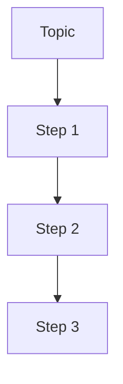
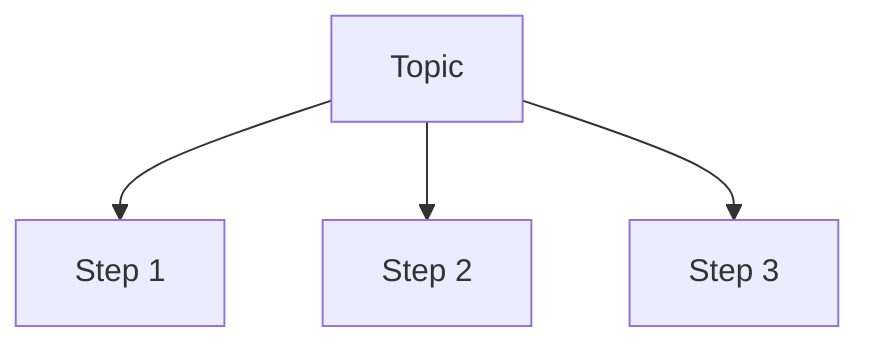
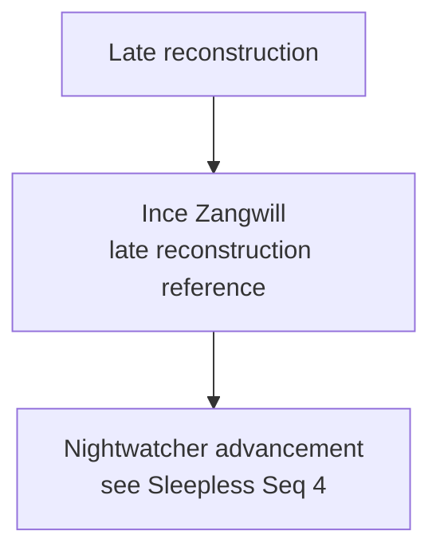
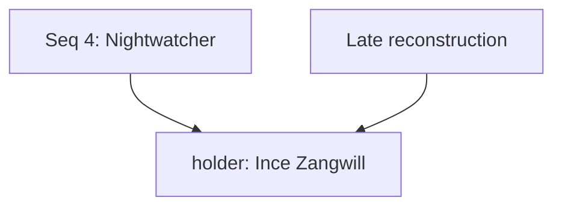
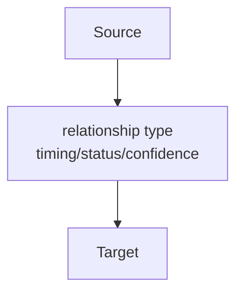

# Rendering Graph Exports

This document records the current working process for rendering Mermaid graph files into shareable image exports.

Rendered files are generated artifacts. If a rendered graph exposes incorrect data, update the source glossary records or Relationship Seeds, regenerate the Mermaid file, and then rerender the image.

## Recommended Outputs

For sharing:

- Use PNG for Discord and other chat previews.
- Keep SVG for archive and zoomable inspection.

The first graph was rendered to:

- `Visualization/rendered/volume-1-knowledge-graph.png`
- `Visualization/rendered/volume-1-knowledge-graph.svg`

## Tool

Use Mermaid CLI:

```powershell
npm install -g @mermaid-js/mermaid-cli
```

The default `mmdc` browser launch may time out on Windows. The working approach is to point Puppeteer at local Microsoft Edge through the permanent render config in `Visualization/config`.

## Permanent Render Config

Puppeteer launch settings live at:

- `Visualization/config/puppeteer-config.json`

Graph render settings live at:

- `Visualization/config/render-settings.json`

If Edge is installed elsewhere, update `executablePath` in the Puppeteer config. Chrome can also be used if available.

## Render Commands

From the repository root, render every configured graph view and write the refresh report:

```powershell
powershell -NoProfile -ExecutionPolicy Bypass -File Visualization\render-graphs.ps1
```

To update only the refresh report without rerendering images:

```powershell
powershell -NoProfile -ExecutionPolicy Bypass -File Visualization\render-graphs.ps1 -SkipRender
```

To render a manually authored Mermaid file without regenerating repository graph views or updating the refresh tracker, use pure render mode:

```powershell
powershell -NoProfile -ExecutionPolicy Bypass -File Visualization\render-mermaid.ps1 `
  -InputPath Visualization\graphs\example.mmd
```

By default, pure render mode writes both SVG and PNG files to `Visualization/rendered/` using the input filename. You can pass one or more explicit outputs:

```powershell
powershell -NoProfile -ExecutionPolicy Bypass -File Visualization\render-mermaid.ps1 `
  -InputPath Visualization\graphs\example.mmd `
  -OutputPath Visualization\rendered\example.svg,Visualization\rendered\example.png
```

Use pure render mode for one-off, manually authored, or agent-drafted Mermaid files. Use the canonical refresh command only when generated graph artifacts should be rebuilt from Relationship Seeds.

Use `-NoProfile` to keep local shell profile output from contaminating command output.

The helper reads `Visualization/config/render-settings.json`, renders every configured view to every configured output, updates the semantic graph snapshot, and updates the live refresh tracker in:

- `Visualization/README.md`

The semantic snapshot is stored at:

- `Visualization/data/refresh-snapshot.json`

The snapshot lets the tracker report added or removed nodes, added or removed relationships, changed relationship labels, duplicate relationships, broken links, orphan nodes, and pending graph nodes across refreshes.

## Automatic Render Size

The render scripts use the `autoSize` block in `Visualization/config/render-settings.json` to increase Mermaid viewport size for larger graphs.

The default dimensions remain `width` and `height`. When `autoSize.enabled` is true, the renderer counts Mermaid node and edge lines, estimates graph complexity, detects high fan-out hubs, and increases render width and height in bounded steps.

This keeps small graphs fast and compact while giving large relationship maps more room to lay out cleanly. If a large graph still renders cramped or clipped, adjust:

- `complexityUnit`
- `widthStep`
- `heightStep`
- `fanOutThreshold`
- `fanOutWidthStep`
- `maxWidth`
- `maxHeight`

Wide fan-out graphs are expected. If one source, target, group, artifact, pathway, or concept connects to many neighbors, Mermaid often spreads the graph horizontally and may need extra width before the first render looks sensible. The render helpers use `fanOutThreshold` and `fanOutWidthStep` to widen those graphs automatically.

Fan-out sizing only gives the layout room. It does not decide semantic grouping. When a hub still produces messy crossings after auto-sizing, prefer one of these projections:

- group related leaves under intermediate semantic nodes;
- split the graph into narrower topic-specific views;
- use relationship-node projection for long relationship explanations;
- use local reference/proxy nodes when a summary or reconstruction would otherwise pull edges across unrelated sections.

## Ordered-Series Layout

Ordered information should usually render as a chain, not as a flat fan.

This rule is universal. It applies to pathway sequences, timelines, phases, stages, ranks, steps, chapters, episodes, investigation beats, and any other ordered progression.

Preferred projection:



Avoid this shape when the children are ordered:



Flat fan-out is appropriate for unordered peer sets. Ordered-series fan-out usually makes Mermaid stretch the graph horizontally and hides the progression the graph is meant to show.

The layout validator can flag nodes with too many direct ordered-series children. The configured patterns are intentionally generic, such as `Seq 9`, `Phase 1`, `Step 1`, `Chapter 1`, and `Episode 1`.

## Class Coverage Validation

The render scripts validate Mermaid class coverage before rendering styled graphs.

When a graph uses `classDef` or `class` statements, every declared or edge-used node must have an explicit class assignment. The validator also reports class assignments that reference missing nodes, nodes assigned to undefined classes, and configured semantic pattern mismatches.

The current semantic pattern check includes sequence-like node ids. For example, a node such as `seer7_unknown` must be assigned to the `sequence` class when rendering a graph that defines sequence styling.

This prevents styled graphs from silently falling back to Mermaid default node styling.

## Layout-Island Validation

Sectioned graphs should avoid direct cross-section links into nodes that already belong to another branch.

When a graph uses section nodes such as `group`, a summary or reconstruction section should not directly link to an existing `holder` or `sequence` node if that node already has a non-section owner elsewhere in the graph. Use a local reference/proxy node instead.

Preferred projection:



Avoid:



The second shape forces Mermaid to place one node in two visual sections and usually creates long crossing edges.

The layout validator also checks for accidental duplicate visual labels across ordinary nodes. If two node IDs render with the same visible label, either collapse them into one canonical node or label the secondary node explicitly as a reference/proxy.

Proxy/reference-like node IDs, such as `late_ince_ref`, must label themselves as a reference, proxy, reconstruction, summary, or `see ...` node. This keeps local layout helpers from looking like separate canonical entities.

## Deferred Validation Ideas

These graph hygiene checks are worth revisiting after more examples exist, but should not become hard validation yet:

- Section or group nodes with too many direct children may need subgroups or split views.
- Fan-out hubs may eventually get a warning when they exceed the configured `fanOutThreshold`, but current examples are still too few for a hard rule.
- Dense manual graphs that mix hierarchy, evidence, reconstruction, and holder edges with identical arrow semantics may need edge-purpose conventions.
- Declared but disconnected nodes may indicate stale graph fragments, but some draft graphs may use them intentionally.

## Dense Graph Readability

The graph generator projects relationship-heavy views through generated relationship nodes:



This keeps long semantic labels out of Mermaid edge labels, where they tend to overlap when many edges share a hub. The `rel_###` nodes are presentation artifacts only; relationship seeds remain canonical.

Timing-spoiler-free views use the same projection, but omit chapter and episode timing from the relationship node text.

Manual commands remain useful for debugging a single view:

```powershell
mmdc -p Visualization\config\puppeteer-config.json `
  -i Visualization\graphs\volume-1-knowledge-graph.mmd `
  -o Visualization\rendered\volume-1-knowledge-graph.svg `
  -b white `
  -w 2400 `
  -H 1800
```

```powershell
mmdc -p Visualization\config\puppeteer-config.json `
  -i Visualization\graphs\volume-1-knowledge-graph.mmd `
  -o Visualization\rendered\volume-1-knowledge-graph.png `
  -b white `
  -w 2400 `
  -H 1800 `
  -s 2
```

The first PNG export produced a readable Discord-friendly image around `4768 x 1426` pixels and about `428 KB`.

Keep the generated PNG/SVG exports only when they are useful project artifacts.

## Troubleshooting

If `mmdc` times out after 30 seconds even on a tiny test graph, it is likely failing to launch its default browser. Use the Puppeteer config above.

Tiny test graph:

```powershell
"graph TD`nA[Alpha] --> B[Beta]" | mmdc `
  -p Visualization\config\puppeteer-config.json `
  -i - `
  -o Visualization\rendered\_mmdc-test.svg
```

Delete `_mmdc-test.svg` after confirming the renderer works.
