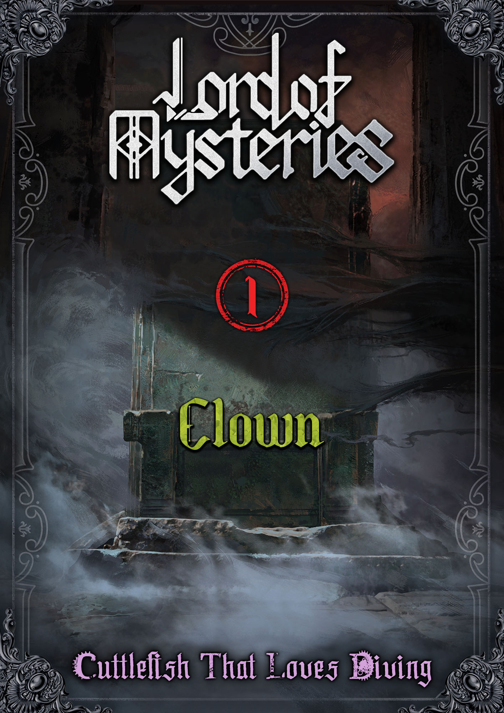

# Volume 1: Clown



## Metadata

Type: Volume Summary
Status: Active
Volume: 1
Chapter Range: 1-213
Spoiler Boundary: Novel Volume 1
Reader Knowledge Boundary: End of Novel Volume 1
Current Analysis Status: Summary scaffold; detailed thread links are partial
Confidence Level: High for structure and linked artwork; Medium for summary completeness
Tags: volume, volume-1
Last Updated: 2026-07-04

Related Boards:
- [Main Reread Board](../Boards/01_LoTM_Main_Reread_Board.md)

Related Glossary Threads:
- [0-08](../Glossary_Threads/Artifacts/artifact-0-08.md)
- [Antigonus Notebook](../Glossary_Threads/Artifacts/artifact-antigonus-notebook.md)
- [Church of Evernight](../Glossary_Threads/Factions/faction-church-of-evernight.md)
- [Dunn Smith](../Glossary_Threads/Characters/character-dunn-smith.md)
- [Old Neil](../Glossary_Threads/Characters/character-old-neil.md)
- [Seer Pathway](../Glossary_Threads/Pathways/pathway-seer.md)
- [Sleepless Pathway](../Glossary_Threads/Pathways/pathway-sleepless.md)

Related Investigations:
- [0-08 Volume 1 Reveal Timeline](../Investigations/Artifacts/artifact-0-08/novel-volume-1-reveal-timeline.md)
- [Antigonus Notebook Novel Volume 1 Reveal Timeline](../Investigations/Artifacts/artifact-antigonus-notebook/novel-volume-1-reveal-timeline.md)
- [Church of Evernight Volume 1 Reveal Timeline](../Investigations/Factions/faction-church-of-evernight/novel-volume-1-reveal-timeline.md)

Official Artwork: [Link to image map](../Artwork/official-epub-image-map.md#volume-1-clown)
- [Volume 1 cover: Clown](../Artwork/extracted/volume-1-clown/0004-spine-0006-volumecover-volume-1-cover.jpg)
- [End of Volume 1 emblem page](../Artwork/extracted/volume-1-clown/0005-spine-0220-endofvolume-v01-end.jpeg)
- [Pathways Guide spoiler warning title page](../Artwork/extracted/volume-1-clown/0006-spine-0221-pathways-pathways-guide.jpeg)
- [Twilight Giant pathway guide page](../Artwork/extracted/volume-1-clown/0007-spine-0221-pathways-pathways1.jpeg)
- [Death pathway guide page](../Artwork/extracted/volume-1-clown/0008-spine-0222-pathways-pathways2.jpeg)
- [Darkness pathway guide page](../Artwork/extracted/volume-1-clown/0009-spine-0223-pathways-pathways3.jpeg)
- [Image Gallery spoiler warning title page](../Artwork/extracted/volume-1-clown/0010-spine-0224-artwork-image-gallery.jpeg)
- [Klein Moretti as The Fool tarot portrait](../Artwork/extracted/volume-1-clown/0011-spine-0225-characters-tarot1.jpeg)
- [Audrey Hall as Justice tarot portrait](../Artwork/extracted/volume-1-clown/0012-spine-0225-characters-tarot2.jpeg)
- [Alger Wilson as The Hanged Man tarot portrait](../Artwork/extracted/volume-1-clown/0013-spine-0226-characters-tarot3.jpeg)
- [Derrick Berg as The Sun tarot portrait](../Artwork/extracted/volume-1-clown/0014-spine-0227-characters-tarot4.jpeg)
- [Klein Moretti early-stage portrait](../Artwork/extracted/volume-1-clown/0015-spine-0228-characters-character1.jpeg)
- [Klein Moretti as a Nighthawk portrait](../Artwork/extracted/volume-1-clown/0016-spine-0229-characters-character2.jpeg)
- [Dunn Smith portrait](../Artwork/extracted/volume-1-clown/0017-spine-0230-characters-character3.jpeg)
- [Tingen City panorama](../Artwork/extracted/volume-1-clown/0018-spine-0231-locations-location1.jpeg)
- [Divination Club Citrine Room interior](../Artwork/extracted/volume-1-clown/0019-spine-0232-locations-location2.jpeg)

## Purpose

Volume 1 pages summarize the reader's end-of-volume state: what the volume was about, which mysteries and character arcs now matter, and where to go for detailed glossary evidence.

This page is not a replacement for granular reveal timelines. It is a reader-facing dashboard for the completed `Clown` volume.

## Spoiler Boundary

- Medium: Novel
- Safe through: Chapter 213, end of Volume 1
- Reader knowledge state: The reader has completed `Clown` and can know the full Tingen arc outcome.
- Later-volume contamination risks: Avoid using later explanations of pathways, deities, historical eras, Tarot Club members, or surviving long-term consequences unless they are already visible by the Volume 1 boundary.

## Volume Snapshot

- Volume title: Clown
- Chapter range: 1-213
- Primary setting arc: Tingen City, centered on Klein's new life, Blackthorn Security Company, and the local Nighthawks.
- Central conflict: Klein tries to survive and understand the world after transmigration while the Antigonus Notebook, Secret Order pursuit, and 0-08-linked manipulation converge on Tingen.
- Main character arc: Klein moves from disoriented outsider to cautious Beyonder and Nighthawk, then into someone personally marked by the cost of hidden-world conflict.
- Major factions: Church of Evernight, Nighthawks, Tarot Club, Secret Order, Machinery Hivemind, Mandated Punishers.
- Main mysteries: Klein's transmigration, the gray fog, the Antigonus Notebook, Azik Eggers, 0-08, Ince Zangwill, the pathway system, and the logic behind Tingen's escalating incidents.
- End-state: The Tingen foundation is complete; the local arc closes in tragedy while Klein's identity, pathway, and broader hidden-world connections are pushed into a new phase.

## Volume Summary

`Clown` is the foundation volume: it teaches the reader how dangerous knowledge is, how institutions manage the supernatural, and how ordinary routines can sit beside cosmic-scale manipulation. Klein begins as someone trying to understand why he woke up in another world, but the volume steadily gives him anchors: his siblings, his job, the Tarot Club, his pathway, and the Nighthawks.

The Tingen arc is also a local tragedy. The Church of Evernight and the Nighthawks become familiar, practical, and human before the volume reveals how far beyond them larger forces can reach. By the end, the reader has a working model of Beyonders, Sequences, potions, sealed artifacts, divination, the gray fog, and official organizations, but also understands that this model is incomplete and dangerous.

The title `Clown` lands as both a pathway advancement and a tone statement. Klein survives by learning performance, caution, and emotional control, while the volume's final movement makes clear that survival in this world can require laughing or acting through grief.

## Major Developments

| Development | Chapter / range | Type | Reader knowledge state | Links |
|---|---:|---|---|---|
| Klein awakens in the body of Klein Moretti and begins investigating his situation. | 1-6 | Identity / premise | Reader knows the protagonist is displaced into a new world with immediate danger around the original Klein's death. |  |
| The gray fog and first Tarot Club gathering establish Klein's hidden leverage. | 6-7 | Concept / organization | Reader sees a private mysticism space and the beginning of recurring cross-faction information exchange. |  |
| Klein enters the Nighthawks' orbit and learns official Beyonder procedures. | 13-34 | Faction / pathway | Reader learns the Church's local team structure, sealed artifacts, starting Sequences, and Klein's Seer advancement. | [Church of Evernight](../Glossary_Threads/Factions/faction-church-of-evernight.md), [Seer Pathway](../Glossary_Threads/Pathways/pathway-seer.md) |
| Divination, spirit vision, and mysticism training become practical tools rather than abstract lore. | 31-47 | Power system | Reader sees early Seer abilities, ritual methods, and limits applied in daily investigation work. | [Divination](../Glossary_Threads/Concepts/concept-divination.md) |
| The Antigonus Notebook and Secret Order thread expands from family tragedy into a larger hidden-world conflict. | 9-213 | Mystery / artifact | Reader knows the notebook is central to the Tingen crisis and tied to forces beyond a normal criminal case. | [Antigonus Notebook](../Glossary_Threads/Artifacts/artifact-antigonus-notebook.md) |
| Old Neil's collapse shows the personal cost of Beyonder loss of control. | 150s | Character / power system | Reader sees that mystical practice, grief, and hidden obsession can become lethal. | [Old Neil](../Glossary_Threads/Characters/character-old-neil.md) |
| 0-08 and Ince Zangwill reframe many Tingen events as manipulated causality. | 190s-213 | Artifact / antagonist | Reader learns that a sealed artifact can shape events at a scale far beyond the local team's awareness. | [0-08](../Glossary_Threads/Artifacts/artifact-0-08.md) |
| The Tingen finale closes the local Nighthawks arc in tragedy and forces Klein into a new life phase. | 210-213 | Volume climax | Reader ends the volume with the local foundation broken, but Klein's broader path opened. | [Dunn Smith](../Glossary_Threads/Characters/character-dunn-smith.md) |

## Character Movement

| Character | Volume role / movement | End-of-volume state | Links |
|---|---|---|---|
| Klein Moretti | Transmigrator, new Seer, Tarot Club founder, Nighthawk member. | Forced past the Tingen phase and into a larger hidden-world trajectory. |  |
| Dunn Smith | Nighthawk captain and Klein's first model of official Beyonder responsibility. | Central to the emotional and operational cost of the Tingen finale. | [Dunn Smith](../Glossary_Threads/Characters/character-dunn-smith.md) |
| Old Neil | Mentor for mysticism practice and cautionary figure for loss of control. | His arc resolves as a personal tragedy that clarifies Beyonder risk. | [Old Neil](../Glossary_Threads/Characters/character-old-neil.md) |
| Leonard Mitchell | Fellow Nighthawk with unusual presence and later-thread mystery seeds. | Remains a notable Tingen survivor and unresolved internal mystery. |  |
| Azik Eggers | History professor and early deep-history mystery. | Established as a major unresolved thread beyond ordinary Tingen cases. |  |
| Audrey Hall | Tarot Club member and early audience surrogate for aristocratic and Spectator-path hints. | Recurring Tarot Club participant with growing curiosity and access. |  |
| Alger Wilson | Tarot Club member and maritime Church-connected information source. | Recurring Tarot Club participant and practical hidden-world broker. |  |
| Ince Zangwill | Hidden antagonist behind the final Tingen shape. | Revealed as a key hostile operator tied to 0-08. |  |

## Pathway / Power-System Reveals

| Subject | What this volume establishes | Reader-safe unknowns | Links |
|---|---|---|---|
| Seer pathway | Klein's first pathway, with divination, spirit vision, ritual practice, and advancement into Clown. | Full sequence ladder and long-term pathway implications remain unknown. | [Seer Pathway](../Glossary_Threads/Pathways/pathway-seer.md) |
| Sleepless pathway | Church of Evernight pathway access, Nighthawk member abilities, and basic night/sleep-related implications. | Full ladder and later formal naming remain unsafe at early boundaries. | [Sleepless Pathway](../Glossary_Threads/Pathways/pathway-sleepless.md) |
| Beyonders and Sequences | Potions, advancement, madness/loss of control, sealed artifacts, and institutional management become the core magic-system grammar. | Most pathways, high Sequences, and cosmology remain incomplete. | [Beyonders](../Glossary_Threads/Concepts/concept-beyonders.md) |
| Divination and ritualistic magic | Practical divination and ritual procedures become repeatable tools with limits. | Deeper mechanics and broader ritual classifications remain partial. | [Divination](../Glossary_Threads/Concepts/concept-divination.md), [Prayers & Rituals](../Glossary_Threads/Concepts/concept-prayers-and-rituals.md) |
| Sealed artifacts | 0-08 and other Church-handled artifacts show that objects can carry severe rules and consequences. | Artifact classification and long-term historical context remain incomplete. | [0-08](../Glossary_Threads/Artifacts/artifact-0-08.md) |

## Important Threads Started

- Klein's original transmigration and the gray fog.
- The Tarot Club as a recurring information and influence structure.
- Azik Eggers and the deeper historical/memory mystery.
- The Antigonus family/notebook thread.
- The Church pathways and the broader Sequence system.
- The danger and rules of sealed artifacts.

## Threads Resolved

- Klein's initial entry into the Beyonder world and first official pathway choice.
- The Tingen Nighthawks foundation arc.
- Old Neil's Volume 1 character tragedy.
- The immediate Tingen crisis around 0-08 and Ince Zangwill reaches its volume climax, though consequences continue.

## Links Out

### Glossary Threads

- [0-08](../Glossary_Threads/Artifacts/artifact-0-08.md)
- [Antigonus Notebook](../Glossary_Threads/Artifacts/artifact-antigonus-notebook.md)
- [Beyonders](../Glossary_Threads/Concepts/concept-beyonders.md)
- [Divination](../Glossary_Threads/Concepts/concept-divination.md)
- [Church of Evernight](../Glossary_Threads/Factions/faction-church-of-evernight.md)
- [Blackthorn Security Company](../Glossary_Threads/Locations/location-blackthorn-security-company.md)
- [Dunn Smith](../Glossary_Threads/Characters/character-dunn-smith.md)
- [Old Neil](../Glossary_Threads/Characters/character-old-neil.md)
- [Seer Pathway](../Glossary_Threads/Pathways/pathway-seer.md)
- [Sleepless Pathway](../Glossary_Threads/Pathways/pathway-sleepless.md)

### Investigations

- [0-08 Volume 1 Reveal Timeline](../Investigations/Artifacts/artifact-0-08/novel-volume-1-reveal-timeline.md)
- [Antigonus Notebook Novel Volume 1 Reveal Timeline](../Investigations/Artifacts/artifact-antigonus-notebook/novel-volume-1-reveal-timeline.md)
- [Church of Evernight Volume 1 Reveal Timeline](../Investigations/Factions/faction-church-of-evernight/novel-volume-1-reveal-timeline.md)
- [Dunn Smith Novel Volume 1 Reveal Timeline](../Investigations/Characters/character-dunn-smith/novel-volume-1-reveal-timeline.md)
- [Old Neil Novel Volume 1 Reveal Timeline](../Investigations/Characters/character-old-neil/novel-volume-1-reveal-timeline.md)
- [Seer Pathway Novel Volume 1 Reveal Timeline](../Investigations/Pathways/pathway-seer/novel-volume-1-reveal-timeline.md)
- [Sleepless Pathway Novel Volume 1 Reveal Timeline](../Investigations/Pathways/pathway-sleepless/novel-volume-1-reveal-timeline.md)

## Volume Data Block

```yaml
volume_summary:
  volume: 1
  title: Clown
  chapter_range:
    start: 1
    end: 213
  reader_boundary:
    medium: novel
    book: lotm-1
    volume: 1
    chapter: 213
  official_artwork:
    - image_number: 4
      type: volume_cover
      file: Artwork/extracted/volume-1-clown/0004-spine-0006-volumecover-volume-1-cover.jpg
      usage: primary_volume_image
    - image_number: 5
      type: end_of_volume
      file: Artwork/extracted/volume-1-clown/0005-spine-0220-endofvolume-v01-end.jpeg
      usage: end_marker
    - image_number: 6
      type: pathways_title
      file: Artwork/extracted/volume-1-clown/0006-spine-0221-pathways-pathways-guide.jpeg
      usage: volume_appendix_title
    - image_number: 7
      type: pathway_guide
      file: Artwork/extracted/volume-1-clown/0007-spine-0221-pathways-pathways1.jpeg
      usage: planned_pathway_page
    - image_number: 8
      type: pathway_guide
      file: Artwork/extracted/volume-1-clown/0008-spine-0222-pathways-pathways2.jpeg
      usage: planned_pathway_page
    - image_number: 9
      type: pathway_guide
      file: Artwork/extracted/volume-1-clown/0009-spine-0223-pathways-pathways3.jpeg
      usage: pathway_page
    - image_number: 10
      type: image_gallery_title
      file: Artwork/extracted/volume-1-clown/0010-spine-0224-artwork-image-gallery.jpeg
      usage: volume_appendix_title
    - image_number: 11
      type: character_gallery
      file: Artwork/extracted/volume-1-clown/0011-spine-0225-characters-tarot1.jpeg
      usage: planned_character_page
    - image_number: 12
      type: character_gallery
      file: Artwork/extracted/volume-1-clown/0012-spine-0225-characters-tarot2.jpeg
      usage: planned_character_page
    - image_number: 13
      type: character_gallery
      file: Artwork/extracted/volume-1-clown/0013-spine-0226-characters-tarot3.jpeg
      usage: planned_character_page
    - image_number: 14
      type: character_gallery
      file: Artwork/extracted/volume-1-clown/0014-spine-0227-characters-tarot4.jpeg
      usage: planned_character_page
    - image_number: 15
      type: character_gallery
      file: Artwork/extracted/volume-1-clown/0015-spine-0228-characters-character1.jpeg
      usage: planned_character_page
    - image_number: 16
      type: character_gallery
      file: Artwork/extracted/volume-1-clown/0016-spine-0229-characters-character2.jpeg
      usage: planned_character_page
    - image_number: 17
      type: character_gallery
      file: Artwork/extracted/volume-1-clown/0017-spine-0230-characters-character3.jpeg
      usage: character_page
    - image_number: 18
      type: location_gallery
      file: Artwork/extracted/volume-1-clown/0018-spine-0231-locations-location1.jpeg
      usage: planned_location_page
    - image_number: 19
      type: location_gallery
      file: Artwork/extracted/volume-1-clown/0019-spine-0232-locations-location2.jpeg
      usage: planned_location_page
  major_developments:
    - label: Klein awakens in Tingen
      chapter: 1
      type: premise
      links: []
    - label: Klein joins the Nighthawks and becomes a Seer
      chapter: 31
      type: pathway_and_faction
      links:
        - Glossary_Threads/Pathways/pathway-seer.md
        - Glossary_Threads/Factions/faction-church-of-evernight.md
    - label: 0-08 reframes the Tingen crisis
      chapter: 213
      type: artifact_and_antagonist
      links:
        - Glossary_Threads/Artifacts/artifact-0-08.md
  key_threads:
    started:
      - gray_fog
      - tarot_club
      - antigonus_notebook
      - azik_eggers
      - sequence_pathways
    resolved:
      - tingen_foundation_arc
      - old_neil_volume_1_arc
      - klein_initial_pathway_choice
```

## Notes

- This page intentionally summarizes at the volume level. Detailed chapter-by-chapter reveal evidence belongs in glossary thread ledgers and investigations.
- The current page is a pilot structure and should be refined after more completed volume pages exist.
